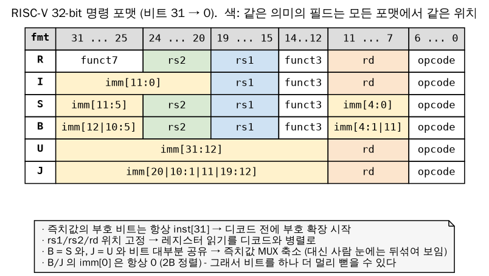

# 부록 A: RISC-V 스칼라 ISA & 표준 입문 (RVV 사용자를 위한)

> 💡 RVV 에 익숙하지만 스칼라 코어/표준 문서는 낯선 사람을 위한 페이지. 각 절은 **스펙이 무엇을 정하는가 → C906 RTL 은 어떻게 구현했나 → 유닛 테스트로 확인한 값** 순서로 정리했다.
> ⚠️ 이 페이지의 수치는 smart_run/study/unit_tests 의 테스트를 Verilator 로 실행해 얻은 값이다(테스트 이름을 함께 적었다). RTL 인용은 C906_RTL_FACTORY/gen_rtl 기준 파일:라인이다.

---

## 1. 표준 문서 지도 — 무엇이 어디에 정의되어 있나

| 문서 | 다루는 내용 | C906 이 따르는 버전 (UM 1.5) | 이후 주요 변화 |
|------|------------|---------------------------|---------------|
| Unprivileged ISA (Vol. I) | 정수/부동소수점/원자/압축 명령, 메모리 모델 | 2.2 (2017) | 20191213 비준: Zicsr·Zifencei 를 I 에서 분리, RVWMO 메모리 모델 정식화 |
| Privileged Architecture (Vol. II) | M/S/U 모드, CSR, trap, 가상메모리(Sv39), PMP | 1.10 (2017) + mcountinhibit(2019 draft) | 1.11(2019), 1.12(2021): mstatush, PMP 규칙 보강, Svpbmt/Sstc 등 확장 |
| External Debug Support | JTAG DTM, Debug Module, trigger | 0.13.2 | 이후 개정판 진행 |
| PLIC / CLINT | 외부·타이머·소프트웨어 인터럽트 | PLIC spec, CLINT(사실상 표준) | AIA(APLIC/IMSIC), Sstc(S-mode 타이머) |
| psABI | 레지스터 사용 규칙, 호출 규약, ELF | GCC 기본 lp64/lp64d | — |
| Vector (V) | RVV | 상용 C906 = RVV 0.7.1 (오픈 C906 은 비활성) | RVV 1.0 비준(2021) |
| Profiles | 응용 프로세서가 갖춰야 할 확장 묶음 | (해당 없음: RV64GC 시대) | RVA20, RVA22, RVA23 |

**확장 이름 규칙** (misa 와 -march 문자열):

| 표기 | 의미 | 예 |
|------|------|----|
| 한 글자 | 표준 기본/주요 확장 | I, M, A, F, D, C, V, H |
| G | IMAFD + Zicsr + Zifencei 의 약칭 | RV64GC = RV64IMAFDC_Zicsr_Zifencei |
| Z???? | 표준 부가 확장 (첫 글자 뒤가 관련 확장) | Zicsr, Zifencei, Zba, Zbb, Zicond |
| S???? / Sm???? | 특권(supervisor/machine) 확장 | Svpbmt, Sstc, Smepmp |
| X???? | 벤더 확장 | XTheadBa, XTheadCmo … (C906 의 확장 명령) |

**실측 — misa** (`u00_smoke`): `misa = 0x8000_0000_0094_112D`

- [63:62] MXL = 2 → RV64
- 확장 비트 = **A C D F I M S U X** (X = 비표준 확장 존재), **V 비트는 0**
- mvendorid = 0x5B7 (T-Head), marchid = mimpid = 0

> ⚠️ 오픈 C906 은 V 확장이 꺼진 구성이다. `aq_cp0_info_csr.v:150 assign misa_vector = 1'b0;` RTL 디렉토리 이름(vfalu, vfmau, vidu, vlsu, vdsp)에 'v' 가 붙은 것은 벡터 옵션이 있는 상용 C906 과 같은 소스 트리이기 때문이다. smart_run 의 ISA_VECTOR(RVV 1.0 인코딩) 테스트가 FAIL 하는 것도 이 때문이다.

---

## 2. 정수 레지스터와 ABI

| 레지스터 | ABI 이름 | 용도 | 호출 시 보존 |
|---------|---------|------|------------|
| x0 | zero | 항상 0 (쓰기 무시) | — |
| x1 | ra | 복귀 주소 (**RAS 예측의 기준**) | caller |
| x2 | sp | 스택 포인터 | callee |
| x3 / x4 | gp / tp | 전역 / 스레드 포인터 | — |
| x5–x7, x28–x31 | t0–t6 | 임시 | caller |
| x8–x9, x18–x27 | s0–s11 | 저장 | callee |
| x10–x17 | a0–a7 | 인자/반환값 (a7 = syscall 번호 관례) | caller |

- RVV 의 v0(마스크) 처럼, 스칼라에서 하드웨어가 특별 취급하는 레지스터는 **x0** 과 **x1(ra)** 이다. x0 은 WBT/forward 에서 제외되고, x1 은 분기 예측기가 호출/복귀를 판별하는 데 쓴다(5 절).
- C906 GPR: 31 개 × 64bit, 레지스터마다 clock gating (`aq_idu_id_gpr_gated_reg.v`, `x_aq_idu_id_gpr_gated_reg_1~31`).
- 유닛 테스트 프레임워크는 **x31(t6)을 mark 레지스터**로 쓴다 — VCD/trace 의 구간 번호.

---

## 3. 명령어 인코딩 — 6 가지 포맷과 즉치값 비트 배치



| 포맷 | 쓰임 | 즉치값 | 비트 배치 |
|-----|------|-------|-----------|
| R | reg-reg ALU (add, mul …) | 없음 | funct7 · rs2 · rs1 · funct3 · rd · opcode |
| I | addi, load, jalr, csr | 12bit | imm[11:0] = inst[31:20] |
| S | store | 12bit | imm[11:5] = inst[31:25], imm[4:0] = inst[11:7] |
| B | 조건 분기 | 13bit (2B 단위) | imm[12\|10:5] = inst[31:25], imm[4:1\|11] = inst[11:7] |
| U | lui, auipc | 20bit (상위) | imm[31:12] = inst[31:12] |
| J | jal | 21bit (2B 단위) | imm[20\|10:1\|11\|19:12] = inst[31:12] |

**왜 B/J 의 즉치값 비트가 뒤섞여 있나?**

1. **부호 비트는 항상 inst[31]** — 즉치값을 디코드하기 전에 부호 확장을 시작할 수 있다.
2. **rs1/rs2/rd 위치가 모든 포맷에서 같다** — 레지스터 파일 읽기를 디코드와 병렬로 시작한다.
3. **같은 의미의 비트를 포맷 사이에서 같은 inst 위치에 둔다** — S 와 B, U 와 J 는 비트 대부분이 겹쳐서 즉치값 MUX 가 작아진다. 대신 사람이 읽기에는 뒤섞여 보인다.

C906 은 이 즉치값을 두 군데에서 만든다.

**(1) IFU pre-decode** — 분기 target 을 IP 단계에서 미리 계산 (`aq_ifu_pre_decd.v:118-148`)

```verilog
// B-Type: BEQ BNE BLT BGE BLTU BGEU
assign btype_vld       = inst0[6:0] == 7'b1100011;
assign btype_imm[39:0] = {{28{inst0[31]}}, inst0[7], inst0[30:25],
                         inst0[11:8], 1'b0};
// J-Type: JAL
assign jtype_vld       = inst0[6:0] == 7'b1101111;
assign jtype_imm[39:0] = {{20{inst0[31]}}, inst0[19:12], inst0[20],
                         inst0[30:21], 1'b0};
// Jr-Type: JALR X1  (= ret : rs1 = x1, rd != x1)
assign jrtype_vld      = inst0[6:0] == 7'b1100111 && inst0[19:15] == 5'b1
                      && inst0[11:7] != 5'b1;
assign jltype_vld      = jtype_vld && inst0[11:7] == 5'b1;           // jal  x1 = call
assign jlrtype_vld     = inst0[6:0] == 7'b1100111 && inst0[11:7] == 5'b1; // jalr x1 = call
```

**(2) IDU decoder** — ALU/LSU 로 보내는 즉치값 (`aq_idu_id_decd.v:543-560`)

```verilog
case(decd_src1_imm_sel[13:0])
  14'h01  : x_decd_src1_imm = {{32{x_inst[31]}}, x_inst[31:12], 12'b0};          // U-type (lui)
  14'h02  : x_decd_src1_imm = {{52{x_inst[31]}}, x_inst[31:20]};                 // I-type
  14'h04  : x_decd_src1_imm = {{58{x_inst[12]}}, x_inst[12], x_inst[6:2]} & ...; // C.ADDI/C.LI (6bit)
  14'h20  : x_decd_src1_imm = {{53{x_inst[31]}}, x_inst[30:25], x_inst[11:7]};   // S-type
  14'h40  : x_decd_src1_imm = {56'b0, x_inst[3:2],x_inst[12],x_inst[6:4],2'b0};  // C.LWSP
  ...
  14'h1000: x_decd_src1_imm = {{59{x_inst[24]}}, x_inst[24:20]} << x_inst[26:25];// XThead 확장(인덱스 load/store)
  14'h2000: x_decd_src1_imm = {59'b0, x_inst[19:15]};                            // CSR uimm (zimm)
endcase
```

> 💡 RVV 비교: RVV 는 OP-V(1010111) 하나의 opcode 안에서 funct3 로 OPIVV/OPIVX/OPIVI… 를 나눈다. 스칼라는 opcode[6:2] 가 포맷과 기능군을 함께 정한다. C906 decoder 는 opcode 를 보고 **즉치값 선택 one-hot(decd_src1_imm_sel)** 을 먼저 만든 뒤 MUX 한다.

---

## 4. RV64 특유 규칙 (RV32 와 다른 점)

| 규칙 | 내용 | 확인 |
|-----|------|-----|
| XLEN = 64 | 모든 정수 레지스터 64bit | — |
| *W 명령 | addw/subw/sllw/mulw/divw… : 하위 32bit 로 계산 후 **부호 확장**해서 64bit 에 쓴다 | `p3_be02` mulw/divw |
| shift 양 | sll/srl/sra 는 rs2[5:0] (0~63), sllw 등은 rs2[4:0] | — |
| lui/auipc | 32bit 결과를 부호 확장 (lui 0x80000 → 0xFFFF_FFFF_8000_0000) | — |
| li 의사명령 | 64bit 상수는 lui+addiw+slli+addi… 로 확장 | 아래 objdump |
| lw / lwu | lw 는 부호 확장, lwu 는 0 확장 (RV64 에만 lwu) | — |

```asm
# crt0 의 'li x3, 0x444333222' (PASS magic) 를 objdump 로 보면 (out/u00_smoke/u00_smoke.objdump)
lui    gp, 0x444        # gp = 0x0044_4000
addiw  gp, gp, 0x333    # 0x0044_4333   (32bit 연산 후 부호 확장)
c.slli gp, 12           # 0x4_4433_3000  (16bit 압축 명령)
addi   gp, gp, 0x222    # 0x4_4433_3222
```
---

## 5. 제어 흐름 명령과 "힌트" — 분기 예측과의 연결

| 명령 | 동작 | 스펙의 RAS 힌트 | C906 예측 |
|-----|------|----------------|----------|
| beq/bne/blt/bge/bltu/bgeu | PC + imm (조건) | — | BHT(방향) + BTB(0-bubble target) |
| jal rd, off | rd = PC+4, PC += off | rd=x1/x5 → push | IP 에서 target 계산, rd=x1 이면 RAS push |
| jalr rd, off(rs1) | rd = PC+4, PC = (rs1+off) & ~1 | rs1=x1/x5, rd≠x1/x5 → pop (ret) | **rs1=x1 만** RAS 로 예측. 그 외 jalr 은 예측 없이 EX1 에서 redirect |
| ret (= jalr x0, 0(x1)) | 복귀 | pop | RAS 4-entry |

스펙(Unprivileged, "Return-address stack prediction hints") 은 x1 과 **x5** 를 링크 레지스터로 인정하지만, C906 pre-decode 는 x1 만 본다(위 3 절 코드). x5 를 링크로 쓰는 코드(일부 millicode)는 C906 에서 RAS 이득이 없다.

**실측** (`p2_fe04_ras_jalr`, 32 회 호출):

| 호출 방식 | 사이클 | 비고 |
|----------|-------|-----|
| jal leaf (직접 호출) | 238 | ret 는 RAS 로 예측 |
| jalr leaf(t3) (함수 포인터, rs1≠ra) | 332 | 매 호출 JALR redirect (+약 3 cycle/회) |
| jal, RAS 끔 (MHCR.RS=0) | 297 | 매 ret 가 EX1 에서 redirect |

---

## 6. M 확장 — 곱셈/나눗셈

| 명령 | 결과 | 특수 경우 (스펙) |
|-----|------|----------------|
| mul / mulh / mulhsu / mulhu | 128bit 곱의 하위 / 상위 64bit | — |
| div / divu | 몫 | 0 으로 나누기 → 모든 비트 1 (예외 없음) |
| rem / remu | 나머지 | 0 으로 나누기 → 피제수 그대로 |
| div (-2^63 / -1) | overflow | 몫 = -2^63, 나머지 = 0 (예외 없음) |

> 💡 RISC-V 정수 나눗셈은 **예외를 내지 않는다**(x86 의 #DE 와 다름). 그래서 C906 나눗셈기는 이런 경우를 반복 없이 1 사이클에 처리한다.

**실측** (`p3_be02_muldiv`, 기준 addi = 4 cycle 을 빼면 순수 latency)

| 연산 | 사이클(측정값) | 해석 |
|-----|-------------|-----|
| mul/mulh/mulw 의존 체인 16 개 | 51 (=3×16+3) | **latency 3**, 독립이면 1/cycle (21) |
| divu (2^64-1)/3 | 39 | 몫 64bit → 2bit/cycle × 32 회 |
| divu 1000/3 | 15 | 몫 비트가 적으면 빠름 (정규화) |
| divu 0x1_2345_6789/1 | 24 | |
| divu 3/7, 7/7 | 8 | |
| 0 으로 나누기 / 피제수 0 / overflow | 5 | 반복 없이 즉시 |
| divu 직후 같은 피연산자 remu | +1 | **결과 버퍼 hit** (`aq_iu_div.v:779`) |

```verilog
// aq_iu_div.v:779-787 - 직전 나눗셈과 피연산자가 같으면 결과를 재사용
assign div_dividend_hit_buffer = div_dividend_raw[63:0] == div_dividend[63:0];
assign div_divisor_hit_buffer  = div_divisor_reg[63:0]  == div_divisor[63:0];
assign div_signed_hit_buffer   = div_oper_is_signed_flop == div_oper_is_signed;
assign div_word_hit_buffer     = div_oper_is_word_flop  == div_oper_is_word;
assign div_hit_buffer = div_dividend_hit_buffer && div_divisor_hit_buffer
                     && div_signed_hit_buffer   && div_word_hit_buffer;
```

컴파일러는 `q = a / b; r = a % b;` 를 `div` 다음 `rem` 으로 붙여서 내보내므로, 이 버퍼 덕분에 rem 이 사실상 공짜가 된다.

---

## 7. A 확장 — LR/SC, AMO, 그리고 메모리 순서

```
lr.d   rd, (rs1)         # load + reservation 등록
sc.d   rd, rs2, (rs1)    # reservation 이 살아 있으면 store, rd = 0 (성공) / 0 아님 (실패)
amoadd.d rd, rs2, (rs1)  # rd <- M[rs1]; M[rs1] <- M[rs1] + rs2  (원자적)
접미사 .aq / .rl / .aqrl  # acquire / release 순서 의미 (RVWMO)
```

**실측** (`p4_mem03_amo_fence`)

| 시나리오 | 결과 | 의미 |
|---------|------|-----|
| lr.d → sc.d | sc 결과 0, 메모리 갱신 | 성공 |
| sc.d 단독 | sc 결과 1, 메모리 그대로 | reservation 없으면 실패 |
| lr.d → (같은 주소) sd → sc.d | **sc 성공(0)** | 같은 hart 의 일반 store 는 reservation 을 깨지 않음 (스펙상 구현 자유) |
| amoadd / amoswap / amomax | 이전 값 반환 10/15/5, 최종 77 | 정확 |
| amoadd (warm, line 이 D$ 에 있을 때) | 5 cycle (빈 측정 3) | D$ 안에서 read-modify-write |

- C906 reservation 관리: `aq_lsu_amr.v`. AMO 는 IDU 가 split(`aq_idu_id_split.v`) 해서 LSU 로 보낸다.

---

## 8. Zicsr — CSR 명령과 CSR 주소의 의미

| 명령 | 동작 | 주의 |
|-----|------|-----|
| csrrw rd, csr, rs1 | t = csr; csr = rs1; rd = t | rd = x0 이면 **읽지 않음** (읽기 부작용 없음) |
| csrrs rd, csr, rs1 | csr \|= rs1 | rs1 = x0 이면 **쓰지 않음** → `csrr` 의사명령 |
| csrrc rd, csr, rs1 | csr &= ~rs1 | rs1 = x0 이면 쓰지 않음 |
| csrrwi/csrrsi/csrrci | rs1 대신 5bit zimm | IDU 즉치값 14'h2000 경로 |

**CSR 주소 12bit 는 스스로 권한을 말한다**

```
 csr[11:10] : 11 = 읽기 전용, 그 외 = 읽기/쓰기
 csr[ 9: 8] : 접근 가능한 최저 모드   00 = U, 01 = S, 10 = H, 11 = M
 예) mstatus 0x300 = 0b0011_0000_0000 -> RW, M 전용
     cycle   0xC00 = 0b1100_0000_0000 -> RO, U 부터 (단, mcounteren 이 허락해야 함)
     mhcr    0x7C1 = 0b0111_1100_0001 -> RW, M 전용, 0x7C0~0x7FF = M 모드 '커스텀' 영역
```

- 권한 없는 CSR 접근, 읽기 전용 CSR 쓰기 → **illegal instruction (mcause 2)**, mtval = 명령 인코딩. 실측(`p3_be04_trap`): `unimp`(= csrrw x0, cycle, x0) → mcause 2, mtval = 0xC0001073.
- U 모드에서 mstatus 읽기 → illegal (`p5_sys01_priv_deleg`: mtval = 0x30002373 = `csrr t1, mstatus`).
- S 모드에서 `rdcycle` → mcounteren.CY = 0 이면 illegal. (`p4_mem04_sv39` 에서 실제로 겪은 문제: mcounteren = 7 로 열어 줘야 했다)

**WARL / WLRL / WPRI** — CSR 필드의 "쓰기 규칙"

| 용어 | 뜻 | C906 예 |
|-----|----|--------|
| WARL (Write Any, Read Legal) | 아무 값이나 써도 되지만 읽으면 합법 값만 보인다 | mstatus.MPP 에 예약값 2'b10 을 쓰면 00 으로 바뀜 |
| WLRL (Write Legal, Read Legal) | 합법 값만 써야 함, 아니면 결과 미정 | mcause 의 예외 코드 등 |
| WPRI | 예약 필드 — 쓸 때 보존, 읽으면 0 | mstatus 의 빈 비트 |

```verilog
// aq_cp0_trap_csr.v:633-649 : MPP 는 WARL - 2'b10(H 모드, 미지원)은 U(00)로 강제
assign regs_mpp_write_ill = iui_regs_wdata[12:11] == 2'b10;
always @(posedge regs_flush_clk or negedge cpurst_b)
  if(!cpurst_b)                                  mpp[1:0] <= 2'b11;
  else if(rtu_yy_xx_expt_vld && !mdeleg_vld_dp)  mpp[1:0] <= pm[1:0];   // trap 진입: 이전 모드 저장
  else if(iui_regs_inst_mret)                    mpp[1:0] <= 2'b00;     // mret 후 최저 모드로
  else if(mstatus_local_en && regs_mpp_write_ill) mpp[1:0] <= 2'b00;    // WARL
  else if(mstatus_local_en)                      mpp[1:0] <= iui_regs_wdata[12:11];
```

**C906 커스텀 CSR (UM 16.1.7, 비트 위치는 `aq_cp0_ext_csr.v`)**

| CSR | 주소 | 주요 비트 | 유닛 테스트에서 쓴 곳 |
|-----|------|----------|-------------------|
| MXSTATUS | 0x7C0 | MM(15) 비정렬 HW 처리, MAEE(21) PTE 확장 속성, THEADISAEE(22) XThead 명령, PM(31:30) 현재 모드 | `p3_be04` MM, `p4_mem04` MAEE |
| MHCR | 0x7C1 | IE(0) DE(1) WA(2) WB(3) RS(4) BPE(5) BTB(6) | `p2_fe02` BTB/BHT on-off |
| MCOR | 0x7C2 | 캐시/BHT/BTB 무효화 (sel, inv, bht_inv(16), btb_inv(17)) | crt0, INV_BP |
| MHINT | 0x7C5 | DPLD(2) D$ prefetch, AMR(4:3), IPLD(8) I$ prefetch | `p4_mem01` |

> ⚠️ CSR 접근 명령은 C906 에서 **직렬화** 된다: CP0 명령은 ID 에서 "파이프라인이 빌 때까지" 대기한다(`aq_idu_id_ctrl.v` `ctrl_dis_cp0_stall`). 그래서 유닛 테스트의 `csrr mcycle`(TIC/TOC) 은 앞선 명령이 모두 끝난 뒤의 시각을 읽는다 — 측정 오버헤드 3 cycle.

---

## 9. 메모리 순서 — FENCE, FENCE.I, RVWMO

- **RVWMO**: 같은 hart 안에서는 프로그램 순서대로 보이지만, 다른 hart/장치에게는 load/store 순서가 바뀌어 보일 수 있다. `fence pred, succ` (pred/succ ⊆ {r, w, i, o}) 로 순서를 강제한다.
- **FENCE.I**: 자기 자신이 쓴 코드를 실행하기 전에 I-fetch 를 동기화. C906 은 **I-Cache 전체 무효화**로 구현한다.

| 실측 (`p4_mem03_amo_fence`) | 사이클 |
|---|---|
| fence rw, rw (진행 중인 메모리 접근 없음) | 4 (= 측정 오버헤드 3 + 1) |
| fence.i | **812** |
| fence.i 직후 작은 함수 호출 | 26 (평소 13), I$ miss 3 회 |

> 💡 RVV 비교: 벡터 load/store 도 같은 RVWMO 를 따르며(요소 단위 순서는 별도 규칙), 벡터 예외는 vstart 로 재시작 위치를 기록한다. 스칼라는 mepc 하나로 충분하다 — 한 명령이 한 번에 하나의 메모리 접근만 하기 때문(비정렬 분할 제외).

---

## 10. C 확장 (RVC) — 16bit 압축 명령

- 자주 쓰는 형태만 16bit 로: `c.addi`, `c.li`, `c.lw/ld/sw/sd`, `c.j`, `c.beqz/bnez`, `c.mv`, `c.add`, `c.jr/jalr`…
- 3bit 레지스터 필드(rd'/rs1'/rs2')는 **x8~x15** (s0,s1,a0~a5) 만 가리킨다 → 컴파일러가 자주 쓰는 레지스터를 여기로 배정.
- 명령 정렬(IALIGN)이 16bit 로 완화 → 32bit 명령이 4B 경계를 넘을 수 있다.
- C906: IDU 가 32bit 로 확장(`aq_idu_expand_32.v`), IFU ipack 이 4B fetch 안의 inst0/inst1 을 정렬(`aq_ifu_ipack.v`).

**실측** (`p2_fe01_fetch_rvc`, 명령 32 개)

| 블록 | cold (I$ miss 포함) | warm | I$ miss |
|-----|-------------------|------|--------|
| 32bit addi ×32 (128B, 2 line) | 61 | 35 | 2 |
| 16bit c.addi ×32 (64B, 1 line) | 41 | 35 | 1 |
| 32bit addi ×32 를 2B 어긋나게 | — | 37 (+2 = c.nop 2 개) | — |

→ single-issue 라 warm IPC 는 같고(1.0), **코드 크기 절반 = I$ miss 절반** 이 RVC 의 실질 이득. 4B 경계를 넘는 32bit 명령도 추가 비용 없음.

---

## 11. RVV 에서 알던 것 ↔ 스칼라 대응표

| RVV 개념 | 스칼라/특권 쪽 대응 | C906 에서 보는 곳 |
|---------|-------------------|-----------------|
| vsetvli → vtype/vl CSR 갱신 | CSR 쓰기 일반 (mstatus, satp …) — **직렬화** | ID `ctrl_dis_cp0_stall` |
| 마스크(v0)로 조건 실행 | 조건 분기 + 분기 예측 | BHT/BTB/BJU, mispredict 3 cycle |
| vstart (예외 후 재개 위치) | mepc/sepc (예외 명령 PC), precise exception | RTU retire, `p3_be04_trap` |
| unit-stride / strided / indexed load | 1 명령 1 주소, 비정렬은 MM 비트로 HW 처리 | `p3_be04` MM=1: +1 cycle, MM=0: mcause 4 |
| 세그먼트 load 의 메모리 순서 | RVWMO + fence | `p4_mem03` |
| VLEN/ELEN | XLEN = 64 | — |
| vector FP 유닛 공유 | 스칼라 FPU = vfalu/vfmau/vfdsu | Phase 6 |
| RVV 0.7.1 vs 1.0 | 상용 C906 = 0.7.1(인코딩 다름) / 오픈 C906 = V 없음 | misa.V = 0 |

---

## 12. 체크리스트

- [ ] misa 값을 확장 문자로 풀어 쓸 수 있다
- [ ] B/J 포맷 즉치값이 뒤섞인 이유 3 가지를 말할 수 있다
- [ ] *W 명령과 부호 확장 규칙을 설명할 수 있다
- [ ] RAS 힌트(x1/x5)와 C906 의 구현 차이를 설명할 수 있다
- [ ] RISC-V 나눗셈이 예외를 내지 않는 경우들의 결과를 말할 수 있다
- [ ] CSR 주소 비트로 권한/읽기전용 여부를 판단할 수 있다
- [ ] WARL 의 예를 RTL 에서 찾을 수 있다
- [ ] fence 와 fence.i 의 차이, C906 에서의 비용을 말할 수 있다
