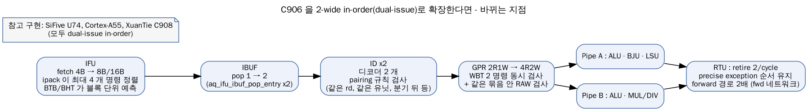
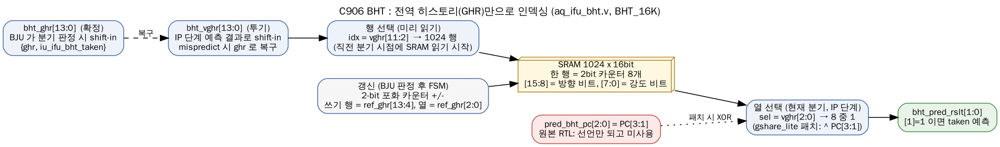
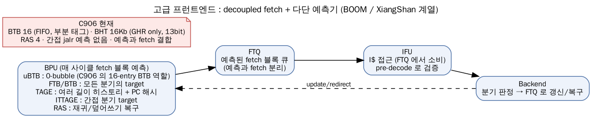

# 부록 B: C906 을 넘어서 — 고급 마이크로아키텍처 참고 자료

> 💡 각 주제를 **① C906 의 현재(RTL 근거 + 유닛 테스트 실측) → ② 고급 기법 → ③ C906 에 적용한다면 어디를 고치나 → ④ 참고 구현/문헌** 순서로 정리했다. 실험할 수 있는 것은 `smart_run/study/unit_tests` 의 테스트와 `PATCH=` 기능으로 직접 측정할 수 있게 했다.

---

## 1. Dual-issue in-order (2-wide superscalar)

### ① C906 의 현재

| 지점 | 현재 폭 | 근거 |
|-----|--------|-----|
| fetch | 4B/cycle (32bit 1 개 or 16bit 2 개) | `aq_ifu_pcgen.v` `pcgen_ifpc_inc = pc[63:2] + 4` |
| IBUF → ID | 1 명령/cycle | `aq_ifu_ibuf.v` (pop entry 2 개는 출력 레지스터) |
| 디코드 / dispatch | 1 | `aq_idu_id_decd.v`, EX1 래치 1 개 |
| GPR | 읽기 3 (src0~2) / 쓰기 2 (wb0 rbus, wb1 LSU) | `aq_idu_id_gpr.v`, `aq_rtu_wb.v` |
| retire | 1/cycle | `aq_rtu_retire.v` |

실측: hazard 없는 직선 코드도 IPC 상한은 1.0 이다(`p3_be01` MARK 1: 32 명령 35 cycle — 3 은 측정 오버헤드).

### ② 기법



같은 사이클에 두 명령을 내보내되, **두 명령 사이에 의존성/자원 충돌이 없을 때만** 짝을 지어(pairing) 보낸다. in-order 를 유지하므로 rename/ROB 는 필요 없다.

전형적인 pairing 규칙 (U74/A55 류):

| 규칙 | 이유 |
|-----|-----|
| 둘째 명령이 첫째의 결과를 쓰면 짝 불가 (단 ALU→ALU cascade 를 허용하는 설계도 있음) | 같은 사이클 RAW |
| load/store 는 한 사이클에 1 개 | LSU 포트 1 |
| MUL/DIV/CSR/fence/AMO 는 단독 | 유닛 1 개, 직렬화 |
| 분기는 둘째 슬롯에만 (또는 분기 뒤 명령은 다음 사이클) | redirect 처리 단순화 |
| 같은 rd 를 쓰는 두 명령 짝 불가 | WAW, write-back 순서 |

### ③ C906 에 적용한다면

| 모듈 | 변경 |
|-----|-----|
| `aq_ifu_pcgen.v`, `aq_ifu_icache*.v` | fetch 8B 이상 (데이터 SRAM 폭 2 배 또는 2 뱅크) |
| `aq_ifu_ipack.v`, `aq_ifu_pre_decd.v` | 한 fetch 블록의 최대 4 개 halfword 정렬, 블록 안의 여러 분기 pre-decode |
| `aq_ifu_ibuf.v` | pop 2, 엔트리 증설 |
| `aq_idu_id_decd.v` × 2 + 새 pairing 로직 | 두 번째 디코더, 짝 판정 |
| `aq_idu_id_gpr.v` | 읽기 포트 4~6, 쓰기 포트 2~3 |
| `aq_idu_id_wbt.v`, `aq_idu_id_ctrl.v` | 두 명령 동시 hazard 검사 + 짝 내부 검사, EX1 래치 2 개 |
| `aq_iu_top.v` | ALU 2 개 (pipe A: ALU/BJU/LSU, pipe B: ALU/MUL) |
| `aq_rtu_*.v` | retire 2/cycle, 예외 시 짝 중 어느 쪽까지 반영할지, forward 경로 2 배 |
| `aq_iu_bju.v` (IU PC 생성기) | 두 명령의 PC 를 함께 계산 |

> 💡 비용의 핵심은 **forward 네트워크**다. 생산자 수(EX1 ALU×2, EX2 load, EX3 mul, RTU fwd) × 소비자 수(2 명령 × 3 피연산자)만큼 MUX 입력이 늘어 EX1 타이밍을 압박한다.

**실험 아이디어**: `p3_be01` 의 alu_indep(독립 ALU 쌍) 을 기준으로, dual-issue 라면 32 명령 → 약 16 cycle 이 되어야 한다. 실제 코드에서 짝을 지을 수 있는 비율은 pipeview 의 명령열을 위 규칙으로 세어 추정할 수 있다.

### ④ 참고

- SiFive U74 (RV64GC, dual-issue in-order, 8 단), Arm Cortex-A55, XuanTie **C908** (C906 후속, dual-issue, RVV 1.0)
- Hennessy & Patterson, *Computer Architecture: A Quantitative Approach* 3 장 / Shen & Lipasti, *Modern Processor Design* 4 장

---

## 2. 분기 예측 개선

### ① C906 의 현재 — 측정으로 드러난 약점

| 약점 | 실측 | 근거 |
|-----|-----|-----|
| BHT 가 GHR 만 사용 → 파괴적 앨리어싱 | 같은 히스토리의 A(T)/B(N): mispredict **182** vs 대조군 20 (`p2_fe03`) | `aq_ifu_bht.v:253,305` |
| 히스토리 포화 전 warm-up | 루프 진입마다 약 14 회 mispredict (`p2_fe02`) | 매 반복 다른 GHR → 다른 카운터 |
| BTB 16 entry | taken 34 개 루프에서 매번 IP redirect (`p2_fe03` MARK 3/4: 약 13,600 cycle) | `aq_ifu_btb.v` ENTRY_NUM=16 |
| 간접 분기 예측 없음 | 함수 포인터 호출 +약 3 cycle/회 (`p2_fe04` 238 → 332) | `aq_iu_bju.v:649` |
| RAS 4 entry, 포인터만 복구 | 깊이 4 에서 wrong-path push 로 1 회 mispredict | `aq_ifu_ras.v:208` |
| BTB miss 인 taken 분기 | 2 cycle bubble (`p2_fe02` cfg2) | IP 단계 redirect |

### ② 실험 — 남겨진 PC 포트로 "gshare-lite" 만들기

C906 BHT 에는 쓰이지 않는 PC 입력이 있다. 예측 시점의 `pred_bht_pc[2:0]`(= 분기 PC[3:1])는 **8 개 카운터 중 하나를 고르는 3bit** 와 폭이 정확히 같다. 행(row)은 이전 분기 시점에 미리 읽어야 하므로 PC 를 넣을 수 없지만, 열(column) 선택은 현재 분기가 IP 에 왔을 때 하므로 PC 를 넣을 수 있다.

`patches/gshare_lite/aq_ifu_bht.v` (원본 대비 변경 3 곳):

```verilog
// 예측 : 열 선택에 PC[3:1] XOR
assign bht_sel_way[7:0] = 8'b1 << (bht_vghr[2:0] ^ pred_bht_pc[2:0]);
// 갱신 : 같은 해시. 갱신할 분기의 PC 를 ref_vghr 과 같은 시점에 래치
always @ (posedge bht_clk or negedge cpurst_b)
  if(!cpurst_b)                                   bht_ref_pc[2:0] <= 3'b0;
  else if(iu_ifu_bht_mispred || bht_upd_write)    bht_ref_pc[2:0] <= iu_ifu_bht_cur_pc[3:1];
assign bht_upd_idx[2:0] = bht_ref_vghr[2:0] ^ bht_ref_pc[2:0];
```

```bash
cd smart_run/study/unit_tests
make run T=p2_fe03_bp_ghr                      # 원본
make run T=p2_fe03_bp_ghr PATCH=gshare_lite    # 패치 RTL 로 자동 재빌드 후 실행
```

| `p2_fe03_bp_ghr` (128 회) | 원본 (GHR only) | gshare_lite (+PC[3:1]) |
|---|---:|---:|
| 교대 T,N | 18 | 18 |
| 주기 3 | 30 | 30 |
| **앨리어싱 A(T)/B(N)** | **182** | **60** |
| 대조군 | 20 | 32 |



해석:

- PC 비트가 다른 분기는 같은 히스토리여도 다른 카운터를 쓰게 되어 **파괴적 앨리어싱이 1/3 로** 줄었다.
- 대신 (히스토리, PC) 조합이 늘어나 **학습할 엔트리가 많아지고 warm-up 이 길어졌다**(20 → 32). 테이블 크기가 같으면 앨리어싱과 용량 경쟁은 늘 trade-off 다.
- 3bit 로는 부족하다. 처음 실험에서 B 를 4B 정렬 주소에 두었더니, PC[3:1] 이 같은 filler 분기(4B 정렬 분기의 PC[1] 은 항상 0 → 4 가지 값뿐)와 다시 충돌해 개선이 없었다. 테스트는 B 를 2B 어긋난 주소에 두어 분리를 보장한다.

### ③ 더 나아가려면



| 기법 | 핵심 아이디어 | C906 에서 바꿀 곳 |
|-----|-------------|----------------|
| **fetch-block PC 로 인덱싱** | 미리 읽기 시점에 이미 알려진 "fetch 블록 주소"를 행 인덱스 해시에 넣는다 | `aq_ifu_bht.v` 의 `bht_idx` 에 `pcgen_pred_ifpc` 일부 XOR, 갱신 쪽도 같은 블록 PC 를 IU 까지 전달 |
| tournament (bimodal + global) | PC 인덱스 bimodal 과 GHR 예측을 고르는 chooser | BHT 옆에 PC 인덱스 테이블 + chooser |
| **TAGE** | 길이가 기하급수적으로 다른 여러 히스토리 + 부분 태그 + useful 비트. 가장 긴 히스토리의 hit 를 사용 | 예측기를 통째로 교체. 미리 읽기 파이프라인과 맞추는 것이 관건 |
| perceptron | 히스토리 비트별 가중치 합 | 덧셈 트리가 길어 저전력 코어엔 부담 |
| loop predictor | 반복 횟수를 세어 루프 탈출 분기를 맞춤 | `p2_fe02` 의 탈출 mispredict 와 warm-up 개선 |
| 큰 BTB / FTB, uBTB + 2 단 BTB | 모든 taken 분기의 target, 블록 단위 | `aq_ifu_btb.v` 엔트리/연관도/태그 폭 |
| **ITTAGE / 간접 BTB** | jalr target 을 히스토리와 함께 예측 | `aq_iu_bju.v:649` 의 "항상 redirect" 대신 예측 target 과 비교 |
| RAS 복구 강화 | mispredict 때 덮어쓴 엔트리 내용까지 복구(체크포인트), 또는 linked-list RAS | `aq_ifu_ras.v` 에 "push 로 덮어쓴 값" 저장 |
| decoupled front-end (FTQ) | 예측기가 fetch 보다 앞서 달리며 블록 주소를 큐에 쌓음 | IFU 구조 변경 (BOOM, XiangShan 방식) |

### ④ 참고

- S. McFarling, "Combining Branch Predictors", DEC WRL TN-36, 1993 (gshare/tournament)
- A. Seznec, P. Michaud, "A case for (partially) TAgged GEometric history length branch prediction", JILP 2006 (TAGE) / ITTAGE
- D. Jiménez, C. Lin, "Dynamic Branch Prediction with Perceptrons", HPCA 2001
- K. Skadron et al., "Improving Prediction for Procedure Returns with Return-Address-Stack Repair Mechanisms", MICRO 1998
- BOOM 문서 (Frontend/BPD), XiangShan 문서 (BPU: uFTB/FTB/TAGE-SC/ITTAGE/RAS)

---

## 3. Macro-op fusion

### ① 현재
C906 IDU 는 반대 방향인 **split**(한 명령 → 여러 micro-op, `aq_idu_id_split.v`)만 한다. 자주 붙어 다니는 명령 쌍을 하나로 합치는 fusion 은 없다.

### ② 기법 — RISC-V 에서 흔한 융합 후보

| 쌍 | 의미 | 효과 |
|---|-----|-----|
| lui rd, hi ; addi rd, rd, lo | 32bit 상수 | 1 op |
| auipc ra, hi ; jalr ra, lo(ra) | 먼 호출 (`call`) | 1 op, 예측도 쉬워짐 |
| slli rd, rs, 32 ; srli rd, rd, 32 | zero-extend (Zba 없을 때) | 1 op |
| add rd, rs1, rs2 ; ld rd, 0(rd) | 인덱스 load | 1 op (주소 계산 융합) |
| mulh ; mul (같은 피연산자) | 128bit 곱 | 곱셈기 1 회 |

### ③ C906 에 적용한다면
IBUF 에서 두 엔트리를 동시에 보고(`aq_ifu_ibuf.v` pop 2), 디코더가 쌍을 인식해 하나의 EX1 명령으로 보낸다. retire 는 두 명령으로 세야 한다(minstret, 예외 시 mepc). single-issue 여도 융합 쌍에 대해 IPC > 1 이 가능하다.

### ④ 참고
- C. Celio et al., "The Renewed Case for the Reduced Instruction Set Computer: Avoiding ISA Bloat with Macro-Op Fusion for RISC-V", 2016

---

## 4. 메모리 쪽 개선

| 주제 | C906 현재 (실측) | 개선 방향 | 고칠 곳 |
|-----|----------------|---------|--------|
| store→load forward 범위 | 같은 크기만, `sd A; lw A+4` 는 +2 cycle (`p4_mem02`) | 포함 관계면 바이트 시프트해서 forward | `aq_lsu_stb.v` `dc_hit_stb_full/part` 판정, 데이터 정렬 |
| D$ miss latency 숨기기 | LFB 8 개(non-blocking), stride prefetch (`p4_mem01` — 이 SoC 모델에선 이득 없음) | stream/stride 테이블 강화, L2 + 더 먼 prefetch, BOP/SMS | `aq_lsu_pfb*.v` |
| VIPT 4-way 32KB 의 alias 처리 | HW 가 두 그룹을 찾음 (`dc_alias_hit`) | way 크기를 4KB 이하로(더 높은 연관도) 하면 alias 자체가 사라짐 | 구조 변경 |
| I$ way prediction | MHINT.IWPE 존재 | way 예측으로 SRAM 읽기 전력 절감 | `aq_ifu_icache.v` |
| PMP 권한을 uTLB 에 캐시 | PMP 변경 후 sfence.vma 필요 (`p5_sys03`) | PMP CSR 쓰기 시 HW 가 uTLB 무효화 | `aq_cp0_prtc_csr.v` → MMU |

실험: `p4_mem01` 은 `bus_delay` 레지스터로 메모리 지연을 바꿔 가며 측정할 수 있다(0/100). 실제 DRAM 에 가까운 지연(수십~수백 cycle)에서 prefetch/LFB 의 효과를 보려면 SoC 의 `axi_fifo` 지연 모델이 "줄 선 요청에 약 200 cycle 을 더하는" 특성을 먼저 고쳐야 한다(Phase 4 의 5 절).

---

## 5. ISA 확장 — 표준 비트 조작과 C906 의 XThead

C906 은 비준 전에 나온 코어라 표준 Zb* 대신 자체 확장(XThead)을 가진다. 디코더(`aq_idu_id_decd.v`)의 `x_inst[6:0] == 7'b0001011`(custom-0 opcode) 경로가 그것이다.

| 표준 (비준 2021~) | 용도 | C906 대응 (XThead, MXSTATUS.THEADISAEE=1) |
|-----|-----|-----|
| Zba (sh1add/sh2add/sh3add, add.uw …) | 주소 계산 | XTheadBa (th.addsl) |
| Zbb (clz/ctz/cpop, min/max, rev8, sext …) | 비트 조작 | XTheadBb (th.ff1, th.rev, th.ext/extu …) |
| Zbs (bset/bclr/binv/bext) | 단일 비트 | XTheadBs (th.tst) |
| Zicond (czero.eqz/nez) | 분기 없는 선택 | XTheadCondMov (th.mveqz/mvnez) |
| — | 인덱스/증가 주소 load/store | XTheadMemIdx (즉치값 MUX 의 `<< x_inst[26:25]` 경로) |
| Zicbom/Zicbop (캐시 관리) | | XTheadCmo (th.dcache.*) |

- 프로파일 RVA22/RVA23 은 Zba/Zbb/Zbs 등을 필수로 요구한다 → C906 같은 RV64GC + 벤더 확장 코어는 이 프로파일을 만족하지 못한다.
- C906 에 Zba/Zbb 를 넣는다면: 디코더 표 추가(opcode OP/OP-IMM/OP-32 의 funct7 조합) + `aq_iu_alu.v` 에 연산 추가. 유닛 테스트는 `-march=rv64gc_zba_zbb` 로 빌드해 결과를 EXPECT 로 확인할 수 있다.

---

## 6. 같은 계열의 큰 코어와 비교

| 항목 | C906 | C910 (OpenC910) | BOOM (SonicBOOM) | XiangShan (Nanhu/Kunminghu) |
|-----|-----|-----|-----|-----|
| 실행 방식 | in-order, single-issue | out-of-order, superscalar, 12 단 | out-of-order | out-of-order |
| 분기 예측 | BTB16 + GHR BHT + RAS4 | 다단 예측기 | TAGE-L 계열, FTQ | uFTB/FTB + TAGE-SC + ITTAGE + RAS, FTQ |
| 소스 | Verilog (생성됨) | Verilog | Chisel | Chisel |
| 학습 포인트 | 단순·명확, 전력 지향 | 상용 OoO 구조 | 연구용 OoO 표준 | 최신 고성능 프런트엔드 |

- Chen et al., "Xuantie-910: A Commercial Multi-Core 12-Stage Pipeline Out-of-Order 64-bit High Performance RISC-V Processor with Vector Extension", ISCA 2020
- OpenC910 의 IFU/IDU 를 C906 과 같은 유닛 테스트 방식(관찰 모듈 + 마이크로벤치마크)으로 비교해 보는 것을 다음 과제로 추천한다.

---

## 7. 이 환경으로 해 볼 수 있는 실험 목록

| 실험 | 방법 | 볼 것 |
|-----|-----|------|
| BHT 해시 | `patches/gshare_lite` 확장: 행 인덱스에 fetch-block PC 혼합 | `p2_fe02/03` mispredict, 앨리어싱 vs warm-up |
| BTB 크기 | `aq_ifu_btb.v` ENTRY_NUM 과 인스턴스 수 변경 (패치 디렉토리에 복사) | `p2_fe03` MARK 3/4 사이클 |
| RAS 깊이 / 복구 | `aq_ifu_ras.v` 엔트리 8 개 + 덮어쓴 값 저장 | `p2_fe04` depth 4~8 의 RAS mispredict |
| JALR 예측 | BJU 에서 "직전 target 재사용" 같은 단순 예측 추가 | `p2_fe04` MARK 12 |
| STB forward 확장 | 포함 관계 forward | `p4_mem02` MARK 3 (68 → 36 목표) |
| 메모리 지연 | `bus_delay` 값, axi_fifo 지연 모델 수정 | `p4_mem01` prefetch 효과 |

패치 방법: `unit_tests/patches/<이름>/` 에 수정한 RTL 파일(원본과 같은 파일 이름)을 두고 `make run T=<test> PATCH=<이름>` — Makefile 이 filelist 의 해당 파일을 바꿔 별도 빌드한다(`build/verilator_<이름>/`).
