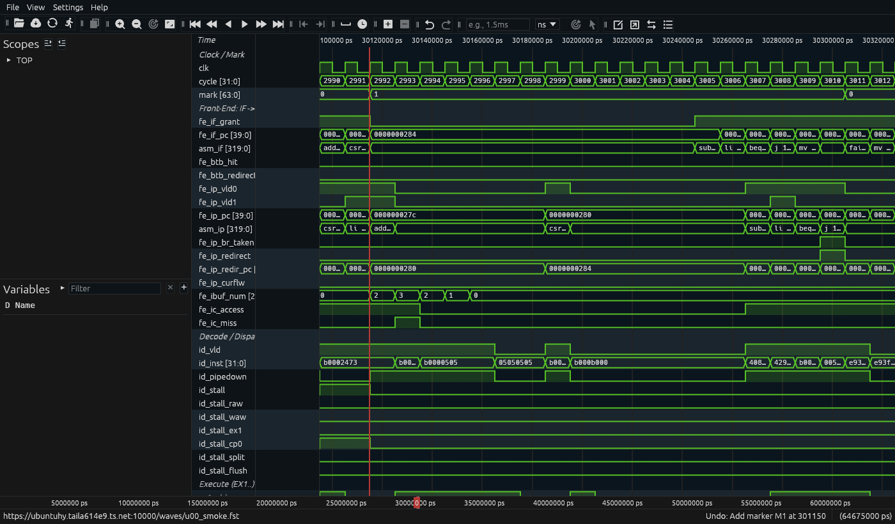

# Phase 1: Project Orientation & Simulation Basics

> **기간**: Week 1
> **목표**: OpenC906 프로젝트 구조를 이해하고, 첫 시뮬레이션을 성공적으로 실행한다.
> ⚠️ v2 정정: 스펙 표(D-Cache 4-way, FIFO 교체, BHT 16Kb GHR, V 없음, PA 40bit), 모듈 계층(CLINT/PLIC 는 CPU top 안), 학습용 유닛 테스트 환경(7 절, Verilator) 추가.

---

## 1. OpenC906 Architecture Overview

### 1.1 C906이란?

C906은 T-Head(Alibaba 산하 반도체 부문)에서 개발한 **64-bit RISC-V** CPU 코어이다.

**주요 스펙** (datasheet / UM / RTL `cpu_cfig.h` 와 유닛 테스트로 확인):

| Feature | Specification | 확인 |
|---------|--------------|------|
| ISA | RV64GC (= RV64IMAFDC_Zicsr_Zifencei) + XThead 확장 | misa 실측 0x8000_0000_0094_112D = ACDFIMSUX |
| Vector | **오픈 C906 은 V 비활성** (상용 C906 은 RVV 0.7.1 옵션) | `misa_vector = 1'b0` |
| Pipeline | single-issue, in-order. 매뉴얼 5 단 / RTL 기준 IF → I$ → IP → ID → EX1 → EX2(RT) (+EX3 MUL) | Phase 2 |
| I-Cache | 32KB, 2-way, 64B line, **FIFO**, VIPT | tag SRAM 의 fifo 비트 |
| D-Cache | 32KB, **4-way**, 64B line, write-back, **FIFO**, VIPT | `aq_dcache_tag_array.v`, `p4_mem01` |
| 분기 예측 | BTB 16-entry + BHT 16Kb(**전역 히스토리만**) + RAS 4-entry | Phase 2 |
| MMU | Sv39, uTLB 10(I/D 각각) + jTLB 128 4-way, HW PTW, **PA 40bit** | `cpu_cfig.h` PA_WIDTH |
| FPU | 단/배정밀도 (+반정밀도), IEEE 754-2008 | Phase 6 |
| PMP | 8 entry, 최소 4KB, NA4 미지원 | Phase 5 |
| 인터럽트 | CLINT + PLIC(240 소스, 32 우선순위) | Phase 5 |
| Debug | RISC-V Debug 0.13.2 | Phase 7 |
| Privilege | M/S/U | Phase 5 |
| 버스 | AXI4 128bit master | Phase 4 |
| 표준 버전 | User ISA 2.2, Privileged 1.10 | 부록 A |

### 1.2 Block Diagram

```
┌─────────────────────────────────────────────────────┐
│                    OpenC906 Core                     │
│                                                     │
│  ┌──────┐  ┌──────┐  ┌──────┐  ┌──────┐  ┌──────┐ │
│  │ IFU  │→│ IDU  │→│  IU  │→│ RTU  │→│ CP0  │ │
│  │Fetch │  │Decode│  │Exec  │  │Retire│  │System│ │
│  └──┬───┘  └──────┘  └──┬───┘  └──────┘  └──────┘ │
│     │                    │                           │
│  ┌──┴───┐            ┌──┴───┐                       │
│  │ICache│            │ LSU  │                        │
│  └──┬───┘            └──┬───┘                        │
│     │                 ┌──┴───┐                       │
│     │                 │DCache│                        │
│     │                 └──┬───┘                        │
│  ┌──┴─────────────────┬──┴───┐                       │
│  │        MMU (TLB)          │                        │
│  └──────────┬────────────────┘                        │
│          ┌──┴───┐                                    │
│          │ BIU  │← AXI Master                        │
│          └──────┘                                    │
└─────────────────────────────────────────────────────┘
```

---

## 2. Project Directory Structure

### 2.1 Top-Level Structure

```
openc906/
├── C906_RTL_FACTORY/
│   ├── gen_rtl/          # CPU RTL 소스 (253 Verilog files)
│   │   ├── ifu/          # Instruction Fetch Unit
│   │   ├── idu/          # Instruction Decode Unit
│   │   ├── iu/           # Integer Unit
│   │   ├── lsu/          # Load/Store Unit
│   │   ├── mmu/          # Memory Management Unit
│   │   ├── rtu/          # Retire Unit
│   │   ├── cp0/          # System Control (CSRs)
│   │   ├── biu/          # Bus Interface Unit
│   │   ├── pmp/          # Physical Memory Protection
│   │   ├── pmu/          # Performance Monitoring
│   │   ├── dtu/          # Debug Transfer Unit
│   │   ├── tdt/          # RISC-V Debug Transport
│   │   ├── clint/        # Core Local Interrupt Timer
│   │   ├── plic/         # Platform Interrupt Controller
│   │   ├── vfalu/        # FP Add/Sub/Convert
│   │   ├── vfmau/        # FP Multiply-Accumulate
│   │   ├── vfdsu/        # FP Divide/Sqrt
│   │   ├── vidu/         # Vector/FP Decode
│   │   ├── vdsp/         # Vector DSP
│   │   ├── cpu/          # Top-level wrappers
│   │   ├── clk/          # Clock
│   │   ├── rst/          # Reset
│   │   ├── fpga/         # FPGA SRAM models
│   │   └── common/       # Shared utilities
│   └── setup/
│       └── setup.csh     # CODE_BASE_PATH 설정
│
├── smart_run/            # 시뮬레이션 환경
│   ├── Makefile          # 메인 빌드 스크립트
│   ├── setup/            # 환경 설정
│   ├── logical/          # SoC 데모 + 테스트벤치
│   │   ├── tb/tb.v       # 최상위 테스트벤치
│   │   ├── common/soc.v  # SoC Top
│   │   ├── axi/          # AXI 인터커넥트
│   │   ├── ahb/          # AHB 브릿지
│   │   ├── apb/          # APB 페리페럴 버스
│   │   ├── uart/         # UART 컨트롤러
│   │   ├── gpio/         # GPIO
│   │   └── mem/          # 메모리 컨트롤러
│   ├── tests/            # 테스트 케이스
│   └── work/             # 빌드 출력 디렉토리
│
└── doc/                  # 문서
    ├── openc906 datasheet.pdf
    ├── 玄铁C906用户手册.pdf
    └── 玄铁C906集成手册.pdf
```

### 2.2 Module Hierarchy (Top-Down)

```
tb (smart_run/logical/tb/tb.v)
└── x_soc (soc)
    ├── x_cpu_sub_system_axi
    │   └── x_c906_wrapper
    │       └── x_cpu_top (openC906)                ← CPU 최상위 (gen_rtl/cpu/rtl/openC906.v)
    │           ├── x_aq_top_0 (aq_top)
    │           │   ├── x_aq_core (aq_core)
    │           │   │   ├── x_aq_ifu_top   ← Instruction Fetch (+BTB/BHT/RAS)
    │           │   │   ├── x_aq_idu_top   ← Decode / Dispatch (WBT)
    │           │   │   ├── x_aq_iu_top    ← ALU / BJU / MUL / DIV
    │           │   │   ├── x_aq_lsu_top   ← Load/Store, D-Cache
    │           │   │   ├── x_aq_cp0_top   ← CSR, trap
    │           │   │   ├── x_aq_rtu_top   ← Retire / Write-back
    │           │   │   ├── x_aq_vidu_top  ← FP(/Vector) decode
    │           │   │   └── x_aq_vpu_top   ← FPU: falu, fcnvt, fspu, fdsu, vfmau, vlsu
    │           │   ├── x_aq_mmu_top       ← uTLB/jTLB/PTW
    │           │   ├── x_aq_pmp_top       ← PMP
    │           │   ├── x_aq_dtu_top       ← Debug (core 쪽)
    │           │   ├── x_aq_hpcp_top      ← 성능 카운터
    │           │   └── x_aq_cpuio_top
    │           ├── x_aq_biu_top           ← AXI master
    │           ├── x_aq_mp_clk_top / x_aq_mp_rst_top / x_aq_sysio_top
    │           ├── x_tdt_top              ← Debug Module (DM/DTM)
    │           ├── x_clint_top            ← CLINT (CPU top 안!)
    │           └── x_plic_top             ← PLIC  (CPU top 안!)
    ├── x_axi_fifo                         ← 메모리 지연 모델 (Phase 4 의 5 절)
    ├── axi interconnect / axi_slave128    ← SRAM (f_spsram_524288x128 x 2)
    ├── x_ahb / x_apb                      ← UART, GPIO, timer, bus_delay 레지스터
    └── x_mem_ctrl, x_err_gen
```

---

## 3. Simulation Environment

### 3.1 Environment Setup

```bash
# 1. 환경 변수 설정
cd openc906/smart_run
source ./setup/setup.sh

# 확인할 환경 변수:
# CODE_BASE_PATH  → C906_RTL_FACTORY 경로
# TOOL_EXTENSION  → RISC-V GCC 도구 경로
```

### 3.2 Build Flow

시뮬레이션은 2단계로 구성된다:

```
[Step 1: RTL Compile]
  Verilog Sources (.v) → iverilog → xuantie_core.vvp (시뮬레이터 바이너리)

[Step 2: Test Case Build & Run]
  Assembly (.s) → GCC → ELF → objcopy → HEX → Srec2vmem → .pat (메모리 이미지)
  vvp xuantie_core.vvp → 시뮬레이션 실행 → run_case.report (PASS/FAIL)
```

#### Makefile 주요 타겟

| Command | Description |
|---------|-------------|
| `make compile SIM=iverilog` | RTL 컴파일 (vvp 생성) |
| `make showcase` | 사용 가능한 테스트 케이스 목록 |
| `make buildcase CASE=xxx` | 테스트 케이스만 빌드 |
| `make runcase CASE=xxx SIM=iverilog` | 컴파일 + 빌드 + 시뮬레이션 실행 |
| `make runcase CASE=xxx DUMP=on` | 파형 덤프 포함 실행 |
| `make regress` | 전체 테스트 실행 |
| `make clean` | work 디렉토리 정리 |

### 3.3 Available Test Cases

| Case | Type | Description |
|------|------|-------------|
| `ISA_INT` | Assembly | 정수 연산 명령어 테스트 |
| `ISA_LS` | Assembly | Load/Store 명령어 테스트 |
| `ISA_FP` | Assembly | 부동소수점 명령어 테스트 |
| `ISA_THEAD` | Assembly | T-Head 커스텀 ISA 확장 |
| `coremark` | C | CoreMark 벤치마크 |
| `MMU` | Assembly | MMU 페이지 테이블 테스트 |
| `interrupt` | Assembly | PLIC 인터럽트 테스트 |
| `exception` | Assembly | 예외 처리 테스트 |
| `debug` | Assembly+V | JTAG 디버그 테스트 |
| `csr` | Assembly | CSR 레지스터 조작 테스트 |
| `cache` | Assembly | I/D Cache 동작 테스트 |

---

## 4. First Simulation: Step by Step

### 4.1 RTL 컴파일

```bash
cd openc906/smart_run
source ./setup/setup.sh
make compile SIM=iverilog
```

성공 시 `work/xuantie_core.vvp` 파일이 생성된다 (약 56MB).

### 4.2 테스트 실행

```bash
make runcase CASE=ISA_INT SIM=iverilog DUMP=on
```

### 4.3 결과 확인

```bash
# PASS/FAIL 확인
cat work/run_case.report

# 파형 보기
gtkwave work/test.vcd &
```

### 4.4 GTKWave에서 관찰할 주요 신호

| Signal Path | Description |
|-------------|-------------|
| `tb.clk` | System clock (10ns period) |
| `tb.rst_b` | Active-low reset |
| `tb.x_soc.x_cpu_sub_system_axi...core0_pad_retire` | Instruction retire (1=retired) |
| `tb.x_soc.x_cpu_sub_system_axi...core0_pad_retire_pc` | Retired instruction PC |
| `tb.x_soc.biu_pad_awaddr` | AXI write address |
| `tb.x_soc.biu_pad_araddr` | AXI read address |

---

## 5. Testbench Deep Dive

### 5.1 tb.v 핵심 구조

```verilog
module tb();
  // 1. Clock Generation
  reg clk;
  initial begin
    clk = 0;
    forever #5 clk = ~clk;  // 10ns period = 100MHz
  end

  // 2. Reset Sequence
  reg rst_b;
  initial begin
    rst_b = 1;
    #100 rst_b = 0;   // Assert reset
    #100 rst_b = 1;   // Release reset
  end

  // 3. Memory Initialization
  initial begin
    $readmemh("inst.pat", mem_inst_temp);  // 명령어 로드
    $readmemh("data.pat", mem_data_temp);  // 데이터 로드
    // → SRAM에 byte 단위로 분배
  end

  // 4. PASS/FAIL Detection
  always @(posedge clk) begin
    if (value0 == 64'h444333222)    // Magic value → PASS
      $display("simulation finished successfully");
    if (value0 == 64'h2382348720)   // Magic value → FAIL
      $display("simulation finished with error");
  end

  // 5. Timeout Watchdog
  initial begin
    #700000000;  // 700ms timeout
    $display("meeting max simulation time, stop!");
    $finish;
  end

  // 6. Livelock Detection
  always @(posedge clk) begin
    // 50000 cycle 동안 retire 없으면 FAIL
    if ((cycle_count % 50000 == 0) && retire_inst_in_period == 0)
      $finish;
  end

  // 7. SoC Instantiation
  soc x_soc(
    .i_pad_clk(clk),
    .i_pad_rst_b(rst_b),
    ...
  );
endmodule
```

### 5.2 PASS/FAIL 메커니즘

테스트 프로그램은 종료 시 특정 magic value를 레지스터에 기록한다:

```
PASS: Write-back 값이 0x444333222 → TEST PASS
FAIL: Write-back 값이 0x2382348720 → TEST FAIL
Timeout: 700ms 초과 → TEST FAIL
Livelock: 50000 cycle 동안 retire 없음 → TEST FAIL
```

### 5.3 Memory Map

```
tb.v 의 적재 (5.1 의 initial 블록)
  inst.pat → 0x0000_0000 부터 256KB  (.text/.rodata, linker.lcf 의 MEM1)
  data.pat → 0x0004_0000 부터 256KB  (.data/.bss,  linker.lcf 의 MEM2)
SoC 주소
  0x0000_0000 ~        : SRAM (f_spsram_524288x128 x 2 = 8MB x 2)
  0x1001_5000          : UART (APB)          0x1001_A000 : bus_delay 레지스터 (APB)
  0x40_0000_0000       : PLIC   (pad_cpu_apb_base)
  0x40_0400_0000       : CLINT  (base + 0x400_0000)
```

테스트 프로그램의 `printf`는 UART 주소(0x10015000)에 write 하는 방식이고, 테스트벤치가 0x10015000 으로의 AXI write 를 감지해 `$write`로 콘솔에 출력한다.

> ⚠️ 0x1001_5000 은 sysmap 상 cacheable 구간이라, D-Cache 가 켜진 상태의 `sw` 는 캐시에만 머물고 AXI 로 나가지 않는다(Phase 4 의 3.4 절). 유닛 테스트 환경은 그래서 다른 콘솔 채널을 쓴다(7 절).

---

## 6. Lab Exercises

### Lab 1.1: 첫 시뮬레이션
- [ ] `make compile SIM=iverilog` 실행하여 RTL 컴파일
- [ ] `make runcase CASE=ISA_INT SIM=iverilog` 실행하여 PASS 확인
- [ ] `work/run_case.report`에서 `TEST PASS` 확인

### Lab 1.2: 파형 관찰
- [ ] `DUMP=on`으로 재실행
- [ ] gtkwave에서 `test.vcd` 열기
- [ ] `clk`, `rst_b` 신호 추가하여 clock/reset 동작 확인
- [ ] `core0_pad_retire` 신호를 찾아 instruction retirement 관찰
- [ ] `retire_pc`를 추가하여 실행 중인 PC 값 추적

### Lab 1.3: 테스트 케이스 분석
- [ ] `tests/cases/ISA/ISA_INT/C906_INT_SMOKE.s` 읽기
- [ ] 어셈블리 코드가 어떤 명령어를 테스트하는지 파악
- [ ] PASS 판정을 위한 magic value가 어디에서 기록되는지 찾기

### Lab 1.4: 다른 테스트 케이스 실행
- [ ] `make showcase`로 전체 테스트 목록 확인
- [ ] `ISA_LS`, `ISA_FP` 등 다른 케이스 실행
- [ ] 각 테스트의 시뮬레이션 시간 비교

---

---

## 7. 학습용 유닛 테스트 환경 (smart_run/study/unit_tests)

smart_run 의 기본 흐름(iverilog)은 이 설계에서 **초당 약 10 cycle** 로 돌고 초기화에만 약 3 분이 걸린다(실측). 단계별 동작을 사이클 단위로 공부하기 위해 Verilator 기반의 별도 환경을 만들었다. 원본 tb.v 와 RTL 은 수정하지 않는다.

### 7.1 구성

```
smart_run/study/unit_tests/
├── Makefile              # make sim / run / all / wave / web
├── common/
│   ├── crt0.S            # 최소 startup: 캐시/예측기 초기화, HPM 이벤트 설정, PMP entry7=전체 허용
│   ├── lib.S             # 콘솔 출력 (putc/puts/putdec/report)
│   ├── study.h           # MARK/TIC/TOC/REPORT 매크로, C906 확장 CSR 비트
│   └── linker.ld
├── tb/
│   ├── study_probe.v     # 관찰 모듈: 단계별 신호 재명명 + 디스어셈블리 ASCII + trace 로그
│   ├── study_tbdev.v     # TB 장치: SoC 외부 인터럽트 선 구동 (store 로 제어, Phase 5 6 절)
│   ├── soc_overlay/      # SoC 파일 학습용 사본 (cpu_sub_system_axi.v: 외부 인터럽트 입력 추가, 원본과 한 줄 차이)
│   └── sim_top.v         # Verilator 용 래퍼 (tb + study_probe + study_tbdev)
├── tests/                # 테스트 19 개, 폴더 하나에 하나: tests/<test>/<test>.S
│   └── p5_sys06_wfi_flag/ #   <test>.S + 실행 후 복사되는 <test>.objdump, console.log (git 에 함께 올라감)
├── tools/                # mk_asm_rom / mk_gtkw / pipeview / vcd_query / wave_snap / collect_results / wave_web
├── web/                  # 브라우저 파형 뷰어 (테스트 목록 index.html + Surfer WASM)
└── patches/gshare_lite/  # 실험용 RTL 패치 (부록 B)
```

### 7.2 사용법

```bash
cd smart_run/study/unit_tests
make sim                        # Verilator 빌드 (최초 1 회, 약 3~4 분)
make list                       # 테스트 목록
make run T=p2_fe02_bp_loop      # 빌드 + 실행 (약 1 초) + 결과 출력
make all                        # 전체 실행 → out/RESULTS.md
make wave T=p2_fe02_bp_loop     # GTKWave (그룹/형식이 설정된 세이브 파일)
make web                        # 브라우저 파형 뷰어 시작 (7.3 절, make web-stop 으로 중지)
make run T=p2_fe03_bp_ghr PATCH=gshare_lite   # RTL 패치로 다시 빌드해서 실행
make run T=... SIM=iverilog     # 원본과 같은 시뮬레이터 (매우 느림)
```

출력 (`out/<test>/`). 이 중 `<test>.objdump` 와 `console.log` 는 `tests/<test>/` 의 소스 옆에도 복사된다 (기본 Verilator 빌드만. `PATCH=`/`FULL=`/`SIM=iverilog` 결과는 `out/` 에만):

| 파일 | 내용 |
|-----|-----|
| `console.log` | 프로그램 출력, `@@ 이름 = 값` 측정 결과 |
| `<test>.vcd` | study_probe 신호 덤프 (수 MB~수십 MB) |
| `<test>.gtkw` | GTKWave 세이브 파일 (테스트 헤더 `# GTKW:` 의 그룹) |
| `trace.log` | 사이클별 파이프라인 상태 (기계용) |
| `pipeview.txt` | 사람이 읽는 사이클 표 (IF/IP/IB/ID/EX1/RETIRE + 이벤트) |
| `<test>.objdump` | 디스어셈블리 |

### 7.3 브라우저에서 파형 보기 (`make web`)

GTKWave 는 이 머신의 화면이 있어야 쓸 수 있다. 태블릿이나 폰에서도 파형을 보려고, 브라우저 안에서 돌아가는 파형 뷰어 [Surfer](https://surfer-project.org)(Rust → WebAssembly)를 작은 웹 서버로 띄우고 Tailscale 로 연결했다.

```bash
make web        # 서버 시작 + tailscale serve → https://<호스트>.<tailnet>.ts.net:10000/ (tailnet 전용)
make web-stop   # 중지
```



| 단계 | 하는 일 |
|-----|-----|
| 테스트 목록 (`web/index.html`) | `out/` 의 테스트를 카드로 보여 준다 (PASS 여부, 테스트 설명, 신호 그룹, source / pipeview / objdump / console 링크). 카드의 *MARK 구간* 을 펼치면 테스트 소스 머리 주석의 `MARK n : 설명` 목록이 나오고, `M2` 같은 링크로 그 구간을 바로 연다 |
| VCD → FST | 요청이 오면 `vcd2fst` 로 바꿔 VCD 옆에 캐시한다. 47MB VCD 가 약 0.6MB 가 되어 폰에서도 바로 열린다. VCD 가 더 새로우면 다시 만든다 |
| gtkw → Surfer 명령 | 같은 `<test>.gtkw` 를 Surfer 명령 파일로 바꿔 처음 띄울 신호를 넣는다. 그룹 → divider, `@24`/`@28`/`@800` → Unsigned / Binary / ASCII (`asm_*` 명령어 글자도 그대로 보인다) |
| MARK 마커 | VCD 의 `mark` 신호 변화로 MARK 마다 마커 `M1`, `M2` ... 를 찍고, MARK 1 앞 32 사이클로 확대해서 연다. 그 구간 안에 trap(`rt_expt`)이 있으면 첫 trap(인터럽트 `rt_expt_int` 가 있으면 그것)의 앞 44 ~ 뒤 20 사이클로 연다. 테스트 헤더에 `# ZOOM: mark` 가 있으면 trap 대신 MARK 구간 전체로 연다(`p5_sys06_wfi_flag`: 잠듦 → 깸 → 핸들러 → 탈출). 다른 구간은 카드의 MARK 링크(`/cmds/<test>/m<n>.sucl`)나 명령 팔레트(Space)의 `goto_marker M2` |

- 신호 추가는 왼쪽 Scopes 에서 `study_probe` → Variables 에서 클릭. 형식 변경은 신호 이름 우클릭 → Format (32 bit 명령어는 `RV64` 로 디코딩도 된다).
- 시뮬레이션을 다시 돌리면 브라우저 새로고침만 하면 된다.
- 서버(`tools/wave_web.py`)는 127.0.0.1:18906 에만 열리고, 밖에서는 `tailscale serve --https=10000` 으로 tailnet 안에서만 들어온다(Funnel 아님). 재부팅 후에는 `make web` 을 다시 실행한다.
- Surfer 웹 빌드는 처음 실행할 때 `web/surfer/` 로 받는다 (Surfer GitLab main 브랜치의 CI 산출물, 갱신은 `tools/wave_web.py fetch`).

> ⚠️ **겪은 문제 — 신호 57 개를 넣는 데 56 초**: Surfer 의 `variable_add` 는 신호를 하나씩 읽고, 넣을 때마다 화면을 다시 그린다. 전체 구간(수만 사이클)을 보는 상태에서는 다시 그리는 비용이 신호 수에 비례해 커졌다. 먼저 `zoom_to 0ns 100ns` 로 좁혀 놓고 신호를 넣은 뒤 마지막에 원하는 구간으로 확대하게 바꿔 약 10 초가 되었다(헤드리스 Chromium + 소프트웨어 렌더링 측정).

### 7.4 study_probe — 무엇을 보여 주나

| 그룹 | 신호 예 |
|-----|--------|
| core | `clk`, `cycle`, `mark` (x31 값 = 테스트가 표시한 구간 번호) |
| fe | `fe_if_pc`, `asm_if`, `fe_btb_redirect`, `fe_ip_pc`, `asm_ip`, `fe_ip_redirect`, `fe_ibuf_num`, `fe_ic_miss` |
| bht / ras | `fe_bht_vghr`, `fe_bht_ghr`, `fe_bht_pred`, `fe_ras_push/pop`, `fe_ras_ptr`, `fe_ras_ptr_bju` |
| id | `id_vld`, `id_pipedown`, `id_stall`, `id_stall_raw/waw/ex1/cp0` |
| ex | `ex1_pc`, `asm_ex1`, `ex1_alu/bju/mul/div/lsu/cp0`, `iu_redirect`, `bju_*_mispred`, `fwd0~2` |
| lsu | `lsu_ag_va`, `lsu_dc_pa`, `lsu_dc_hit/miss`, `lsu_stb_fwd`, `lsu_stb_part` |
| rt | `rt_pc`, `asm_rt`, `wb0/wb1`, `rt_flush`, `rt_redirect`, `rt_expt` |
| cp0 | `cp0_priv`, `cp0_mstatus_*`, `cp0_mcause_*`, `cp0_mepc`, `cp0_mtval`, `cp0_scause_*` |
| irq | `irq_ext0`, `irq_age`, `plic_ip35`, `plic_mclaim/sclaim`, `plic_meip/seip`, `clint_msip/ssip`, `mip_*`, `mie_*`, `int_req`, `int_vec`, `rt_redirect_pc` (Phase 5 6 절) |
| wfi | `int_flag`(INT_FLAG_ADDR 로의 store 를 감지한 값), `wfi_state`(0 IDLE / 1 WAIT / 2 LPMD), `wfi_in_lpmd`, `wfi_wake`, `irq_ext0/1`, `plic_mclaim`, `mip_meip`, `int_req`, `asm_rt`, `rt_expt`, `cp0_mepc` (Phase 5 6.7 절) |
| trap | M 과 S 의 trap CSR 나란히: `cp0_mtvec`, `cp0_mepc`, `cp0_mcause_*`, `cp0_mstatus_*` / `cp0_stvec`, `cp0_sepc`, `cp0_scause_*`, `cp0_sstatus_*`, `cp0_mideleg` |
| bus | `bus_arvalid/arready/araddr/arlen`, `bus_rvalid/rlast`, `bus_aw*/w*/b*` |

`asm_*` 신호는 그 단계 PC 의 디스어셈블리를 40 글자 ASCII 로 넣은 것이다 — GTKWave 와 Surfer 웹 뷰어 모두 형식이 ASCII 로 설정되어 있어 파형에 명령어가 그대로 보인다.

#### PC 신호 세 개: `fe_if_pc` vs `rt_pc` vs `rt_redirect_pc`

세 신호는 파이프라인에서 보는 위치가 다르다. `fe_if_pc`는 맨 앞에서 "어디를 읽을지", `rt_pc`는 맨 끝에서 "무엇이 끝났는지", `rt_redirect_pc`는 retire 단계가 "어디서 다시 시작하라"고 앞단에 보내는 주소다.

| 신호 | RTL 원본 | 의미 | 값이 유효한 때 |
|---|---|---|---|
| `fe_if_pc` | `pcgen_fetch_pc` (IFU) | 이번 사이클에 I-Cache에서 읽으려는 주소 | 항상 무언가를 가리킨다. 예측에 따라 미리 가져오는 주소라 결국 실행되지 않을 수도 있다 |
| `rt_pc` | `rtu_pad_retire_pc` (RTU) | 이번 사이클에 retire(완료)한 명령의 PC | `rt_vld` = 1인 사이클만. 그 외에는 이전 값이 남아 있다 |
| `rt_redirect_pc` | `rtu_ifu_chgflw_pc` (RTU → IFU) | RTU가 IFU에게 "여기서부터 다시 fetch하라"고 주는 주소 | `rt_redirect` = 1인 사이클만. 그 외에는 의미 없는 값이 보인다 |

- **`fe_if_pc`: 앞단(투기적).** 실행 중인 명령보다 몇 단계(IF → IP → IBUF → ID → EX → RT) 앞서 있다. 분기 예측을 따라 미리 읽기 때문에 나중에 버려지는 잘못된 경로 주소도 나온다. 예: `p5_sys06` 개요 파형에서 코어가 wfi로 잠든 동안 `fe_if_pc`는 0x46c(루프 시작), `rt_pc`는 0x474(wfi)다. 앞단은 이미 다음 바퀴의 `lw`를 가져다 놓은 상태다.
- **`rt_pc`: 끝단(확정).** 실제로 실행이 끝나 결과가 반영된 명령이고, 프로그램 순서 그대로 나온다. 인터럽트도 여기에 붙는다. `rt_expt` = 1인 사이클의 `rt_pc`가 인터럽트를 실은 명령이고, mepc는 그 다음 PC가 된다(Phase 5 6.3 절).
- **`rt_redirect_pc`: retire 단계가 시작하는 흐름 변경.** trap 진입 시에는 벡터 주소(mtvec + 4×cause), `mret`/`sret`이면 mepc/sepc가 들어간다. fence.i처럼 파이프라인을 비우는 명령도 이 경로를 쓴다. 일반 분기 예측 실패 때 다시 fetch할 주소는 이 신호가 아니라 `iu_redirect_pc`(EX 단계의 BJU)다. redirect가 오면 앞단에서 가져오던 명령은 모두 버리고(flush) 이 주소부터 다시 fetch한다.

한 흐름에서 보면 다음과 같다(`p5_sys06_wfi_flag` MARK 1의 trap 진입, `out/p5_sys06_wfi_flag/trace.log`).

| cycle | `fe_if_pc` | `rt_pc` | `rt_redirect` / `_pc` | 일어난 일 |
|---|---|---|---|---|
| 3126 | 0x370 | **0x378** (wfi), `rt_expt` = 1 | 0 | 깨어난 wfi가 retire하면서 인터럽트가 붙는다 → mepc = 0x37c |
| 3127 | 0x370 | – | **1 / 0x82C** | RTU가 IFU를 MEI 벡터(mtvec + 4×11)로 보낸다 |
| 3128 | **0x82C** | – | 0 | 앞단이 벡터 주소를 fetch하기 시작한다 |
| 3138 | … | **0x82C** (`j m_mei`) | 0 | 벡터 명령 retire. I$ miss로 10 사이클 걸렸다 |

한 주소가 `rt_redirect_pc` → (다음 사이클) `fe_if_pc` → (몇 사이클 뒤) `rt_pc` 순서로 파이프라인을 지나간다. 마지막 두 사이 간격이 fetch부터 retire까지의 지연이다. Phase 5 6.3 절 표의 "trap → 벡터 retire" 사이클 수가 이 간격을 잰 것이다.

파형을 볼 때는 `rt_pc`는 `rt_vld`와, `rt_redirect_pc`는 `rt_redirect`와 같이 본다. 유효 신호가 0인 구간의 값은 무시한다.

### 7.5 테스트 작성 규약 (`common/study.h`)

```asm
#include "study.h"
# GTKW: fe bht ex rt            # 이 테스트의 gtkw 에 넣을 신호 그룹
# ZOOM: mark                    # (선택) 웹 뷰어가 MARK 구간 전체를 보여 준다
  .text
  .globl main
main:
  MARK(1)                       # x31 = 1 → VCD/pipeview 구간 1
  TIC(s0)                       # s0 = mcycle
  ...                           # 측정할 코드
  TOC(s0)                       # s0 = 경과 cycle (csrr 은 앞 명령 완료를 기다림 → 오버헤드 3)
  MARK(0)
  REPORT "my_cycles", s0        # 콘솔: "@@ my_cycles = 123"
  j    pass                     # 또는 j fail
```

- 콘솔 출력은 `csrw mscratch, ch` 한 번 = 한 글자이고, probe 가 이를 감지해 출력한다.
- 예외를 다루는 테스트는 `trap_handler` 를 정의한다(없으면 crt0 의 기본 handler 가 FAIL 처리).

### 7.6 이 환경을 만들며 알게 된 것들 (모두 각 Phase 에 반영)

| 현상 | 원인 | 위치 |
|-----|-----|-----|
| iverilog 초당 약 10 cycle | 대형 메모리 배열 + 이벤트 기반 시뮬레이션 | — |
| Verilator 에서 즉시 FAIL | tb.v 의 livelock 검사가 초기화 안 된 `cycle_count % 50000` 에 의존 (iverilog 는 X 라 거짓, Verilator 는 0) → `--x-initial unique` + 랜덤 초기화 | Makefile |
| UART 출력 없음 | 0x1001_5000 이 sysmap cacheable 구간 | Phase 4 |
| 메모리 latency 가 들쭉날쭉 | SoC 의 axi_fifo 지연 모델 | Phase 4 |
| `bnez zero, fail` 이 taken 분기가 됨 | 다른 파일의 전역 심볼로 분기하면 GAS 가 `beqz;j` 로 relax | `p2_fe03` |
| 주석 `# line ...` 에서 cpp 오류 | `.S` 는 cpp 를 거치므로 `#` 뒤 `line` 이 지시어로 해석됨 | — |
| S-mode 접근이 캐시 안 됨 | MAEE=0 동작 → MAEE=1 + PTE 속성 | Phase 4 |
| PMP lock 후에도 M store 성공 | uTLB 에 PMP 권한 캐시 → sfence.vma 필요 | Phase 5 |

## 8. Checklist

- [ ] 프로젝트 디렉토리 구조를 설명할 수 있다
- [ ] CPU 모듈 계층 구조를 그릴 수 있다
- [ ] `make runcase` 명령으로 시뮬레이션을 실행할 수 있다
- [ ] gtkwave에서 파형을 열고 신호를 추가할 수 있다
- [ ] PASS/FAIL 판정 메커니즘을 설명할 수 있다
- [ ] 테스트 프로그램이 메모리에 로드되는 과정을 설명할 수 있다
- [ ] 유닛 테스트 하나를 실행하고 pipeview.txt / VCD / gtkw 로 결과를 읽을 수 있다
- [ ] `make web` 으로 브라우저(태블릿/폰)에서 같은 파형을 열고 MARK 마커로 구간을 이동할 수 있다
- [ ] MARK/TIC/TOC/REPORT 로 자신의 측정 테스트를 작성할 수 있다
