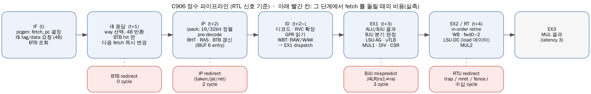
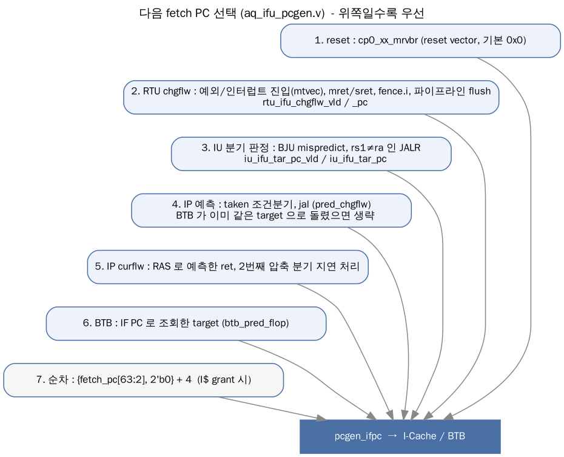
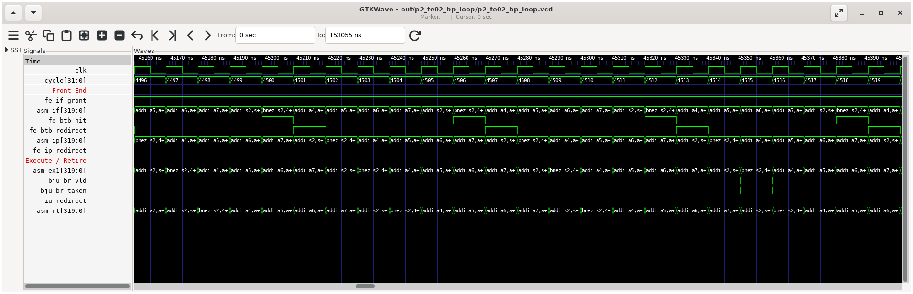
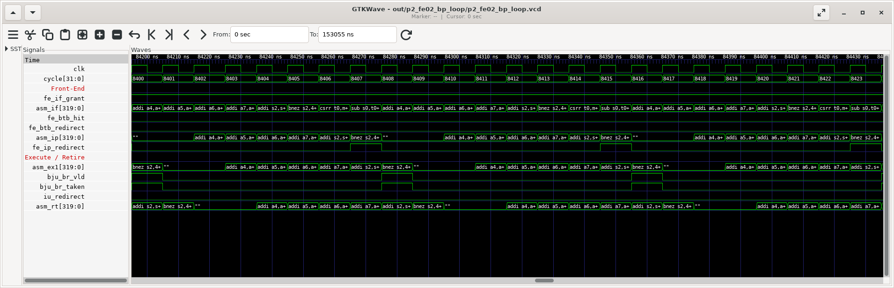
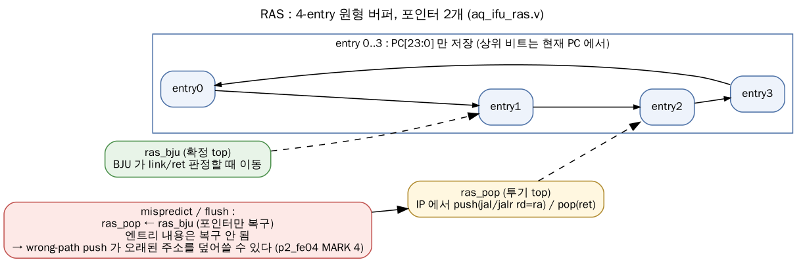
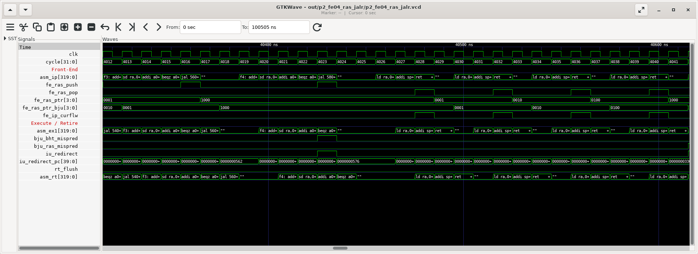
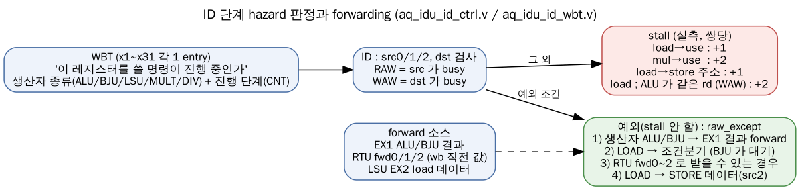
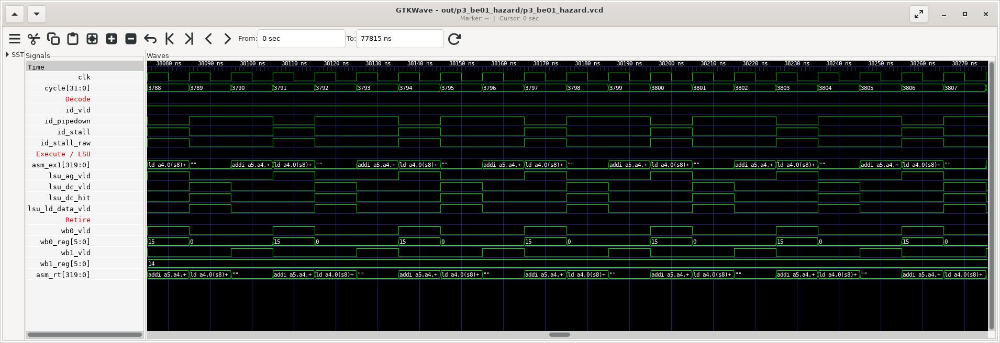

# Phase 2: CPU Pipeline Front-End (IFU, IDU)

> **기간**: Week 2-3
> **목표**: 명령어가 fetch 되어 EX1 로 내려가기까지(IFU → IDU)의 구조를 RTL 과 사이클 단위 실측으로 이해한다.
> ⚠️ v2 정정: (1) BHT 는 PC 가 아니라 **전역 히스토리(GHR)만으로** 인덱싱된다 (2) BTB 는 모든 분기의 target 저장소가 아니라 **taken 분기의 bubble 을 없애는 16-entry L0 BTB** 다 (3) I-Cache 교체는 LRU 가 아니라 **FIFO** 다 (4) 파이프라인 단계를 RTL 신호 기준으로 다시 정의했다 (5) JALR(ret 제외)은 예측하지 않는다.
> 💡 실습: `cd smart_run/study/unit_tests && make run T=p2_fe02_bp_loop` → out/p2_fe02_bp_loop/ 의 pipeview.txt(사이클 표), *.vcd + *.gtkw(파형). 환경 설명은 Phase 1 의 7 절.

---

## 1. 파이프라인 개요 — 실측으로 본 단계



C906 은 single-issue, in-order 파이프라인이다. 매뉴얼은 "5 단(IF, ID, EX, MEM, WB)"이라고 부르지만, RTL 신호와 사이클을 맞춰 보면 다음과 같이 보는 것이 정확하다.

| 단계 | 사이클 | 하는 일 | 주요 RTL |
|-----|-------|--------|---------|
| IF | t | 다음 fetch PC 결정, I$ tag/data 읽기 요청(4B), BTB 조회 | aq_ifu_pcgen.v, aq_ifu_icache.v, aq_ifu_btb.v |
| (I$) | t+1 | I$ way 선택/데이터 반환. BTB hit 면 이 사이클에 다음 fetch 를 target 으로 바꿈 | aq_ifu_icache.v, aq_ifu_btb.v |
| IP | t+2 | ipack 이 16/32bit 명령을 정렬, pre-decode, BHT/RAS 예측, 필요하면 redirect | aq_ifu_ipack.v, aq_ifu_pred.v, aq_ifu_bht.v, aq_ifu_ras.v |
| IBUF | — | 6-entry FIFO. 비어 있으면 IP 의 명령이 같은 사이클에 ID 로 바이패스 | aq_ifu_ibuf.v |
| ID | t+2~ | 디코드, RVC 확장, GPR 읽기, WBT 로 hazard 검사, EX1 래치로 dispatch | aq_idu_*.v |
| EX1 | t+3 | ALU/BJU 실행, LSU 주소 계산(AG), MUL 1 단, CSR | aq_iu_*.v, aq_lsu_ag.v |
| EX2/RT | t+4 | retire(in-order), write-back, forward / LSU DC / MUL 2 단 | aq_rtu_*.v, aq_lsu_dc.v |

실측 — 의존 ALU 32 개 (`p3_be01_hazard`, MARK 2, `pipeview.txt` 발췌). 한 명령이 IF → IP/ID → EX1 → RT 를 **사이클당 한 칸씩** 지나간다.

```
    cyc | IF (fetch)          | IP (pred)           |IB| ID                  | EX1                     | RETIRE
   3415 | 054c addi a4,a4,1   | 0544 addi a4,a4,1   | 0| >0544 addi a4,a4,1  | 0540 csrr s0,mcycle CP0 |
   3416 | 0550 addi a4,a4,1   | 0548 addi a4,a4,1   | 0| >0548 addi a4,a4,1  | 0544 addi a4,a4,1   ALU | 0540 csrr s0,mcycle
   3417 | 0554 addi a4,a4,1   | 054c addi a4,a4,1   | 0| >054c addi a4,a4,1  | 0548 addi a4,a4,1   ALU | 0544 addi a4,a4,1
   3418 | 0558 addi a4,a4,1   | 0550 addi a4,a4,1   | 0| >0550 addi a4,a4,1  | 054c addi a4,a4,1   ALU | 0548 addi a4,a4,1
```

- 0x54c 명령: IF 3415 → IP/ID 3417 → EX1 3418 → RT 3419. IF 와 IP 사이 1 사이클이 I$ 접근이다.
- ID 열의 `>` 는 "이번 사이클에 EX1 으로 내려감", `.` 는 stall.
- **IDU 는 PC 를 들고 다니지 않는다.** EX1 의 PC 는 IU 가 "이전 명령의 next PC" 로 직접 계산한다(Phase 3 의 2.6 절). pipeview 의 ID 열 PC 는 다음 사이클 EX1 의 PC 로 역추적한 값이다.

---

## 2. IFU (Instruction Fetch Unit)

### 2.1 구성 파일

```
gen_rtl/ifu/rtl/ (23 files)
```

| 파일 | 역할 |
|-----|-----|
| `aq_ifu_top.v` | IFU top |
| `aq_ifu_pcgen.v` | 다음 fetch PC 선택 |
| `aq_ifu_icache.v` (+ `_tag_array`, `_data_array`) | I-Cache 32KB 2-way |
| `aq_ifu_btb.v` (+ `_btb_entry`) | 16-entry BTB (IF 단계 0-bubble redirect) |
| `aq_ifu_ipack.v` (+ `_entry`) | 4B fetch 안의 16/32bit 명령 정렬 (inst0/inst1, 반쪽 h0) |
| `aq_ifu_pre_decd.v` | 분기/jal/call/ret 판별, 분기 offset 계산 |
| `aq_ifu_pred.v` | IP 단계 예측 결정 (BHT/RAS/BTB 결과 종합, redirect) |
| `aq_ifu_bht.v` (+ `_bht_array`) | 16Kb BHT (GHR 인덱스) |
| `aq_ifu_ras.v` (+ `_ras_entry`) | 4-entry RAS |
| `aq_ifu_ibuf.v` (+ `_entry`, `_pop_entry`) | 6-entry 명령 버퍼 |
| `aq_ifu_ctrl.v`, `aq_ifu_vec.v` | fetch 제어, reset/vector |

### 2.2 다음 PC 생성 (`aq_ifu_pcgen.v`)



```verilog
// aq_ifu_pcgen.v:237-255 - fetch PC 레지스터 갱신 (위에 있을수록 우선)
always @ (posedge pcgen_cpuclk)
begin
  if(vec_pcgen_rst_vld)                          // 1. reset : mrvbr (reset vector)
    pcgen_ifpc[39:0] <= cp0_xx_mrvbr[39:0];
  else if(pcgen_delay_chgflw_vld)                // 2~4. RTU / IU / IP 의 change-flow
    pcgen_ifpc[39:0] <= pcgen_delay_chgflw_pc[39:0];
  else if(pcgen_chgflw_cur && !icache_pcgen_grant)   // 5. RAS ret / delay 분기
    pcgen_ifpc[39:0] <= pcgen_fetch_pc[39:0];
  else if(ipack_pcgen_reissue && icache_pcgen_inst_vld)
    pcgen_ifpc[39:0] <= icache_pcgen_addr[39:0];
  else if(pcgen_chgflw_btb && !icache_pcgen_grant)   // 6. BTB target
    pcgen_ifpc[39:0] <= pcgen_fetch_pc[39:0];
  else if(icache_pcgen_grant)                    // 7. 순차 : pc[63:2] + 4
    pcgen_ifpc[39:0] <= pcgen_ifpc_inc[39:0];
end
// change-flow 중에서는 RTU 가 IU 보다, IU 가 IP 예측보다 우선
assign pcgen_delay_chgflw_pc[39:0] = {40{rtu_ifu_chgflw_vld}}  & rtu_ifu_chgflw_pc[39:0]
                                   | {40{pcgen_br_chgflw_vld}} & pcgen_br_chgflw_pc[39:0];
assign pcgen_br_chgflw_pc[39:0]    = iu_ifu_tar_pc_vld ? iu_ifu_tar_pc[39:0]
                                                       : pred_pcgen_chgflw_pc[39:0];
assign pcgen_ifpc_inc[63:0]        = {pcgen_fetch_pc[63:2], 2'b0} + 64'h4;   // fetch 폭 = 4B
```

- **fetch 폭은 4B/cycle** — 32bit 명령 1 개 또는 16bit 명령 2 개. single-issue 라 이것으로 충분하다(RVC 측정은 2.5 절).
- reset vector 는 고정값이 아니라 CSR `mrvbr`(C906 확장, 기본 0x0).

### 2.3 I-Cache (`aq_ifu_icache.v`)

| 항목 | 값 | 근거 |
|-----|----|-----|
| 크기 / 연관도 | 32KB, 2-way | `cpu_cfig.h` ICACHE_32K, tag array 의 way0/way1 |
| line | 64B, 256 set → index = addr[13:6] | I_TAG_INDEX_WIDTH = 8 |
| 교체 | **FIFO** (set 당 1bit) | tag SRAM 59bit = {fifo, way1 tag 29b, way0 tag 29b} (`aq_ifu_icache_tag_array.v:98`) |
| 주소 | VIPT (index 는 VA, tag 는 PA) | datasheet |
| miss | BIU 로 line fill, critical word 먼저 | UM 2.2.1 |

```verilog
// aq_ifu_icache_tag_array.v:98 - 한 set 의 tag 엔트리 = FIFO 비트 + 2 way 태그
assign icache_tag_bwen_b[58:0] = ~{icache_tag_wen[2],          //fifo
                                  {29{icache_tag_wen[1]}},     //way1
                                  {29{icache_tag_wen[0]}}};    //way0
```

실측 (`p2_fe01_fetch_rvc`): 128B(2 line) 블록의 cold 실행 61 cycle vs warm 35 cycle → **I$ miss 1 회 ≈ 13 cycle** (이 SoC 에서 명령 영역 0x0~0x1FFFF 는 메모리 지연 0).

### 2.4 분기 예측 — 3 단 구조

C906 의 분기 예측은 "어디서 알아차리느냐"에 따라 3 단으로 나뉜다. 단계가 늦을수록 버려지는 fetch 가 많다.

| 단계 | 장치 | 무엇을 아나 | taken 시 비용(실측) |
|-----|------|-----------|------------------|
| IF (+1) | **BTB** 16-entry | "이 fetch 주소에 taken 분기가 있었다 → target" | **0 cycle** |
| IP | pre-decode + **BHT** + **RAS** | 명령 종류, 방향 예측, offset 으로 target 계산, ret 주소 | **2 cycle** |
| EX1 | **BJU** | 실제 방향/target | 예측 실패 시 **3 cycle** |

실측 (`p2_fe02_bp_loop`: 본문 6 명령 루프 × 64 회, 이상적 387 cycle)

| 설정 | warm cycles | mispredict(HPM) | 해석 |
|-----|------------|----------------|-----|
| BHT on, BTB on (기본) | 431 | 14 | 387 + 14×3 = 429 → taken 분기 bubble 0 |
| BHT on, BTB off | 527 | 14 | 387 + 14×3 + 49×2 = 527 → taken 마다 IP redirect 2 |
| BHT off | 576 | 63 | 387 + 63×3 = 576 → taken 마다 mispredict 3 |

**(a) BTB on — 0 bubble** (cycle 4501: IF 가 0x424 bnez 를 fetch 한 다음 사이클에 BTB 가 바로 0x410 을 fetch)

```
    cyc | IF (fetch)          | IP (pred)           | ID                  | EX1                    | RETIRE              | events
   4500 | 0424 bnez s2,410    | 041c addi a7,a4,4   | >041c addi a7,a4,4  | 0418 addi a6,a4,3  ALU | 0414 addi a5,a4,2   |
   4501 | 0410 addi a4,a4,1   | 0420 addi s2,s2,-1  | >0420 addi s2,s2,-1 | 041c addi a7,a4,4  ALU | 0418 addi a6,a4,3   | BTB-redirect
   4502 | 0414 addi a5,a4,2   | 0424 bnez s2,410    | >0424 bnez s2,410   | 0420 addi s2,s2,-1 ALU | 041c addi a7,a4,4   |
   4503 | 0418 addi a6,a4,3   | 0410 addi a4,a4,1   | >0410 addi a4,a4,1  | 0424 bnez s2,410   BJU | 0420 addi s2,s2,-1  | BR-resolve:T
```



**(b) BTB off — IP redirect, 2 bubble** (cycle 8407: IP 에서 bnez 를 taken 으로 예측했지만 IF 는 이미 0x428, 0x42c 를 가져온 뒤)

```
   8406 | 0428 csrr t0,mcycle | 0420 addi s2,s2,-1  | >0420 addi s2,s2,-1 | 041c addi a7,a4,4  ALU | 0418 addi a6,a4,3   |
   8407 | 042c sub s0,t0,s0   | 0424 bnez s2,410    | >0424 bnez s2,410   | 0420 addi s2,s2,-1 ALU | 041c addi a7,a4,4   | IP-redirect->0410
   8408 | 0410 addi a4,a4,1   |                     |                     | 0424 bnez s2,410   BJU | 0420 addi s2,s2,-1  | BR-resolve:T
   8409 | 0414 addi a5,a4,2   |                     |                     |                        | 0424 bnez s2,410    |
   8410 | 0418 addi a6,a4,3   | 0410 addi a4,a4,1   | >0410 addi a4,a4,1  |                        |                     |
```



**(c) BHT off — BJU mispredict, 3 cycle** (cycle 12402: EX1 의 BJU 가 taken 확인 → IU redirect, ID/IP/IF 의 wrong-path 를 모두 버림)

```
  12401 | 042c sub s0,t0,s0   | 0424 bnez s2,410    | >0424 bnez s2,410        | 0420 addi s2,s2,-1 ALU | 041c addi a7,a4,4  |
  12402 | 0430 csrr s1,...    | 0428 csrr t0,mcycle | .(flushed) csrr t0,mcycl | 0424 bnez s2,410   BJU | 0420 addi s2,s2,-1 | MISPRED(BHT) IU-redirect
  12403 | 0410 addi a4,a4,1   |                     |                          |                        | 0424 bnez s2,410   |
  12404 | 0414 addi a5,a4,2   |                     |                          |                        |                    |
  12405 | 0418 addi a6,a4,3   | 0410 addi a4,a4,1   | >0410 addi a4,a4,1       |                        |                    |
```


#### 2.4.1 BTB (`aq_ifu_btb.v`)

- **16 entry, fully associative**, 태그/target 모두 **PC 하위 16bit 만** 저장(`BTB_ADDR_WIDTH = 16`) → target 상위 비트는 현재 PC 에서 가져온다(±32KB 안의 분기만 정확).
- 교체: **FIFO** 포인터(`btb_fifo`) 로 순서대로 덮어쓴다.
- 조회: IF 의 fetch PC 로 조회, hit 면 다음 사이클 `btb_pred_flop` → pcgen 이 target 을 fetch (0-bubble).
- 갱신: **IP 단계가 taken 분기/jal 을 예측했을 때** 그 분기의 4B 정렬 PC 와 target 을 기록한다. 단 IBUF 가 비어 가는(`ibuf_pred_hungry`) 상황에서만 — bubble 이 실제로 성능을 깎을 때만 BTB 를 쓴다.
- BTB 가 틀리면(target 이 IP 계산과 다름) IP 가 다시 redirect (`btb_mis_pred`).

```verilog
// aq_ifu_btb_entry.v:147 - 부분 태그 비교 (16bit)
assign btb_rd_hit = btb_tag[BTB_ADDR_WIDTH-1:0] == btb_rd_acc_tag[BTB_ADDR_WIDTH-1:0]
                 && btb_vld;
// aq_ifu_pred.v:720 / 795 - BTB 검증과 갱신 조건
assign btb_mis_pred     = (pred_br_tar[39:0] != btb_pred_tar_pc[39:0] || !pred_br_taken)
                          && btb_pred_tar_vld && ipack_pred_inst0_vld;
assign pred_btb_upd_vld = pred_br_taken && !btb_mis_pred && ibuf_pred_hungry;
```

> ⚠️ BTB 는 16 개뿐이다. `p2_fe03_bp_ghr` 의 MARK 3/4 루프에는 taken 분기가 34 개라서 BTB 가 계속 덮어써지고, 거의 모든 taken 분기가 IP redirect(2 cycle)를 치른다(128 회 반복에 약 13,600 cycle).

#### 2.4.2 BHT (`aq_ifu_bht.v`) — 전역 히스토리만으로 인덱싱


- 크기: 1024 행 × 16bit SRAM = 2bit 카운터 8K 개 = **16Kb** (cpu_cfig.h `BHT_16K`, `BHT_INDEX_WIDTH = 10`).
- 매뉴얼(UM 2.2.1)은 "Gshare" 라고 하지만 RTL 은 **PC 를 전혀 쓰지 않는다**. PC 입력 포트 `pred_bht_pc[2:0]`, `iu_ifu_bht_cur_pc[39:0]` 는 `&Force("input", ...)` 로 선언만 되어 있다.
- 히스토리 2 개: `bht_ghr`(BJU 판정으로 확정) / `bht_vghr`(IP 예측으로 투기 갱신, mispredict 시 ghr 로 복구).
- **미리 읽기(ahead pipelining)**: 행은 직전 분기 시점에 `vghr[11:2]` 로 미리 읽어 두고, 현재 분기가 IP 에 오면 `vghr[2:0]` 으로 8 개 중 하나를 고른다. 행을 미리 읽어야 하므로 **행 인덱스에는 PC 를 넣을 수 없다** — 아직 그 분기를 fetch 하지 않았기 때문. (열 선택에는 PC[3:1] 을 넣을 수 있다 → 부록 B 의 gshare_lite 실험)

```verilog
// aq_ifu_bht.v:203 - 확정 히스토리: BJU 의 실제 결과를 shift-in
    bht_ghr[HIS_WIDTH-1:0] <= {bht_ghr[HIS_WIDTH-2:0], iu_ifu_bht_taken};
// aq_ifu_bht.v:253-257 - SRAM 행 인덱스 : 히스토리만 사용
assign bht_idx[IDX_WIDTH-1:0] = bht_inv_req    ? ...
                              : bht_miss_read1 ? bht_ghr[HIS_WIDTH-1:4]
                              : bht_miss_read2 ? bht_ghr[HIS_WIDTH-2:3]
                              : (bht_miss_write || bht_upd_vld) ? bht_ref_vghr[HIS_WIDTH-1:4]
                              : bht_vghr[HIS_WIDTH-3:2];
// aq_ifu_bht.v:305 - 행 안의 카운터 8 개 중 선택 : 역시 히스토리만
assign bht_sel_way[7:0] = 8'b1 << bht_vghr[2:0];
```

**GHR 예측기의 성질 — 실측** (`p2_fe03_bp_ghr`, 128 회 반복)

| 패턴 | 조건분기 수 | mispredict | PC 인덱스 2bit 카운터였다면 |
|-----|-----------|-----------|-------------------------|
| 교대 T,N,T,N | 256 | **18** (학습 완료) | 교대 패턴은 거의 매번 틀림 |
| 주기 3 T,T,N | 256 | 30 | 1/3 가량 틀림 |
| 앨리어싱: A(항상 T)와 B(항상 N) 앞 히스토리가 같음 | 4480 | **182** | 0 에 가까움 (A, B 가 다른 카운터) |
| 대조군 (B 도 항상 T) | 4480 | 20 | — |

- 히스토리 기반이라 **패턴은 잘 배우지만**, 서로 다른 분기가 같은 히스토리를 보면 같은 카운터를 공유해서 싸운다(파괴적 앨리어싱).
- **warm-up 비용**: `p2_fe02` 의 루프는 warm 실행에서도 처음 14 회 연속으로 틀린다. 루프 분기가 taken 될 때마다 GHR 이 한 비트씩 바뀌어 매번 **다른(아직 학습 안 된) 카운터**를 보기 때문이다. 히스토리가 1 로 가득 찬(포화) 뒤부터 맞는다. 2bit 카운터라 같은 엔트리를 두 번 학습해야 예측이 바뀌므로 cold 실행 한 번으로는 부족하다.

#### 2.4.3 RAS (`aq_ifu_ras.v`) — 4-entry, 포인터만 복구



- push: IP 에서 `jal x1` / `jalr x1` (call). pop: `jalr x0, 0(x1)` (ret, rs1 = x1).
- 엔트리에는 **PC[23:0]** 만 저장(상위 비트는 현재 PC).
- `ras_pop`(투기 top) 과 `ras_bju`(확정 top) 두 포인터. mispredict/flush 때는 **포인터만** 확정 값으로 되돌린다.
- ret 하나가 아직 확정되지 않았을 때 다음 ret 이 오면 IP 가 잠시 멈춘다(`pred_ret_stall`, RAS_WAIT 상태).

```verilog
// aq_ifu_ras.v:205-212 - 투기 포인터: flush/mispredict 면 확정 포인터로 복구 (내용은 복구 안 함)
  else if(rtu_ifu_flush_fe || iu_ifu_bht_mispred || iu_ifu_pc_mispred && !iu_ifu_link_vld)
    ras_pop[ENTRY_NUM-1:0] <= ras_bju[ENTRY_NUM-1:0];
  else if(pred_ras_link_vld)                                // push
    ras_pop[ENTRY_NUM-1:0] <= {ras_pop[0], ras_pop[ENTRY_NUM-1:1]};
  else if(pred_ras_ret_vld && !ras_cur_st)                  // pop
    ras_pop[ENTRY_NUM-1:0] <= {ras_pop[ENTRY_NUM-2:0], ras_pop[ENTRY_NUM-1]};
// 엔트리 쓰기는 IP 단계(투기)에서 바로 일어난다
assign entry3_upd = pred_ras_link_vld && ras_pop[0];
```

**실측** (`p2_fe04_ras_jalr`, 서로 다른 함수 f1→f2→…→fN, warm)

| 깊이 N | 1 | 2 | 3 | 4 | 5 | 6 | 7 | 8 |
|-------|---|---|---|---|---|---|---|---|
| cycles | 14 | 23 | 37 | 45 | 57 | 69 | 91 | 91 |
| RAS mispredict (trace) | 0 | 0 | 0 | **1** | 2 | 3 | 4 | 5 |

깊이 4 에서 이미 1 번 틀리는 이유 — **wrong-path push**:

```
   4013 | ...                 | 0568 addi a0,a0,-1  | ...
   4014 | 0580 addi sp,sp,-16 | 056c beqz a0,574    |                        <- f4: a0==0 이라 taken 이어야 함
   4015 | 0584 sd ra,0(sp)    | 0570 jal 580        | (flushed) jal ...      <- 예측은 not-taken -> wrong-path 의 jal 이 RAS push!
        |                     |                     |                          EX1: beqz MISPRED(BHT) -> 포인터만 복구
   ...  (f4, f3, f2 의 ret 는 RAS 로 정확히 예측)
   4034 | ...                 | 0574 ld ra,0(sp)    | ...                    | 051c ret | MISPRED(RAS) IU-redirect->0330
```

wrong-path 의 `jal`(f5 호출)이 4 엔트리 중 가장 오래된 것(main 으로의 복귀 주소)을 덮어썼다. 포인터는 복구됐지만 내용은 사라졌으므로 마지막 ret 가 틀린다.



#### 2.4.4 JALR — 예측하지 않는다

| 종류 | 예측 | 실측 (32 회 호출) |
|-----|-----|-----------------|
| `jal ra, f` (직접 호출) + `ret` | target: IP 계산, ret: RAS | 238 cycle |
| `jalr ra, 0(t3)` (함수 포인터) | **없음** — EX1 의 BJU 가 계산해서 redirect (`bju_pc_reg_mispred`) | 332 cycle (+약 3/호출) |
| RAS 끔 + jal | ret 마다 redirect | 297 cycle |

```verilog
// aq_iu_bju.v:649 - rs1 이 ra 가 아닌 JALR 은 항상 "mispredict" 로 처리 (redirect)
assign bju_pc_reg_mispred  = bju_inst_jalr && idu_iu_ex1_src0_reg[4:0] != 5'b1; // ras reg wrong
```

### 2.5 IPack 과 RVC — 4B 안의 명령 1~2 개

- fetch 한 4B 를 `inst0`(32/16bit) 와 `inst1`(16bit) 로 나눈다. 32bit 명령이 4B 경계를 넘으면 앞 절반을 `h0` 로 보관했다가 다음 fetch 와 합친다(`ipack_pred_h0_vld`).
- 같은 4B 에 압축 분기 2 개가 있고 첫째를 not-taken 으로 예측하면, 둘째의 예측을 한 사이클 미룬다(`pred_delay_br`).

실측 (`p2_fe01_fetch_rvc`, 명령 32 개): 32bit/RVC 모두 warm 35 cycle(IPC 1), cold 는 32bit 61 / RVC 41(I$ miss 2→1), 4B 경계를 걸친 32bit 명령도 추가 비용 없음.

### 2.6 IBUF (`aq_ifu_ibuf.v`)

- **6 entry** FIFO(`ENTRY_NUM = 6`) + 출력 레지스터 2 개(pop entry).
- 비어 있으면 IP → ID 바이패스(위 표에서 IP 와 ID 가 같은 사이클).
- ID 가 stall 해도 IFU 는 IBUF 가 찰 때까지 계속 fetch → 짧은 stall 을 흡수. (`csrr` 이 파이프라인이 비기를 기다리는 동안 IB 열이 6 까지 차는 것을 pipeview 에서 볼 수 있다)

---

## 3. IDU (Instruction Decode Unit)

### 3.1 구성

```
gen_rtl/idu/rtl/ (10 files)
```

| 파일 | 역할 |
|-----|-----|
| `aq_idu_id_decd.v` | 디코더 (6662 줄): 실행 유닛 선택(EU), 즉치값, 레지스터 필드 |
| `aq_idu_expand_32.v` | RVC → 32bit 확장 |
| `aq_idu_id_split.v` | 여러 단계로 나눠야 하는 명령(AMO 등) 분할 |
| `aq_idu_id_gpr.v` (+ `_gated_reg`) | 31 × 64bit GPR, 레지스터별 clock gating |
| `aq_idu_id_wbt.v` (+ `_entry`) | Write-Back Table: 레지스터별 "진행 중인 생산자" 추적 (scoreboard) |
| `aq_idu_id_ctrl.v` | hazard 판정, stall, EX1 래치(dispatch) |
| `aq_idu_id_dp.v` | 데이터패스 (피연산자 MUX, forward 선택) |

즉치값/인코딩은 부록 A 의 3 절 참조.

### 3.2 Dispatch 와 EX1 래치

ID 는 명령을 해당 실행 유닛(EU) 으로 보내기 위해 **EX1 래치(`ex1_inst_vld`, `ex1_eu_sel`)** 를 채운다. EU 는 one-hot 10bit: ALU, BJU, MULT, DIV, CP0, LSU, …, FP, VEC (`aq_idu_cfig.h`).

```verilog
// aq_idu_id_ctrl.v:390 - ID 가 멈추는 이유들
assign ctrl_dis_stall = rtu_idu_flush_stall      // flush 진행 중
                     || ctrl_ex1_stall           // EX1 이 못 내려감 (유닛 full 등)
                     || ctrl_dis_dep_stall       // RAW / WAW
                     || ctrl_dis_cp0_stall       // CSR/fence : 파이프라인이 빌 때까지
                     || ctrl_dis_vec_stall;
```

### 3.3 Hazard 판정 — WBT 와 "예외 규칙"



WBT 는 x1~x31 마다 "이 레지스터를 쓸 명령이 아직 진행 중인가, 그 생산자는 어떤 유닛이고 어느 단계인가"를 기록한다. ID 는 RAW/WAW 를 검사하되, **forward 로 해결되는 경우는 stall 하지 않는다**:

```verilog
// aq_idu_id_ctrl.v:431 - src0 의 RAW 를 무시해도 되는 조건
assign ctrl_dis_src0_raw_except =
  //1. if producer is alu/bju which could forward from ex1
     (wbt_ctrl_src0_info[`WB_INT_TYPE:`WB_INT_TYPE-2] == `WB_INT_TYPE_ALU)
  || (wbt_ctrl_src0_info[`WB_INT_TYPE:`WB_INT_TYPE-2] == `WB_INT_TYPE_BJU)
  //2. if producer is load and consumer is bju condbr
  || (wbt_ctrl_src0_info[`WB_INT_TYPE:`WB_INT_TYPE-2] == `WB_INT_TYPE_LSU)
     && (dp_ctrl_dis_inst_src_type[2:0] == `WB_INT_TYPE_BJU)
     && (dp_ctrl_dis_inst_func[`FUNC_CONDBR_SEL] == 1'b1) && ...
  //3. if result of producer can be forwarded
  || dp_ctrl_src0_fwd_vld && !(((LSU || MULT) && CNT == 2'd2));
// (src2 에는 4. load -> store 데이터 예외가 추가된다)
```

**실측** (`p3_be01_hazard`, 명령 쌍 × 16, 이상적 35 cycle)

| 쌍 | cycles | 쌍당 추가 | 이유 |
|---|-------|---------|-----|
| ALU 독립 / ALU→ALU 의존 | 35 / 35 | 0 / **0** | EX1 forward (예외 1) |
| load → 바로 사용 | 51 | **+1** | load 데이터는 EX2 에서 나옴 |
| load → 독립 명령 | 35 | 0 | |
| load → (1 명령 건너) load 주소 | 36 | 0 | 거리 2 면 충분 |
| mul → 바로 사용 | 67 | **+2** | MUL latency 3 |
| mul → 독립 | 36 | 0 | MUL 파이프라인 |
| load → 조건분기 | 43 | +0.5 | 예외 2: BJU 가 기다림 |
| load → store 데이터 | 35 | **0** | 예외 4 |
| load → store 주소 | 51 | +1 | 예외 아님 |
| load ; 같은 rd 에 li (WAW) | 67 | **+2** | 생산자가 LSU 면 ALU 의 WAW 예외 없음 |



### 3.4 Split 과 CSR 직렬화

- AMO 등은 `aq_idu_id_split.v` 가 여러 micro-op 로 나눈다(`ctrl_split_stall`).
- CSR/fence 류는 `ctrl_dis_cp0_stall`: **앞선 명령이 모두 끝날 때까지 ID 에서 대기**. 유닛 테스트의 `csrr mcycle` 이 앞 명령 완료 시각을 정확히 읽는 이유이자, CSR 을 자주 건드리는 코드가 느린 이유.

---

## 4. Simulation Exercises (유닛 테스트)

```bash
cd smart_run/study/unit_tests
make sim                       # 최초 1 회 (약 3~4 분)
make run T=p2_fe02_bp_loop     # 결과 수치 출력 + out/p2_fe02_bp_loop/
make wave T=p2_fe02_bp_loop    # GTKWave (그룹/ASCII 디스어셈블리 포함 세이브 파일)
```

### Lab 2.1: 파이프라인 단계 읽기 — `p3_be01_hazard` MARK 2
- [ ] pipeview.txt 에서 한 명령의 IF → IP → EX1 → RT 사이클을 찾는다
- [ ] IB 열이 0 일 때 IP 와 ID 가 같은 사이클인 것(바이패스) 확인
- [ ] GTKWave 에서 `asm_if`, `asm_ip`, `asm_ex1`, `asm_rt` (Data Format = ASCII) 를 나란히 본다

### Lab 2.2: 분기 예측 3 단 — `p2_fe02_bp_loop`
- [ ] MARK 1/2/3 의 warm 사이클을 위 표의 식으로 재현한다
- [ ] `fe_btb_redirect`, `fe_ip_redirect`, `iu_redirect` 가 각각 언제 뜨는지 확인
- [ ] warm 실행 처음 14 회의 MISPRED 와 `fe_bht_ghr` 값 변화를 함께 본다

### Lab 2.3: GHR 앨리어싱 — `p2_fe03_bp_ghr`
- [ ] MARK 3(alias) 과 MARK 4(control) 의 mispredict 차이를 설명한다
- [ ] (심화) `make run T=p2_fe03_bp_ghr PATCH=gshare_lite` 와 비교 (부록 B)

### Lab 2.4: RAS 와 JALR — `p2_fe04_ras_jalr`
- [ ] MARK 4 에서 wrong-path push 를 찾는다 (`fe_ras_push`, `fe_ras_ptr`, `bju_bht_mispred`)
- [ ] MARK 11/12 의 차이(JALR redirect) 를 `bju_jalr_mispred` 로 확인

### Lab 2.5: Hazard — `p3_be01_hazard`
- [ ] 각 MARK 의 ID-stall 이유(RAW/WAW) 를 summary 줄에서 확인
- [ ] load-use 에서 `lsu_ld_data_vld` 와 `id_pipedown` 의 관계를 파형으로 확인

---

## 5. Key Concepts Summary

| 개념 | C906 구현 (RTL 확인) |
|-----|------------------|
| fetch 폭 | 4B/cycle (32bit 1 개 또는 16bit 2 개) |
| I-Cache | 32KB 2-way, 64B line, 256 set, **FIFO**, VIPT |
| BTB | 16-entry FA, 16bit 부분 태그, FIFO 교체, IF 단계 0-bubble |
| BHT | 16Kb (2bit × 8K), **GHR only** (행 vghr[11:2], 열 vghr[2:0]) |
| RAS | 4-entry 원형, PC[23:0], 포인터만 복구 |
| JALR | ret(rs1=x1)만 RAS 예측, 나머지는 EX1 redirect |
| redirect 비용 | BTB 0 / IP 2 / BJU 3 cycle |
| IBUF | 6 entry, 비면 IP→ID 바이패스 |
| ID | 디코드, RVC 확장, split, WBT hazard, CSR 직렬화 |
| forward | ALU/BJU → 0 stall, load → +1, mul → +2 |

---

## 6. Checklist

- [ ] C906 의 단계별 사이클(IF, I$, IP, ID, EX1, RT)을 pipeview 로 설명할 수 있다
- [ ] next-PC 우선순위 7 가지를 말할 수 있다
- [ ] BTB/IP/BJU redirect 비용이 왜 0/2/3 cycle 인지 설명할 수 있다
- [ ] C906 BHT 가 PC 를 쓰지 않는 이유(미리 읽기)와 그 결과(앨리어싱, warm-up)를 설명할 수 있다
- [ ] RAS 의 투기/확정 포인터와 wrong-path push 문제를 설명할 수 있다
- [ ] WBT 의 raw_except 4 가지를 말하고 실측 stall 과 연결할 수 있다
- [ ] CSR 명령이 직렬화되는 이유와 영향을 설명할 수 있다
