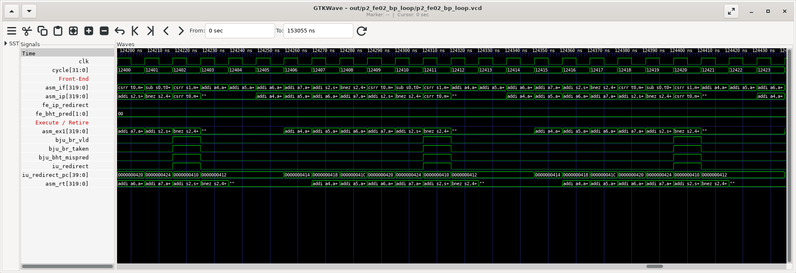
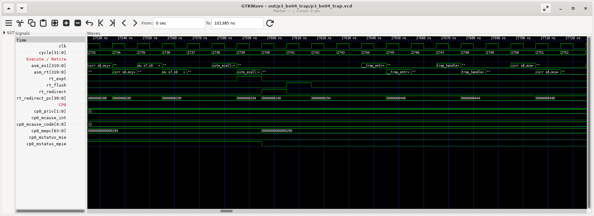

# Phase 3: CPU Pipeline Back-End (IU, RTU)

> **기간**: Week 4-5
> **목표**: 실행(IU)과 retire(RTU)를 RTL 과 사이클 실측으로 이해한다. 분기 판정, 곱셈/나눗셈 latency, precise exception 이 어떻게 만들어지는지 확인한다.
> ⚠️ v2 정정: (1) 나눗셈은 "radix-2 에 32 cycle 고정"이 아니라 **2bit/cycle + 몫 비트 수 비례 + 결과 버퍼**로 2~36 cycle (2) mispredict penalty 실측 **3 cycle** (3) **PC 는 파이프라인을 따라 전달되지 않고 IU 가 직접 계산**한다 (4) 인터럽트 우선순위에 NMI 는 없고 C906 커스텀 원인(16/17/18)이 있다 (5) wb0/wb1 은 "정수/FP" 가 아니라 "rbus(IU/CP0/VPU)/LSU" 포트다.

---

## 1. Back-End Overview

```
 ID ──EX1 래치──┬─> IU : ALU (1 cycle) · BJU (분기 판정) · MULT (3 단) · DIV (반복)
                ├─> LSU : AG(EX1) → DC(EX2)          ── Phase 4
                ├─> CP0 : CSR · trap CSR · fence      ── Phase 5
                └─> VIDU/FPU                         ── Phase 6
                         │
                         ▼
 RTU (EX2) : in-order retire 1/cycle · 예외/인터럽트 처리 · flush · redirect
             write-back : wb0 (rbus: IU/CP0/VPU), wb1 (LSU)
             forward    : fwd0~2 → IDU
```

- **retire 는 사이클당 1 개, 항상 프로그램 순서**. 그래서 예외가 정확하다(precise): 예외 명령 이전은 모두 반영, 이후는 모두 버림.
- 한 명령이 EX1 에 있을 때 다음 사이클 retire 되는 것이 기본 (ALU: EX1 → RT). MUL 은 EX3 에서 결과, LOAD 는 EX2 에서 데이터.

---

## 2. IU (Integer Unit)

### 2.1 구성

```
gen_rtl/iu/rtl/ (9 files)
```

| 파일 | 역할 |
|-----|-----|
| `aq_iu_top.v` | IU top |
| `aq_iu_alu.v` | 산술/논리/shift/비교, RV64 W 연산 |
| `aq_iu_bju.v` | 분기/점프 판정, **IU 의 PC 생성기**, mispredict, BHT/RAS 갱신 신호 |
| `aq_iu_addr_gen.v` | 분기 target 덧셈기 |
| `aq_iu_mul.v`, `booth_code_33_bit.v`, `multiplier_33x33_partial.v` | 곱셈기 |
| `aq_iu_div.v`, `aq_iu_div_shift2_kernel.v` | 나눗셈기 (2bit/cycle) |

### 2.2 ALU (`aq_iu_alu.v`)

| 분류 | 명령 |
|-----|-----|
| 산술 | ADD, SUB, ADDI, ADDW, SUBW, ADDIW |
| 논리 | AND, OR, XOR, ANDI, ORI, XORI |
| Shift | SLL, SRL, SRA (+I, +W) — RV64 shamt 6bit, W 형은 5bit |
| 비교 | SLT, SLTU, SLTI, SLTIU |
| 상위 즉치 | LUI, AUIPC |
| C906 확장 | XThead 산술/비트 조작 (MXSTATUS.THEADISAEE=1 일 때) |

- **1 cycle**: EX1 에서 결과가 나오고, 다음 명령이 바로 쓸 수 있다(forward). 실측: 의존 ALU 32 개 = 35 cycle (`p3_be01_hazard` MARK 2, 기준 3 포함).
- W 연산: 하위 32bit 결과를 64bit 로 부호 확장 (부록 A 4 절).

### 2.3 Multiplier (`aq_iu_mul.v`)

- 33bit Booth radix-4 인코더 + 33×33 부분곱 배열. UM: "16×16, 32×32, 64×64 지원".
- **3 단 파이프라인**: EX1 → EX2 → EX3 에서 write-back (`iu_rtu_ex3_mul_wb_vld`).

| 실측 (`p3_be02_muldiv`) | cycles | 해석 |
|---|---|---|
| mul 의존 체인 ×16 | 51 | (51-3)/16 = **latency 3** |
| mulh 의존 체인 ×16 | 51 | 상위 64bit 도 같은 latency |
| mulw 의존 체인 ×16 | 51 | |
| mul 독립 ×16 | 21 | **throughput 1/cycle** (파이프라인) |
| mul → 바로 사용 (×16 쌍, `p3_be01`) | 67 | 쌍당 +2 stall |

Radix-4 Booth (참고):

| b[2i+1] b[2i] b[2i-1] | 부분곱 |
|---|---|
| 000, 111 | 0 |
| 001, 010 | +M |
| 011 | +2M |
| 100 | -2M |
| 101, 110 | -M |

33bit 승수 → 부분곱 17 개. 2bit 씩 보므로 부분곱 수가 절반이 된다.

### 2.4 Divider (`aq_iu_div.v`) — 가변 latency + 결과 버퍼

- 반복형. `aq_iu_div_shift2_kernel.v` 가 **사이클당 몫 2bit** 를 만든다.
- 시작 전에 피제수/제수를 정규화(leading zero)해서 **몫의 유효 비트 수만큼만** 반복 → 작은 몫은 빨리 끝난다. UM: 2~36 cycle.
- 특수 경우(0 으로 나누기, 피제수 0, signed overflow)는 반복 없이 즉시 (`div_abnormal_res_vld`).
- **결과 버퍼**: 직전 나눗셈과 피연산자/부호/word 가 같으면 EX1 에서 바로 결과 (`div_hit_buffer`).

```verilog
// aq_iu_div.v:343-349
assign div_hit_buffer_res_vld  = div_hit_buffer && !div_abnormal_res_vld;
assign div_ex1_res_vld_raw     = (div_abnormal_res_vld || div_hit_buffer_res_vld) && div_is_idle;
assign div_ex1_res_onehot[3:0] = {div_hit_buffer_res_vld, div_dividend_eq0 && !div_divisor_eq0,
                                  div_divisor_eq0, div_res_overflow};
// aq_iu_div.v:779-787
assign div_hit_buffer = div_dividend_hit_buffer && div_divisor_hit_buffer
                     && div_signed_hit_buffer   && div_word_hit_buffer;
```

| 실측 (`p3_be02_muldiv`, TIC/TOC 포함, 기준 addi = 4) | cycles | 순수 |
|---|---|---|
| divu (2^64-1) / 3 | 39 | ≈35 (몫 64bit → 32 회) |
| remu (2^64-1) / 3 | 39 | 몫과 나머지를 같이 만든다 |
| divu 0x1_2345_6789 / 1 | 24 | ≈20 (몫 33bit) |
| divu 1000 / 3, div -1000 / 3, divw 1000 / 3 | 15, 12, 12 | |
| divu 7/7, 3/7, big/big | 8 | |
| ÷0, 0÷3, (-2^63)÷(-1) | 5 | ≈1 (abnormal) |
| divu → 같은 피연산자 remu | 16 (divu 만: 15) | **rem 은 +1** |

> ⚠️ 측정 함정: 처음에는 워밍업으로 같은 나눗셈을 한 번 실행한 뒤 측정해서 모두 3~5 cycle 이 나왔다. 결과 버퍼 때문이다. 지금 테스트는 직전에 "다른 피연산자"로 실행해 버퍼를 비운다.

- 나눗셈 중에는 DIV 유닛이 busy(`iu_idu_div_full`) → 다음 DIV 는 EX1 에서 대기(구조적 hazard). 다른 명령은 계속 진행할 수 있다.

### 2.5 BJU — 분기 판정과 mispredict



```verilog
// aq_iu_bju.v:611-616 - 조건 판정 (beq/bne/blt/bge/bltu/bgeu 를 두 비교기로)
assign bju_cond_br_taken_raw = (bju_beq_taken ^ bju_op_func[3]) & bju_op_func[2]   // beq/bne
                             | (bju_blt_taken ^ bju_op_func[3]) & bju_op_func[1];  // blt(u)/bge(u)
assign bju_cond_br_taken     = bju_ex1_inst_no_depd || bju_entry_pop ? bju_cond_br_taken_raw
                                                                     : bju_bht_pred[1];
// aq_iu_bju.v:637-653 - 예측 실패 종류
assign bju_bht_mispred_no_entry = bju_cond_sel && (bju_cond_br_taken ^ bju_bht_pred[1])
                                  && bju_ex1_inst_no_depd;                 // EX1 에서 바로 판정
assign bju_bht_mispred_entry    = bju_cond_sel && (bju_cond_br_taken ^ bju_bht_pred[1])
                                  && bju_entry_pop;                         // 피연산자 대기 후 판정
assign bju_pc_reg_mispred  = bju_inst_jalr && idu_iu_ex1_src0_reg[4:0] != 5'b1; // ret 아닌 jalr
assign bju_tar_pc_vld      = bju_tar_pc_vld_raw || bju_ras_mispred_vld;    // → iu_ifu_tar_pc_vld
```

- **BJU entry**: load 결과에 의존하는 분기(`ld a4; bnez a4`)는 ID 에서 멈추지 않고 BJU 의 entry 에 들어가 데이터를 기다렸다가 판정한다(`bju_entry_pop`). `p3_be01` 의 load→branch 가 쌍당 +0.5 로 load-use(+1)보다 싼 이유.
- 판정 결과는 IFU 로 돌아가 BHT 카운터(`iu_ifu_bht_pred/taken`), GHR, RAS 확정 포인터를 갱신한다.

**Penalty 실측** (`p3_be03_mispred_penalty`, 같은 루프 256 회, 분기 조건만 다름)

| 분기 | cycles | mispredict |
|-----|-------|-----------|
| 예측 가능 (항상 not-taken) | 2842 | 7 |
| 예측 불가 (xorshift 난수 bit) | 3517 | 217 |

penalty ≈ (3517 − 2842) / (217 − 7) = **3.2 cycle** — 예측이 맞은 taken 분기의 IP redirect(2 cycle) 비용이 일부 섞여 있다. 순수 BJU redirect 는 3 cycle (Phase 2 의 (c) 사이클 표).

### 2.6 IU 의 PC 생성기 — PC 는 파이프라인을 따라 흐르지 않는다

IFU 의 fetch PC 와 별개로, IU 는 EX1 에 있는 명령의 PC 를 **스스로 계산**한다. 직전 명령이 끝날 때 `next_pc = 분기 taken ? target : pc + 길이(2/4)` 로 갱신한다.

```verilog
// aq_iu_bju.v:681-701
// PC update:
// 1. reset  2. ifu chgflow  3. bju entry chgflow  4. inst cmplt pc(inc pc and ex1 chgflow pc)
always @ (posedge bju_clk)
begin
  if (ifu_iu_reset_vld)
    bju_pcgen_pc_39_1[38:0] <= cp0_xx_mrvbr[39:1];
  else if (ifu_iu_chgflw_vld)                       // RTU 의 trap/mret 등
    bju_pcgen_pc_39_1[38:0] <= ifu_iu_chgflw_pc[39:1];
  else if (bju_not_ex1_chgflw)                      // entry 분기/RAS mispredict
    bju_pcgen_pc_39_1[38:0] <= bju_not_ex1_tar_pc[39:1];
  else if (rtu_iu_ex1_cmplt && !rtu_iu_ex1_inst_split)
    bju_pcgen_pc_39_1[38:0] <= bju_next_pc_update[38:0];
end
assign iu_rtu_ex1_cur_pc[39:0] = bju_pcgen_pc[39:0];
```

- 장점: IF → ID → EX1 래치마다 40bit PC 를 들고 다닐 필요가 없다(면적/전력). 명령 길이(`inst_len`)만 내려보낸다.
- 분기 target 은 이 PC 에 즉치값을 더해 BJU 에서 계산 → IFU 의 예측 target 과 비교할 필요 없이 "방향"만 비교하면 된다(jal 은 IFU 계산이 항상 정확, jalr 은 RAS 예측 PC `ifu_iu_ex1_pc_pred` 와 비교).
- RTU 의 retire PC(`rtu_pad_retire_pc`)는 IU 가 넘겨 준 EX1 PC 를 한 단 늦춘 것이다.

---

## 3. RTU (Retire Unit)

### 3.1 구성

```
gen_rtl/rtu/rtl/ (7 files)
```

| 파일 | 역할 |
|-----|-----|
| `aq_rtu_top.v` | RTU top |
| `aq_rtu_rbus.v` | IU/CP0/VPU 결과 버스, IDU 로 forward(fwd0~2) |
| `aq_rtu_retire.v` | retire 판정, 예외/인터럽트 처리, flush/redirect |
| `aq_rtu_wb.v` | write-back 포트 (wb0 = rbus, wb1 = LSU) |
| `aq_rtu_int.v` | 인터럽트 우선순위 인코더 |
| `aq_rtu_ctrl.v`, `aq_rtu_dp.v` | 제어/데이터패스 (epc, tval 등) |

### 3.2 Write-back 포트

```verilog
// aq_rtu_wb.v:186-197
assign wb_wb0_vld        = wb_rbus_wb_vld || wb_vpu_wb_vld;   // IU/CP0 결과 (또는 VPU→GPR)
assign wb_wb0_data[63:0] = wb_rbus_wb_vld ? wb_wb_rbus_data[63:0] : ...;
assign wb_wb1_vld        = wb_lsu_wb_vld;                     // LOAD 결과
assign wb_wb1_data[63:0] = wb_wb_lsu_data[63:0];
```

- 정수 RF 는 사이클당 최대 2 개 쓰기(ALU 결과 + 앞선 load 결과가 겹칠 때). smart_run 의 tb.v 가 PASS magic 값을 `wb_wb0_data`/`wb_wb1_data` 에서 찾는 이유.

### 3.3 예외 (precise exception) — trap 진입 과정



`p3_be04_trap` MARK 1(ecall) 의 사이클:

| cycle | 사건 |
|-------|-----|
| 2738 | ecall 이 EX1 (CP0 로 dispatch, 예외 정보 생성) |
| 2739 | ecall 이 retire 단계 → `rt_expt`=1, mepc ← 0x290(ecall 자신), mcause ← 11, MPIE ← MIE, MPP ← M |
| 2740 | `rt_redirect`=1, redirect PC = mtvec(0x140 `__trap_entry`), 파이프라인 flush |
| 2744 | `__trap_entry` 가 EX1 (I$ hit 기준 redirect 후 4 cycle) |
| 2747 | `trap_handler` 첫 명령 EX1 |

| 실측 (warm) | 값 |
|---|---|
| TIC ~ handler 의 `csrr mcycle` | 14 cycle |
| ecall → mret 으로 돌아와 TOC 까지 | 38 cycle |
| ecall: mcause / mepc - 명령주소 | 11 / 0 |
| illegal(`unimp` = csrrw x0,cycle,x0): mcause / mtval | 2 / 0xC0001073 (명령 인코딩) |
| ebreak: mcause / mtval | 3 / 0 |
| 비정렬 ld, MXSTATUS.MM=1 | 예외 없음, 7 cycle (정렬 6) |
| 비정렬 ld, MM=0 | mcause 4, mtval = 주소 |

```verilog
// aq_cp0_trap_csr.v:1039-1048 - mepc : 위임되지 않은 예외면 RTU 가 준 EPC 저장
  else if(rtu_yy_xx_expt_vld && !mdeleg_vld_dp)
    mepc_reg[62:0] <= rtu_cp0_epc[63:1];
// aq_cp0_trap_csr.v:669-677 - MPIE
  else if(rtu_yy_xx_expt_vld && !mdeleg_vld_dp)  mpie <= mie_bit;   // trap: MIE 를 백업
  else if(iui_regs_inst_mret)                    mpie <= 1'b1;      // mret 후 1
```

**예외의 출처** (`aq_rtu_retire.v:443-458`)

| 종류 | 출처 | 정확성 |
|-----|-----|-------|
| sync | EX1 에서 판정된 예외(illegal, ecall, 비정렬, page fault…) + breakpoint | precise: 그 명령을 retire 하지 않음 |
| async | LSU 의 **버스 에러**(AXI 응답 오류) — load 면 cause 5, store 면 7 | imprecise: 이미 뒤 명령이 진행된 뒤 보고될 수 있음 |

### 3.4 인터럽트 — retire 시점에 받는다

```verilog
// aq_rtu_int.v:37-53 - 우선순위 (위가 높음)
casez(int_vld_raw[14:0])
  15'b1?????????????? : int_vec = 5'd16; // mcip (C906 커스텀)
  15'b01????????????? : int_vec = 5'd18; // mhip (C906 커스텀)
  15'b001???????????? : int_vec = 5'd11; // meip  machine external (PLIC)
  15'b0001??????????? : int_vec = 5'd3;  // msip  machine software (CLINT)
  15'b00001?????????? : int_vec = 5'd7;  // mtip  machine timer (CLINT)
  15'b000001????????? : int_vec = 5'd9;  // seip
  15'b0000001???????? : int_vec = 5'd1;  // ssip
  15'b00000001??????? : int_vec = 5'd5;  // stip
  15'b000000001?????? : int_vec = 5'd17; // moip  HPM counter overflow (C906 커스텀)
  ...                                     // 아래는 S 로 위임된 같은 원인들
// 받는 조건 : 디버그 마스크가 없고, split 명령 중간이 아닐 때
assign int_vld = |int_vld_raw[14:0] && !dtu_rtu_int_mask && !dp_int_ex2_inst_split;
```

- 표준 우선순위(MEI > MSI > MTI > SEI > SSI > STI)를 따르고, C906 커스텀 원인 16/17/18 이 추가된다. **NMI 는 없다**(디버그 halt 는 별도 경로, Phase 7).
- 자세한 인터럽트 실험은 Phase 5 (`p5_sys02_timer_irq`, 진입 과정의 사이클 분석은 6 절의 `p5_sys04_ext_irq` / `p5_sys05_ipi`).

### 3.5 Flush 와 redirect

| 신호 | 언제 |
|-----|-----|
| `rtu_yy_xx_flush` | 예외/인터럽트/mret/sret/fence.i 등으로 파이프라인 전체를 비울 때 |
| `rtu_ifu_chgflw_vld/_pc` | 새 fetch 주소 (mtvec, mepc, 다음 명령 …) — next-PC 우선순위 2 번 |
| `iu_ifu_tar_pc_vld/_pc` | 분기 mispredict, JALR — RTU 를 거치지 않고 EX1 에서 바로 (3 cycle) |

분기 mispredict 는 RTU 를 기다리지 않는다 — in-order 라 분기보다 앞선 명령은 이미 앞에 있고, 뒤 명령(ID/IP/IF)만 버리면 되기 때문.

---

## 4. Hazards 정리

| 종류 | 상황 | C906 처리 | 실측 |
|-----|-----|---------|-----|
| RAW | ALU → ALU | EX1 forward | 0 |
| RAW | load → use | ID stall | +1 |
| RAW | mul → use | ID stall | +2 |
| RAW | load → store 데이터 / 조건분기 | 예외 규칙 (stall 없음 / BJU 대기) | 0 / +0.5 |
| WAW | load ; ALU 가 같은 rd | ID stall | +2 |
| WAR | — | in-order + 읽기가 ID 에서 끝남 → 없음 | — |
| 구조적 | DIV 사용 중 다음 DIV | EX1 대기 (`iu_idu_div_full`) | 나눗셈 latency |
| 제어 | 분기 mispredict / JALR | IU redirect | 3 |
| 제어 | CSR/fence | ID 에서 파이프라인 비울 때까지 대기 | 수 cycle |

(Phase 2 의 3.3 절에 RTL 과 표 전체)

---

## 5. Simulation Exercises (유닛 테스트)

```bash
cd smart_run/study/unit_tests
make run T=p3_be01_hazard           # hazard 별 stall
make run T=p3_be02_muldiv           # MUL/DIV latency, 결과 버퍼
make run T=p3_be03_mispred_penalty  # penalty
make run T=p3_be04_trap             # 예외 진입/복귀
```

### Lab 3.1: ALU forward 와 load-use
- [ ] `p3_be01` MARK 2(ALU 의존)와 MARK 3(load-use) 의 pipeview 를 비교한다
- [ ] 파형에서 `fwd0_vld/fwd0_reg`, `wb1_vld` 가 언제 뜨는지 본다

### Lab 3.2: MUL/DIV
- [ ] mul 체인과 독립 mul 의 차이로 latency 와 throughput 을 구한다
- [ ] 나눗셈 피연산자를 바꿔(테스트의 DIV1 매크로 한 줄 추가) 몫 비트 수와 사이클 관계를 확인한다
- [ ] MARK 30 에서 remu 가 1 cycle 인 이유를 `div_hit_buffer` 로 설명한다

### Lab 3.3: Mispredict
- [ ] `p3_be03` 에서 penalty 를 계산한다
- [ ] 파형에서 `bju_bht_mispred` → `iu_redirect` → 다음 IF 까지의 사이클을 센다

### Lab 3.4: Precise exception
- [ ] `p3_be04` MARK 1 에서 `rt_expt`, `cp0_mepc`, `cp0_mcause_code`, `rt_redirect_pc` 의 순서를 확인한다
- [ ] MARK 5(비정렬, MM=0)에서 mtval 이 무엇인지 확인한다
- [ ] trap_handler 에서 `mepc + 4` 를 하지 않으면 어떻게 되는지 예측해 본다 (같은 명령에서 무한 trap)

---

## 6. Checklist

- [ ] ALU/MUL/DIV 의 latency 를 실측값으로 말할 수 있다
- [ ] Booth radix-4 가 부분곱 수를 줄이는 원리를 설명할 수 있다
- [ ] C906 나눗셈이 가변 latency 인 이유와 결과 버퍼를 설명할 수 있다
- [ ] BJU 의 mispredict 3 종(BHT, JALR, RAS)과 BJU entry 를 설명할 수 있다
- [ ] IU 가 PC 를 직접 계산하는 이유와 방법을 설명할 수 있다
- [ ] precise exception 이 in-order retire 로 어떻게 보장되는지 설명할 수 있다
- [ ] sync/async 예외의 차이를 설명할 수 있다
- [ ] 인터럽트 우선순위와 받는 시점(retire, split 중 제외)을 설명할 수 있다
