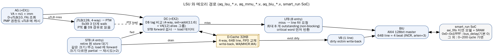
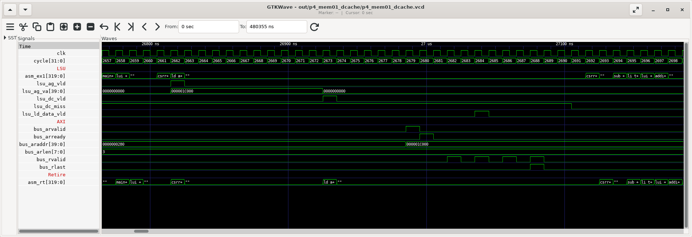
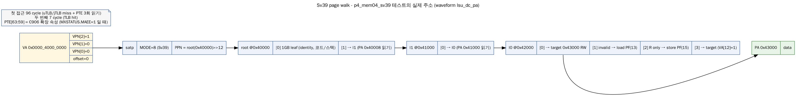
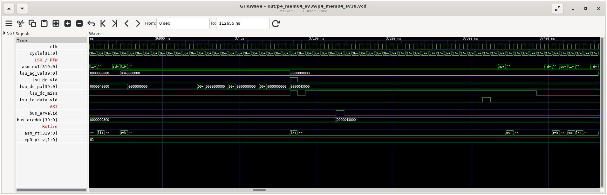

# Phase 4: Memory Subsystem (LSU, MMU, BIU)

> **기간**: Week 6-7
> **목표**: load/store 가 LSU → D-Cache → (miss 시) BIU/AXI → 메모리로 가는 경로, Sv39 주소 변환과 page attribute 를 RTL 과 실측으로 이해한다.
> ⚠️ v2 정정: (1) D-Cache 는 2-way 가 아니라 **4-way**, LRU 가 아니라 **FIFO** 교체 (2) line fill 은 **AXI WRAP 버스트 4 beat**(arlen=3), INCR 8 beat 가 아님 (3) C906 의 물리 주소는 **40bit** (Sv39 스펙의 56bit 가 아님) (4) STB forwarding 은 "같은 크기/주소"일 때만 (5) 페이지 속성(PMA)은 sysmap.h 또는 PTE[63:59] 확장 비트에서 온다.

---

## 1. 메모리 경로 전체



| 블록 | 핵심 사양 | 근거 |
|-----|---------|-----|
| LSU 파이프라인 | AG(=EX1) → DC(=EX2), 사이클당 1 접근 | `aq_lsu_ag.v`, `aq_lsu_dc.v` |
| D-Cache | 32KB, **4-way**, 64B line, write-back, **FIFO**, VIPT | datasheet, `aq_dcache_tag_array.v` |
| STB (store buffer) | 4 entry | `aq_lsu_stb.v` DEPTH=4 |
| LFB (line fill buffer) | 8 entry → 최대 8 개 outstanding miss (non-blocking) | `aq_lsu_lfb.v` DEPTH=8 |
| VB (victim buffer) | dirty line 1 개 | `aq_lsu_vb.v` |
| Prefetch | MHINT.DPLD 로 켬, 2/4/8/16 line 거리 | `aq_lsu_pfb*.v` |
| uTLB | I/D 각각 10 entry, fully associative | `aq_mmu_utlb.v` ENTRY_NUM=10 |
| jTLB | 128 entry, 4-way, I/D 공유 | `cpu_cfig.h` JTLB_ENTRY_128 |
| PTW | Sv39 HW walk, PTE 를 D-Cache 경유로 읽음 | `aq_mmu_ptw.v` |
| BIU | AXI4 128bit master, 캐시 line = WRAP 4 beat | `aq_biu_*.v` |
| 물리 주소 | **40bit** (`PA_WIDTH 40`) | `cpu_cfig.h` |

---

## 2. LSU

### 2.1 파이프라인: AG(EX1) → DC(EX2)

| 단계 | 하는 일 |
|-----|--------|
| AG (EX1) | VA = rs1 + imm, D-uTLB 조회(PA, 속성, PMP 권한), 정렬 검사, D-Cache tag/data 읽기 시작 |
| DC (EX2) | tag 비교(4-way + alias 그룹), STB forward 검사, 데이터 정렬/부호 확장 → RTU 로 결과(wb1) |
| miss | LFB 등록 → BIU 로 line fill → critical word 가 오면 바로 결과 반환 |

- load 결과는 EX2 에서 나온다 → 다음 명령이 바로 쓰면 **+1 cycle** (`p3_be01` ld_use).
- 실측 load hit 5 cycle / miss 31 cycle (`p4_mem01` MARK 1/2, TIC/TOC 오버헤드 3 포함, 메모리 지연 0).



D-Cache miss 한 번의 AXI 흐름 (`p4_mem01` MARK 1): `bus_arvalid`(arlen=3, WRAP) → 4 beat `bus_rvalid` → **두 번째 beat 쯤에 `lsu_ld_data_vld`**(요청한 word 가 먼저 오는 critical-word-first) → `rlast`.

```verilog
// aq_lsu_lfb.v:913-918 / aq_ifu_icache.v:1363-1365 - cacheable 이면 WRAP 4 beat, 아니면 INCR 1 beat
assign lsu_biu_arlen[1:0]   = arbus[BUS_LEN_1:BUS_LEN_0];
assign lsu_biu_arburst[1:0] = arbus[BUS_LEN_1] ? 2'b10 : 2'b01;      // 10 = WRAP, 01 = INCR
assign ifu_biu_arlen[1:0]   = icache_refill_ca ? 2'b11 : 2'b00;
assign ifu_biu_arburst[1:0] = icache_refill_ca ? 2'b10 : 2'b01;
```

### 2.2 D-Cache 구조와 VIPT alias

| 항목 | 값 |
|-----|----|
| 크기/way | 32KB, 4-way → way 하나 8KB |
| line | 64B |
| tag 인덱스 | **addr[11:6]** (64 set) — 4KB 페이지 오프셋 안의 비트만 사용 |
| alias 그룹 | way 하나가 8KB 라 addr[12] 가 페이지 밖. RTL 은 VA[12] 별 그룹(`dc_hit_way[7:0]`, `dc_hit_way_group`)으로 나눠 찾고, 다른 그룹에서 찾으면 **alias hit** 로 처리 |
| 교체 | FIFO |
| 정책 | write-back, write-allocate(MHCR.WA) |

```verilog
// aq_dcache_tag_array.v:150-151 - tag SRAM 인덱스는 addr[11:6] (64 entry)
aq_spsram_64x58  x_aq_spsram_64x58_bank0 (
  .A                  (tag_idx[11:6]     ), ...
// aq_lsu_dc.v:1224 - VA[12] 로 정한 그룹이 아닌 곳에서 hit = alias hit
assign dc_alias_hit_raw = |(dc_hit_way_group[1:0] & ~(2'b1 << dcache_acc_virt_idx[0]));
```

> 💡 **VIPT alias 문제**: 인덱스에 VA 의 페이지 밖 비트(여기선 bit12)를 쓰면, 같은 물리 주소가 VA 에 따라 다른 set 에 들어갈 수 있다(synonym). C906 은 하드웨어로 다른 그룹을 함께 찾아 해결한다. 실측(`p4_mem04_sv39` MARK 5): 같은 물리 페이지를 VA[12]=0/1 두 주소로 매핑해 한쪽으로 쓰고 다른 쪽으로 읽어도 값이 일치했다.

**교체 정책 실측 — FIFO vs LRU 판별** (`p4_mem01` MARK 3, 8KB 간격으로 같은 set 에 5 개 line)

| 순서 | 접근 | cycles | 해석 |
|-----|-----|-------|-----|
| 1~4 | A0, A1, A2, A3 | miss ×4 | 4-way 가득 |
| 5 | A0 다시 | **5 (hit)** | LRU 라면 A0 가 '가장 최근'이 됨 |
| 6 | A4 | 30 (miss) | 하나를 쫓아냄 |
| 7 | A0 | **222 (miss)** | FIFO: 가장 먼저 들어온 A0 가 쫓겨났다 (LRU 였다면 hit) |
| 8 | A1 | 21 (miss) | 7 번의 refill 이 다음 FIFO 순서인 A1 을 쫓아냄 |

→ **FIFO 확인.** (7 번의 222 cycle 은 I-fetch miss 와 겹쳐 SoC 지연 모델의 대기 효과가 붙은 값, 6 절)

### 2.3 Store Buffer 와 store-to-load forwarding

- retire 된 store 는 STB(4 entry)에 들어가 D-Cache 로 내려간다(merge 가능).
- 뒤따르는 load 가 STB 안의 주소를 읽으면:
  - load 바이트를 한 엔트리가 **완전히** 덮으면 → STB 데이터로 즉시 응답(forward)
  - 일부만 겹치거나 여러 엔트리에 걸치면 → forward 불가, 재시도(stall)

```verilog
// aq_lsu_stb.v:590-600
assign stb_dc_ld_fwd_vld        = |(dc_hit_stb_full[DEPTH-1:0]);          // 완전 포함
assign stb_dc_ld_data[...]      = {..{dc_hit_stb_full[0]}} & stb_entry0_data | ... ;
assign stb_dc_multi_or_part_hit = (|(dc_hit_stb_part[DEPTH-1:0])) | dc_hit_stb_merge_addr; // 부분
```

| 실측 (`p4_mem02_stb`, store→load 쌍 ×16, 이상적 35) | cycles | trace 이벤트 |
|---|---|---|
| sd A ; ld A (같은 크기/주소) | 36 | STB-fwd ×16 |
| sd A ; ld A+64 (다른 line) | 36 | — |
| sb A ; lbu A | 36 | STB-fwd ×16 |
| **sd A ; lw A+4** (load 가 store 안에 포함) | **68** | STB-partial ×16 |
| **sw A ; ld A** (load 가 더 큼) | **68** | STB-partial ×16 |

→ 이론상 forward 가능한 "sd 안의 lw" 도 C906 은 partial 로 처리해 쌍당 +2 cycle. **같은 크기로 쓰고 읽는 것**이 빠르다.

### 2.4 Write-allocate 와 prefetch

| 실측 (`p4_mem01`, 64 line) | cycles | 다시 읽을 때 D$ miss |
|---|---|---|
| store 64 회, WA=1 (MHCR.WA) | 812 | 0 |
| store 64 회, WA=0 | 1220 | 64 |
| load 64 회 순차 (line 당 1 회), 지연 0, prefetch off | 1229 (19/line) | 64 |
| 같은 접근, prefetch on (MHINT.DPLD) | 3164 | 54 |
| 같은 접근, 지연 100, prefetch off / on | 7629 / 8564 | 64 / 54 |

> ⚠️ 이 SoC 에서는 prefetch 를 켜면 miss 는 줄지만(64→54) 오히려 느려진다. 6 절의 SoC 지연 모델이 "줄 서 있는 두 번째 읽기"에 약 200 cycle 을 더 붙이기 때문이다(prefetch 는 outstanding 요청을 늘린다). 실제 칩의 DRAM 경로에서는 결과가 다를 수 있다 — **측정값은 메모리 모델에 의존한다**는 교훈.

### 2.5 비정렬 접근 (MXSTATUS.MM)

| 실측 (`p3_be04_trap`) | 결과 |
|---|---|
| ld +3 (8B 경계 걸침), MM=1 (기본) | 예외 없음, 7 cycle (정렬 6) — HW 가 두 번 나눠 접근 |
| 같은 접근, MM=0 | load address misaligned (mcause 4), mtval = 주소 |

### 2.6 Atomic

LR/SC/AMO 의 의미와 실측은 부록 A 의 7 절. RTL: AMO 는 IDU split → LSU(`aq_lsu_amo_alu.v`), reservation 은 `aq_lsu_amr.v`.

---

## 3. MMU — Sv39

### 3.1 구성

| 파일 | 역할 |
|-----|-----|
| `aq_mmu_top.v` | MMU top |
| `aq_mmu_utlb.v` (+ `_utlb_entry`, `_utlb_top`) | I-uTLB / D-uTLB, 10 entry FA |
| `aq_mmu_jtlb.v` (+ tag/data array) | jTLB 128 entry 4-way, PLRU (`aq_mmu_plru.v`) |
| `aq_mmu_ptw.v` | HW page table walker, PMA/PMP 결합 |
| `aq_mmu_sysmap.v`, `sysmap.h` | 주소 구간별 기본 속성(PMA) |
| `aq_mmu_regs.v`, `aq_mmu_tlboper.v` | satp 등 레지스터, sfence/TLB 조작 |
| `aq_mmu_arb.v` | IFU/LSU 요청 중재 |

### 3.2 Sv39 주소와 PTE

```
VA (39bit, 상위 25bit 는 bit38 부호 확장)
 | VPN[2] 38:30 | VPN[1] 29:21 | VPN[0] 20:12 | offset 11:0 |
PA (C906: 40bit)
 | PPN 39:12 | offset 11:0 |
PTE (64bit)
 | 63..59 C906 확장 {SO,C,B,SH,SEC} | 58..54 rsvd | PPN 53:10 | RSW 9:8 | D A G U X W R V |
```

- leaf 판정: R/W/X 중 하나라도 1 이면 leaf. leaf 가 L2 면 1GB, L1 이면 2MB 페이지(PPN 하위 비트가 0 이어야 함).
- **C906 확장 속성**(MXSTATUS.MAEE=1 일 때만 사용): SO(strong order/device), C(cacheable), B(bufferable), SH(shareable), SEC(trustable). Linux 의 T-Head 지원 코드(_PAGE_SO, _PAGE_CACHE …)가 이 비트를 쓴다.

### 3.3 Page walk 실측



`p4_mem04_sv39` 는 다음을 구성하고 S-mode 로 내려가 접근한다.

| PTE | 매핑 |
|-----|-----|
| root[0] | VA 0~1GB → PA 0~1GB identity, 1GB leaf (코드/데이터/스택) |
| root[1] → l1[0] → l0[0] | VA 0x4000_0000 → PA 0x43000 (RW) |
| l0[1] | invalid → load page fault |
| l0[2] | R only → store page fault |
| l0[3] | VA 0x4000_3000 → 같은 PA (VA[12]=1, alias 실험) |

| 실측 | 값 |
|-----|----|
| 첫 load (uTLB/jTLB miss → PTW 3 단계) | **96 cycle** |
| 같은 페이지 두 번째 load (TLB hit) | **7 cycle** |
| PTW 의 PTE 읽기 주소 (waveform `lsu_dc_pa`) | 0x40008 (root[1]) → 0x41000 (l1[0]) → 0x42000 (l0[0]) → 0x43000 (데이터) |
| VA 0x4000_1000 load | mcause 13 (load page fault), mtval = 0x4000_1000 |
| VA 0x4000_2000 store | mcause 15 (store page fault), mtval = 0x4000_2000 |
| VA alias (VA[12] 0 ↔ 1) 쓰기/읽기 | 일치 (HW alias 처리) |



### 3.4 페이지 속성 (PMA) — sysmap.h 와 MAEE

M-mode 이거나 MMU 가 꺼져 있으면 `sysmap.h` 의 8 개 구간이 속성을 정한다. 각 구간의 플래그 5bit 는 PTE 확장 비트와 같은 순서 {SO, C, B, SH, SEC}.

| 구간 (상한, 미포함) | 플래그 | 의미 | 이 SoC 에서 |
|---|---|---|---|
| 0 : ~0x8FFF_F000 | 01111 | cacheable/bufferable 메모리 | SRAM, **UART(0x1001_5000)도 여기** |
| 1 : ~0xBFFF_F000 | 10011 | strong order, non-cacheable (device) | |
| 2 : ~0xCFFF_F000 | 00011 | non-cacheable | |
| 3 : ~0xEFFF_F000 | 01101 | cacheable, SH=0 | |
| 4 : ~0xFFFF_F000 | 01111 | cacheable | |
| 5 : ~0x3F_FFFF_F000 | 01111 | cacheable | |
| 6 : ~0x4F_FFFF_F000 | 10010 | device | **CLINT/PLIC (0x40_0000_0000~)** |
| 7 : ~0xFF_FFFF_F000 | 01111 | cacheable | |
| 그 밖 | — | strong order / non-cacheable / non-bufferable | |

```verilog
// aq_mmu_ptw.v:719-720 - 변환된 페이지의 속성 : MAEE=1 이면 PTE[63:59], 아니면 sysmap
assign ptw_ref_pma[4:0] = cp0_mmu_maee && !ptw_pmp_mach ? lsu_data_flop[63:59]
                                                        : sysmap_mmu_flg[4:0];
```

> ⚠️ **겪은 문제 1 — UART 출력이 안 나옴**: smart_run 의 tb.v 는 0x1001_5000 으로의 AXI write 를 콘솔로 찍지만, 이 주소가 sysmap 구간 0(cacheable)이라 `sw` 가 D-Cache 에만 머물고 버스로 나가지 않았다. 유닛 테스트는 그래서 `csrw mscratch` 를 콘솔 채널로 쓴다(Phase 1 의 7 절).
> ⚠️ **겪은 문제 2 — MAEE=0 의 S-mode**: MAEE=0 으로 Sv39 를 켰을 때 S-mode 의 명령 fetch 와 load 가 매번 버스로 나가는(캐시되지 않는) 동작이 관찰됐다(매뉴얼은 sysmap 속성을 쓴다고 설명). 공식 MMU 테스트(`tests/cases/MMU`)처럼 **MAEE=1 + PTE[63:59]=0x0F** 로 두자 정상(TLB hit load 7 cycle)이 되었다.

### 3.5 TLB 관리

- `sfence.vma` : TLB 무효화. 페이지 테이블을 바꾼 뒤 필요.
- C906 은 **M-mode 접근도 uTLB 를 거치며**(PTW 의 `PTW_MACH_PMP` 상태), PMP 권한을 uTLB 엔트리에 저장한다 → PMP 를 바꾼 뒤에도 `sfence.vma` 가 필요하다(Phase 5 의 PMP 실험).
- UM: uTLB miss 후 jTLB hit 면 최소 4 cycle 에 결과.

---

## 4. BIU — AXI4 Master

### 4.1 구성

| 파일 | 역할 |
|-----|-----|
| `aq_biu_top.v` | BIU top |
| `aq_biu_req_arbiter.v` | IFU(I$ refill)와 LSU(LFB/VB/non-cacheable) 요청 중재 |
| `aq_biu_read_channel.v` / `_write_channel.v` | AR/R, AW/W/B 채널 |
| `aq_biu_wt_entry.v` | write 추적 |
| `aq_biu_apbif.v` | 코어 내부 CLINT/PLIC 접근 경로 |

### 4.2 AXI 트랜잭션

| 종류 | arburst | arlen | 용도 |
|-----|---------|-------|-----|
| 캐시 line fill (I$/D$) | WRAP (10) | 3 (4 beat × 16B = 64B) | critical word 부터 |
| non-cacheable / device | INCR (01) | 0 | 단일 접근 |

```
AR: arvalid ─┐  arready ─┐ (SoC 지연 모델이 여기서 붙잡음)
R : rvalid    ─┐ ─┐ ─┐ ─┐ rlast
LSU: ld_data_vld   └ (critical word 도착 즉시)
```

---

## 5. smart_run SoC 의 메모리 지연 모델 (실측 해석에 필수)

CPU 밖(smart_run/logical) 의 `axi_fifo` 가 AR 요청을 FIFO 에 넣고, 엔트리마다 카운터가 0 이 되면 메모리로 보낸다.

```verilog
// smart_run/logical/axi/axi_fifo.v:205-208 - 0x0~0x1FFFF 의 cacheable 읽기만 '지연 레지스터 값'을 로드
assign araddr_hit = (biu_pad_araddr >= SRAM_START) && (biu_pad_araddr <= SRAM_END) // 0x0 ~ 0x1FFFF
                 &&  biu_pad_arcache[2];
assign create_vld = create_en && araddr_hit;          // counter_load = read_delay (APB 0x1001A000, 기본 0)
// smart_run/logical/common/fifo_counter.v - 로드되지 않은 카운터는 0xC8(200)부터 계속 감소/재장전
```

| 주소 | 읽기 지연 |
|-----|---------|
| 0x0 ~ 0x1FFFF (명령 영역 포함) | `bus_delay` 레지스터 값 (기본 0) — 결정적 |
| 그 밖 (예: .data 의 0x40000~) | free-running 카운터 위상에 따라 **0~200 cycle 가변** |
| 다른 읽기 뒤에 줄 선 요청 | 자기 카운터가 0 이 되는 순간을 놓치면 **약 200 cycle 추가** |

- 그래서 `p4_mem01` 은 버퍼를 0x10000~0x1FFFF 에 두고, `bus_delay` 를 0/100 으로 바꿔 가며 측정한다. `bus_delay`(APB 0x1001_A000) 역시 cacheable 구간이라 MHCR.DE 를 잠시 끄고 쓴다.
- 처음 0x40000 대 버퍼로 측정했을 때 line 당 약 100 cycle, 요청마다 14~191 cycle 로 들쭉날쭉했던 원인이 이것이다(`tools/vcd_query.py` 로 AR valid→ready 간격을 세어 확인).

---

## 6. Simulation Exercises (유닛 테스트)

```bash
cd smart_run/study/unit_tests
make run T=p4_mem01_dcache      # hit/miss, FIFO, prefetch, write-allocate
make run T=p4_mem02_stb         # store-to-load forwarding
make run T=p4_mem03_amo_fence   # LR/SC, AMO, fence, fence.i
make run T=p4_mem04_sv39        # Sv39, PTW, page fault, alias
python3 tools/vcd_query.py out/p4_mem01_dcache/p4_mem01_dcache.vcd --mark 1 \
    --signals bus_arvalid,bus_arready,bus_araddr,bus_arlen,bus_rvalid,bus_rlast,lsu_ld_data_vld
```

### Lab 4.1: miss 한 번 해부
- [ ] MARK 1 에서 AR 요청 → R 4 beat → load 데이터 반환 순서를 사이클로 적는다
- [ ] critical word 가 몇 번째 beat 인지 확인한다

### Lab 4.2: 교체 정책
- [ ] MARK 3 의 8 개 접근 결과로 FIFO 와 LRU 를 구분하는 논리를 설명한다
- [ ] (응용) A0 재사용을 빼면 결과가 어떻게 바뀔지 예측하고 테스트를 고쳐 확인한다

### Lab 4.3: STB
- [ ] `p4_mem02` 의 5 가지 쌍에서 STB-fwd / STB-partial 이벤트를 pipeview 로 확인한다

### Lab 4.4: Sv39
- [ ] `lsu_dc_pa` 로 PTW 가 읽는 3 개 주소를 찾고 VPN 계산과 맞춘다
- [ ] page fault 두 종류의 mcause/mtval 을 확인한다
- [ ] (실험) 테스트의 MAEE 설정을 끄고 S-mode 접근 사이클이 어떻게 변하는지 본다

---

## 7. Checklist

- [ ] D-Cache 의 크기/way/line/교체/쓰기 정책을 정확히 말할 수 있다
- [ ] VIPT 의 alias 문제와 C906 의 해결 방식을 설명할 수 있다
- [ ] FIFO 와 LRU 를 구별하는 실험을 설계할 수 있다
- [ ] STB forward 가 되는 조건과 안 되는 조건을 말할 수 있다
- [ ] line fill 의 AXI 버스트 종류/길이와 critical-word-first 를 설명할 수 있다
- [ ] Sv39 VA/PA/PTE 구조와 3 단계 walk 를 그릴 수 있다
- [ ] PMA(sysmap/PTE 확장 비트)와 PMP 의 차이를 설명할 수 있다
- [ ] 측정값이 SoC 메모리 모델에 따라 달라지는 이유를 설명할 수 있다
