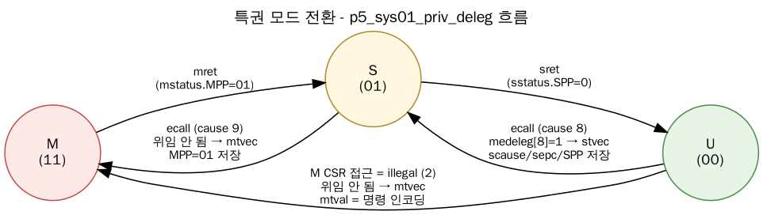
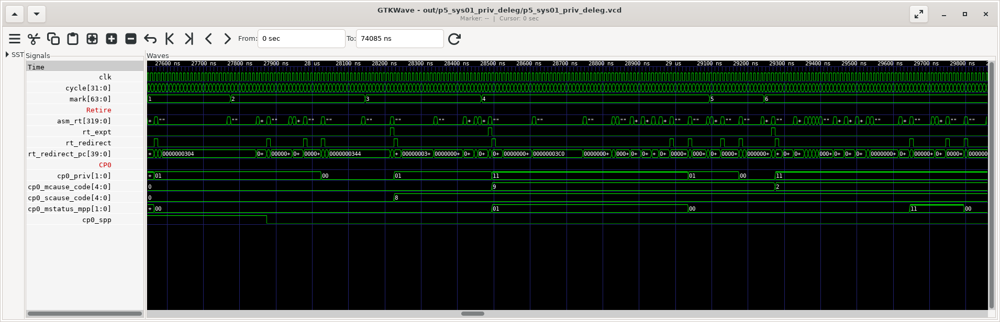
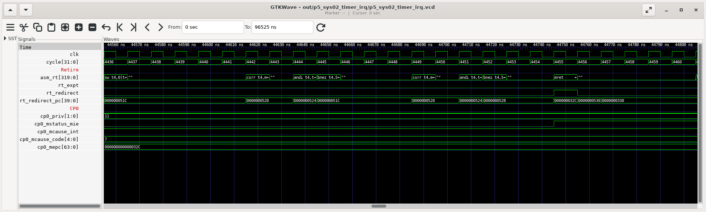
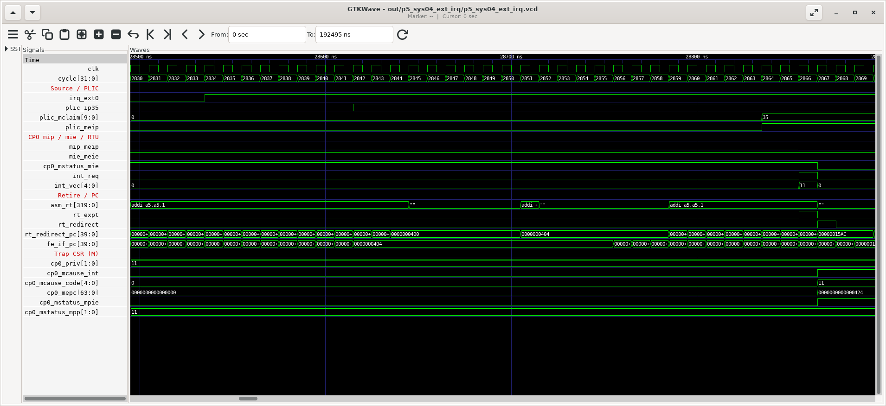
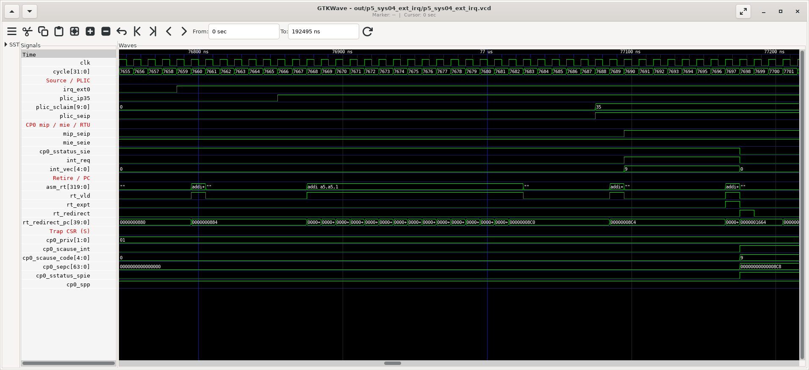
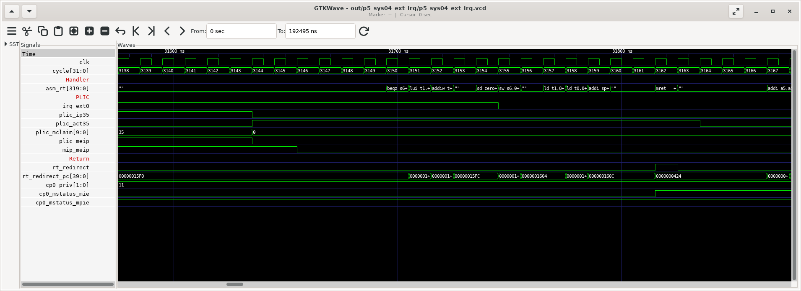
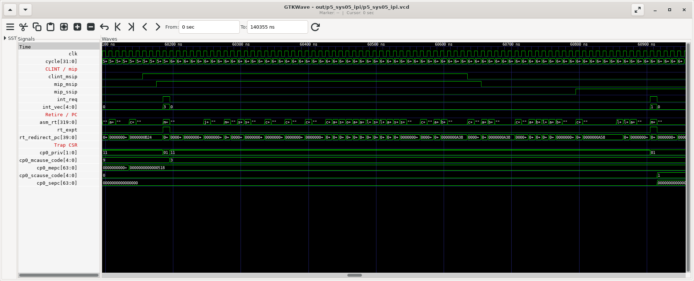
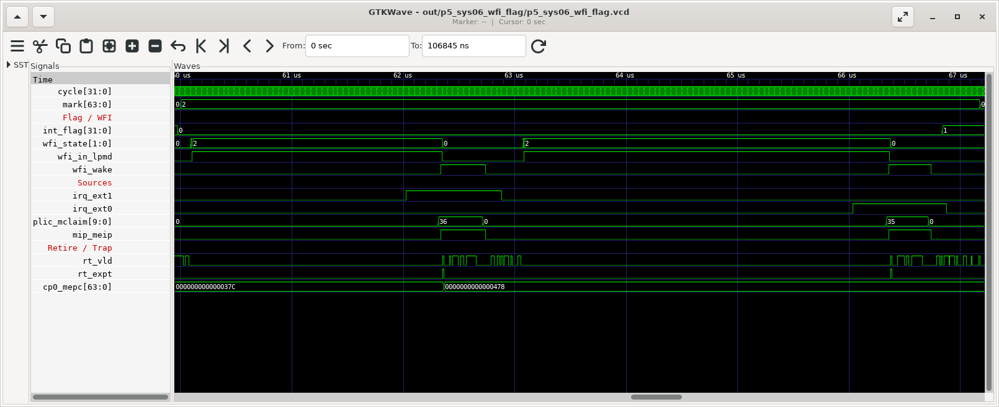
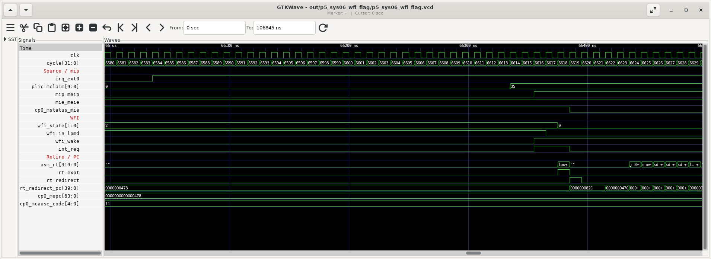
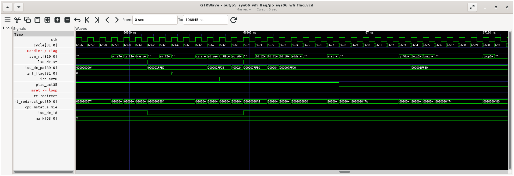

# Phase 5: Privileged Architecture & System (CP0, CLINT, PLIC, PMP)

> **기간**: Week 8-9
> **목표**: 특권 모드, CSR, trap/위임, 인터럽트(CLINT/PLIC), PMP 를 스펙 → RTL → 실측 순서로 이해한다.
> ⚠️ v2 정정: (1) CLINT/PLIC 는 SoC 가 아니라 **CPU top(`openC906.v`) 안**에 있다 (2) CLINT 주소/레지스터 맵을 UM 기준으로 정정(MTIME 은 MMIO 가 아니라 time CSR) (3) PMP 매칭 모드는 4 가지(OFF/TOR/NA4/NAPOT)이며 **C906 은 NA4 미지원, 최소 4KB** (4) PMP 를 바꾼 뒤 `sfence.vma` 가 필요하다(실측).
> 📚 표준: Privileged Architecture 1.10 기준 (부록 A 1 절). CSR 주소 규칙·WARL 은 부록 A 8 절.
> 🆕 6 절: 테스트벤치가 외부 인터럽트 선을 올려 M/S 모드 인터럽트 진입을 사이클 단위로 비교하고(`p5_sys04_ext_irq`), IPI 를 본다(`p5_sys05_ipi`). 6.7 절은 인터럽트 플래그 + `while (!int_flag) { wfi; }` 대기 루프(`p5_sys06_wfi_flag`). PC·trap CSR 의 기능과 설정값, 트랩 엔트리와 핸들러 진입 순서를 정리했다.

---

## 1. 특권 모드

| 모드 | 인코딩 | 용도 | C906 |
|-----|-------|-----|-----|
| M (Machine) | 11 | 펌웨어, trap 최종 처리 | reset 시 M |
| S (Supervisor) | 01 | OS 커널, 가상 메모리 | 지원 |
| U (User) | 00 | 응용 | 지원 |
| (H 10) | — | 하이퍼바이저 | 미지원 → MPP 에 10 을 쓰면 00 (WARL) |

- 현재 모드는 표준 CSR 로는 직접 읽을 수 없다(설계 의도: 하위 모드가 자기 모드를 몰라도 되게). C906 은 MXSTATUS[31:30] PM 으로 보여 준다(M 에서만 읽기 가능).



---

## 2. CP0 (System Control)

### 2.1 구성

```
gen_rtl/cp0/rtl/ (15 files)
```

| 파일 | 역할 |
|-----|-----|
| `aq_cp0_top.v` | CP0 top |
| `aq_cp0_iui.v` | CSR 명령 인터페이스 (읽기/쓰기, 권한/illegal 판정) |
| `aq_cp0_regs.v` | CSR 묶음 컨테이너 ↓ |
| ├ `aq_cp0_info_csr.v` | misa, mvendorid, marchid, mimpid, mhartid |
| ├ `aq_cp0_trap_csr.v` | mstatus/sstatus, mtvec/stvec, mepc/sepc, mcause/scause, mtval/stval, mie/mip, medeleg/mideleg |
| ├ `aq_cp0_prtc_csr.v` | satp, PMP 관련 |
| ├ `aq_cp0_hpcp_csr.v` | 성능 카운터 CSR (Phase 7) |
| ├ `aq_cp0_float_csr.v` | fcsr/frm/fflags (Phase 6) |
| └ `aq_cp0_ext_csr.v` | C906 확장: mxstatus, mhcr, mcor, mhint, mrvbr … |
| `aq_cp0_special.v` | mret/sret/wfi/ecall 등 특수 명령 |
| `aq_cp0_fence_inst.v`, `aq_cp0_cache_inst.v` | fence/fence.i/sfence.vma, 캐시 조작 |
| `aq_cp0_lpmd.v` | 저전력 모드(WFI) |
| `aq_cp0_rst_ctrl.v`, `aq_cp0_vector_inst.v` | reset 시퀀스, 벡터 관련 |

### 2.2 주요 CSR

**Machine**

| CSR | 주소 | 내용 |
|-----|-----|-----|
| mstatus | 0x300 | MIE/MPIE/MPP, SIE/SPIE/SPP, FS, MPRV, SUM, MXR … |
| misa | 0x301 | 실측 0x8000_0000_0094_112D = RV64 ACDFIMSUX |
| medeleg / mideleg | 0x302 / 0x303 | 예외/인터럽트를 S 로 위임 |
| mie / mip | 0x304 / 0x344 | 인터럽트 enable / pending |
| mtvec | 0x305 | trap 진입 주소 (direct / vectored) |
| mcounteren | 0x306 | 하위 모드의 cycle/time/instret/hpm 읽기 허용 |
| mscratch / mepc / mcause / mtval | 0x340~0x343 | trap 처리용 |
| mcountinhibit | 0x320 | 카운터 정지 (1.10 이후 추가분, C906 지원) |
| pmpcfg0 / pmpaddr0~7 | 0x3A0 / 0x3B0~ | PMP |

**Supervisor** : sstatus(0x100), sie/sip, stvec(0x105), scounteren(0x106), sscratch/sepc/scause/stval(0x140~), satp(0x180)

### 2.3 mstatus 와 trap 진입/복귀

```
 mstatus (일부):  ... | MPP[12:11] | SPP[8] | MPIE[7] | SPIE[5] | MIE[3] | SIE[1] |

 M 으로 trap :  MPIE ← MIE,  MIE ← 0,  MPP ← 이전 모드,  mepc ← PC,  mcause/mtval 기록,  PC ← mtvec
 mret        :  MIE ← MPIE,  MPIE ← 1, 모드 ← MPP,  MPP ← U(00),  PC ← mepc
 S 로 trap / sret 는 SPIE/SIE/SPP 로 같은 일을 한다 (SPP 는 1bit: U 또는 S)
```

```verilog
// aq_cp0_trap_csr.v:635-649 - MPP
  if(!cpurst_b)                                   mpp[1:0] <= 2'b11;      // reset: M
  else if(rtu_yy_xx_expt_vld && !mdeleg_vld_dp)   mpp[1:0] <= pm[1:0];    // M 으로 trap: 이전 모드
  else if(iui_regs_inst_mret)                     mpp[1:0] <= 2'b00;      // mret 후 U
  else if(mstatus_local_en && regs_mpp_write_ill) mpp[1:0] <= 2'b00;      // 10(H) 쓰기 → 00 (WARL)
  else if(mstatus_local_en)                       mpp[1:0] <= iui_regs_wdata[12:11];
// aq_cp0_trap_csr.v:653-662 - SPP
  else if(rtu_yy_xx_expt_vld && mdeleg_vld_dp)    spp <= pm[0];          // S 로 위임된 trap
  else if(iui_regs_inst_sret)                     spp <= 1'b0;
```

**sstatus 는 mstatus 의 '창'** — 별도 레지스터가 아니라 같은 비트의 일부만 보이는 뷰다. 실측(`p5_sys01`): M 에서 `csrsi sstatus, 2` 후 mstatus.SIE = 1.

### 2.4 위임 (medeleg / mideleg)

```verilog
// aq_cp0_trap_csr.v:797-799 - 위임은 "현재 S 또는 U 모드"일 때만 (M 에서 난 trap 은 항상 M)
assign medeleg_vld_dp = (pm[1] == 1'b0) && !rtu_yy_xx_expt_int
                 && |(vec_num[15:0] & edeleg[15:0]);
```

### 2.5 실측 — 모드 전환과 위임 (`p5_sys01_priv_deleg`)



| 단계 | 사건 | 기록된 값 |
|-----|-----|---------|
| M → S | MPP=01, mret | `cp0_priv` 11 → 01 |
| S → U | SPP=0, sret | 01 → 00 |
| U: ecall | medeleg[8]=1 → **S 의 stvec** 으로 | scause = 8, sepc = ecall 주소(u_entry+4), sstatus.SPP = 0 |
| S: ecall | 위임 안 됨 → M | mcause = 9, mstatus.MPP = 01 |
| M: mret → S, S: sret → U | | |
| U: `csrr t1, mstatus` | U 는 M CSR 접근 불가 → illegal → M | mcause = 2, MPP = 00, mtval = 0x30002373 (명령 인코딩) |

### 2.6 예외 원인 코드 (mcause, 인터럽트 비트 = 0)

| 코드 | 원인 | 이 자료에서 실측한 곳 |
|-----|-----|-----------------|
| 0 / 1 / 2 | 명령 주소 비정렬 / 명령 접근 오류 / 불법 명령 | 2: `p3_be04`, `p5_sys01` |
| 3 | breakpoint (ebreak) | `p3_be04` |
| 4 / 5 | load 비정렬 / load 접근 오류 | 4: `p3_be04` (MM=0) |
| 6 / 7 | store 비정렬 / store 접근 오류 | 7: `p5_sys03` (PMP) |
| 8 / 9 / 11 | ecall from U / S / M | 8,9: `p5_sys01`, 11: `p3_be04` |
| 12 / 13 / 15 | 명령 / load / store page fault | 13,15: `p4_mem04` |

인터럽트(mcause[63]=1)의 코드와 C906 우선순위는 Phase 3 의 3.4 절(`aq_rtu_int.v`).

---

## 3. CLINT (Core Local Interruptor)

### 3.1 위치와 레지스터 맵 (UM 9 장)

- `openC906.v:886` 에서 `clint_top` 인스턴스 — CPU top 안. 버스 주소의 상위 13bit 는 SoC 가 `pad_cpu_apb_base`(smart_run: 0x40_0000_0000) 로 지정.
- sysmap 구간 6(device, strong order) 에 들어가므로 버스로 직접 나간다. **word(sw/lw) 접근만** 지원.

| 오프셋 | 레지스터 | 의미 |
|-------|---------|-----|
| 0x400_0000 | MSIP0 | bit0 = 1 → mip.MSIP (machine software interrupt) |
| 0x400_4000 / 0x400_4004 | MTIMECMPL0 / H0 | mtime ≥ mtimecmp → mip.MTIP |
| 0x400_C000 | SSIP0 | S 모드 소프트웨어 인터럽트 (C906 확장, MXSTATUS.CLINTEE) |
| 0x400_D000 / 0x400_D004 | STIMECMPL0 / H0 | S 모드 타이머 (C906 확장, CLINTEE) |

- **mtime 은 MMIO 로 읽지 않는다** — `rdtime` (time CSR, mtime 의 읽기 전용 미러). S/U 는 mcounteren.TM 이 1 이어야 읽을 수 있다.
- 64bit mtimecmp 를 32bit 두 번에 쓸 때는 H 를 먼저 최대값 → L → H 순서로 써야 중간 값 때문에 가짜 인터럽트가 생기지 않는다.

### 3.2 실측 (`p5_sys02_timer_irq`)

| 항목 | 값 | 의미 |
|-----|----|-----|
| 200 회 루프 동안 time / mcycle 증가 | 464 / 464 | 이 SoC 에서 mtime 은 CPU 클럭과 같은 속도 |
| mtimecmp = now+300 후 WFI → handler 진입 시 time − 목표 | **30** | 비교 → mip → retire 에서 trap → handler 까지 |
| mcause | 0x8000_0000_0000_0007 | 인터럽트 비트 + MTI(7) |
| mepc − wfi 주소 | 4 | WFI 를 끝낸 뒤 다음 명령에서 인터럽트를 받음 |
| MSIP0 = 1 → 인터럽트 횟수 | 정확히 1 회 (handler 에서 mip 폴링 후 mret) | |
| mstatus.MIE = 0 에서 MSIP0 = 1 | mip.MSIP = 1, 진입 없음 → MIE = 1 이 되는 순간 진입 | |



> ⚠️ 처음 버전의 handler 는 MSIP0 에 0 을 쓴 직후 mret 해서 **같은 인터럽트에 두 번 진입**했다. CLINT 쓰기가 도착해서 mip 가 내려가기까지 시간이 걸린다. 해제 후 `mip` 를 확인하고 복귀하는 것이 안전하다(테스트의 handler 참고).

```asm
# p5_sys02_timer_irq.S trap_handler (발췌) : 해제 후 mip 가 내려갈 때까지 기다린다
  li   t3, CLINT_MSIP0
  sw   zero, 0(t3)
4:
  csrr t4, mip
  andi t4, t4, (1 << 3)
  bnez t4, 4b
  mret
```

---

## 4. PLIC (Platform-Level Interrupt Controller)

### 4.1 구성

- `openC906.v:916` 에서 `plic_top` 인스턴스 (CPU top 안), 주소 = `pad_cpu_apb_base` + 0x0.
- openc906: 외부 인터럽트 240 개(`PLIC_INT_NUM`), 우선순위 32 단계, level/pulse 트리거.

| 파일 | 역할 |
|-----|-----|
| `plic_top.v` | PLIC top |
| `plic_ctrl.v` | 제어 로직 |
| `plic_int_kid.v` | 인터럽트 소스별 pending/우선순위 |
| `plic_hart_arb.v` | hart(target)별 중재 |
| `plic_granu_arb.v`, `plic_32to1_arb.v` | 우선순위 비교 트리 |
| `plic_hreg_busif.v`, `plic_kid_busif.v` | 레지스터 버스 인터페이스 |

### 4.2 동작

1. 소스가 인터럽트 assert → pending
2. priority > threshold 이고 enable 된 것 중 최고 우선순위를 target(M 또는 S 컨텍스트)에 → mip.MEIP / SEIP
3. handler 가 **claim** 레지스터를 읽으면 그 ID 를 받고 pending 이 지워진다
4. 처리 후 같은 ID 를 **complete** 에 쓰면 다시 받을 수 있게 된다

실습: smart_run 기본 케이스 `make runcase CASE=interrupt` (`tests/cases/interrupt/C906_plic_int_smoke.s`, PLICBASE = 0x40_0000_0000). 유닛 테스트에서는 6 절의 `p5_sys04_ext_irq` 가 테스트벤치 외부 인터럽트로 gateway → 중재 → claim/complete 를 사이클 단위로 보여 준다.

---

## 5. PMP (Physical Memory Protection)

### 5.1 규칙 (Priv spec + C906)

```
pmpcfgN 의 각 바이트 :  L[7] | 0 0 | A[4:3] | X[2] | W[1] | R[0]
  A : 0 = OFF, 1 = TOR (이전 pmpaddr ~ 이 pmpaddr), 2 = NA4 (C906 미지원), 3 = NAPOT
NAPOT : pmpaddr = (base >> 2) | (size/8 - 1)      예) 4KB → 하위 9bit 가 1 (0x1FF)
우선순위 : 번호가 작은 entry 가 먼저 매칭
S/U 접근 : 매칭되는 entry 가 없으면 거부 (entry 가 하나라도 구현되어 있으므로)
M 접근   : L=1 인 entry 에만 제한받음. 매칭 없으면 허용
L=1      : 그 entry 는 reset 전까지 수정 불가, M 에도 적용
C906     : 8 entry, 최소 단위 4KB (UM 2.2.6)
```

```verilog
// aq_pmp_acc.v - 매칭되는 entry 가 없을 때의 기본 권한 : M 이면 RWX, 아니면 없음
assign pmp_default_flg[3:0] = cp0_mach_mode ? 4'b0111 : 4'b0;
// 첫 번째 매칭 entry 의 {L, X, W, R} 가 MMU 로 전달된다 (casez 우선순위 인코더)
    16'b???????????????1 : pmp_mmu_flg[3:0] = {pmpcfg0_value[07], pmpcfg0_value[2:0]};
```

### 5.2 실측 (`p5_sys03_pmp`)

설정: entry 0 = `prot_page`(4KB) NAPOT, R 만 / entry 7 = 전체 RWX (crt0)

| 단계 | 동작 | 결과 |
|-----|-----|-----|
| MARK 1 | M 에서 prot_page 에 store (L=0) | 성공 |
| MARK 2 | U 에서 load | 성공 (값 0x1234) |
| MARK 2 | U 에서 store | **store access fault (mcause 7)**, mtval = 주소 |
| MARK 3 | entry 0 에 L=1 후 **곧바로** M 에서 store | **성공(!)** |
| MARK 4 | `sfence.vma` 후 M 에서 store | **store access fault (7)** |
| — | locked entry 의 pmpaddr0 쓰기 | 무시됨 |
| — | pmpcfg0 entry0 읽기 | 0x99 = L, NAPOT, R |

> ⚠️ **PMP 변경 후 sfence.vma 가 필요하다.** C906 은 M-mode 접근도 uTLB 를 통해 처리하고, uTLB 를 채울 때 PMP 권한(`pmp_mmu_flg`)을 엔트리에 함께 저장한다(`aq_mmu_ptw.v`, `PTW_MACH_PMP` 상태). 그래서 이미 uTLB 에 있는 페이지는 PMP 를 바꿔도 예전 권한으로 접근된다. 표준 스펙에는 없는 동작이며, C906 용 펌웨어(OpenSBI 등)가 PMP 설정 뒤 `sfence.vma` 를 하는 이유다.

---

## 6. 인터럽트 진입 해부 — M vs S, 외부 인터럽트와 IPI (`p5_sys04_ext_irq`, `p5_sys05_ipi`)

Lab 5.2(`p5_sys02`)에서는 CLINT 타이머와 소프트웨어 인터럽트가 들어오는지를 확인했다. 여기서는 테스트벤치가 외부 인터럽트 선을 직접 올리고, 그 순간부터 핸들러에 들어갔다가 원래 코드로 돌아오기까지를 사이클 단위로 따라간다. 같은 조건에서 M 모드와 S 모드를 비교하고, 코어 사이 통신에 쓰는 인터럽트(IPI)도 본다.

### 6.1 실험 장치: TB 장치 → PLIC → 코어

```
 테스트 코드 (store)              테스트벤치 tb/study_tbdev.v          SoC (overlay)        CPU top (openC906.v)
 sd N, TBDEV_IRQ0_SET(t0) ──감지──▶ N 사이클 뒤 study_ext_irq[0] = 1 ──▶ xx_intc_int[19] ──▶ pad_plic_int_vld[19] ──▶ PLIC 소스 ID 35
 sd 0, TBDEV_IRQ0_CLR(t0) ──감지──▶ study_ext_irq[0] = 0                                         (level 트리거)
```

- 테스트 코드는 장치 드라이버처럼 store로 "장치"를 제어한다. `TBDEV_BASE`(0x1FFC0)는 일반 메모리라 store가 버스로 나가지 않는다. 그래서 TB 장치는 LSU DC 단계에서 store buffer로 들어가는 순간(`dc_stb_req`)을 계층 참조로 감지한다.
- SoC 쪽은 `unit_tests/tb/soc_overlay/cpu_sub_system_axi.v`를 쓴다. 원본과 다른 곳은 한 줄뿐이며, 원래 0으로 묶여 있던 인터럽트 선 2개 자리를 TB 장치가 구동한다. CPU RTL과 `tb.v`는 그대로다. Verilator 5.020은 다른 모듈 신호에 대한 `force`를 무시하므로 overlay 방식을 택했다.
- 소스 ID가 35인 이유는 다음 한 줄에 있다. 소스 0은 "없음", 1은 L2 ECC, 2~15는 예약이고, SoC의 선 n은 ID 16+n이 된다.

```verilog
// openC906.v:951
assign plic_int_vld[`PLIC_INT_NUM+15:0] = {pad_plic_int_vld[`PLIC_INT_NUM-1:0], 14'b0, l2c_plic_ecc_int_vld, 1'b0};
```

새 probe 신호(GTKW 그룹 `irq`, `trap`. 웹 뷰어에도 같은 순서로 나온다):

| 신호 | 의미 |
|-----|-----|
| `irq_ext0` | TB 장치가 구동하는 선 0 (= PLIC ID 35) |
| `irq_age` | 인터럽트 원인(외부 선, CLINT MSIP/SSIP/MTIP, mip.SSIP)이 1이 된 뒤 몇 사이클째인지. trap 순간의 값이 곧 "원인 → trap" 지연 |
| `plic_ip35` / `plic_act35` | PLIC pending(gateway 통과) / active(claim됨, complete 전) |
| `plic_mclaim` / `plic_sclaim` | 지금 M/S 컨텍스트 claim을 읽으면 받을 ID (0 = 없음) |
| `plic_meip` / `plic_seip` | PLIC → hart 0의 M/S 컨텍스트 인터럽트 요청 |
| `clint_msip` / `clint_ssip` | CLINT MSIP0 / SSIP0 레지스터 |
| `mip_*`, `mie_*` | CP0의 mip/mie 비트 (MEIP, SEIP, MSIP, SSIP …) |
| `int_req`, `int_vec` | RTU가 지금 받을 인터럽트가 있다(다음에 retire하는 명령에 붙는다), 그 원인 번호 |
| `cp0_mtvec`, `cp0_stvec`, `cp0_mideleg`, `cp0_sstatus_sie/spie` | trap CSR (`cp0_mepc`, `cp0_mcause_*`, `cp0_mstatus_*` 등은 기존 신호) |

콘솔(`out/<test>/console.log`)에는 TB 장치와 trap 로그가 함께 찍힌다.

```
[tbdev] cycle 2833: irq0 = 1  (PLIC ID 35)
[irq] #1 cycle 2866: M-mode interrupt cause 11 on retire of pc 0000000420, priv 3 -> 3, mepc = 0000000424, PC -> 00000015ac (source up 32 cycles before)
[tbdev] cycle 3154: irq0 = 0  (CLR, 321 cycles high)
```

### 6.2 PC와 관련 CSR: 무엇을, 어떤 값으로

| CSR (S 쪽 짝) | 기능 | 이 테스트의 값 | 설정할 때 알아 둘 것 |
|-----|-----|-----|-----|
| **mtvec** (stvec) | trap이 들어갈 PC. `BASE[63:2]`와 `MODE[1:0]`로 구성된다. MODE 0 = direct(모든 trap → BASE), 1 = vectored(인터럽트 cause n → BASE + 4n, 예외 → BASE) | `m_vectors \| 1` = 0x1581, `s_vectors \| 1` = 0x1641 | C906은 MODE[0]만 저장한다(`{mtvec_base, 1'b0, mtvec_mode[0]}`). vectored 테이블의 각 엔트리는 4바이트 명령 하나(보통 `j`)여야 하므로 `.option norvc`를 쓴다. BASE는 4바이트 정렬이면 충분하다(C906은 BASE + 4×cause를 덧셈으로 계산한다). direct 모드라면 핸들러 첫머리에서 mcause를 읽어 분기해야 한다(crt0의 `__trap_entry`가 그 예). |
| **mstatus.MIE** (sstatus.SIE) | 현재 모드의 전역 인터럽트 enable | M에서 받으려면 1 | **현재 모드보다 높은 모드의 인터럽트는 MIE와 무관하게 항상 켜져 있다**(S에서 실행 중일 때 MEI는 MIE=0이어도 들어온다, MARK 3). 반대로 S로 위임된 인터럽트는 M에서 실행 중이면 MIE=1이어도 받지 않는다(MARK 4). |
| **mstatus.MPIE / MPP** (SPIE / SPP) | trap 직전의 MIE와 모드를 보관한다. mret이 이 값으로 되돌린다 | 진입할 때 HW가 쓴다 | M → S로 내려가려면 MPP=01을 쓰고 mret한다. 핸들러 안에서 중첩 trap을 허용하려면 mepc/mstatus를 먼저 저장해야 한다. |
| **mie** (sie) | 원인별 enable. MEIE 11, MSIE 3, MTIE 7, SEIE 9, SSIE 1, STIE 5 | MARK에 따라 MEIE 또는 SEIE | sie는 mie 중 mideleg로 위임된 비트만 보이는 창이다(`sie_value = … seie && seip_acc_en …`). |
| **mip** (sip) | 원인별 pending. MEIP/MSIP/MTIP는 PLIC/CLINT 신호를 반영하며 읽기 전용이다. SEIP/STIP/SSIP는 M이 써서 S에 인터럽트를 "주입"할 수 있다 | `p5_sys05` MARK 2에서 M이 `csrsi mip, 2`(SSIP) | C906: `seip = PLIC S 요청 \|\| seip_reg`, `ssip = CLINT SSIP0 && CLINTEE \|\| ssip_reg`. 해제는 원인 쪽에서 한다(PLIC claim, CLINT 쓰기, sip 쓰기). |
| **mideleg** | 어떤 인터럽트를 S가 직접(stvec으로) 받을지 정한다 | MARK 2/4: bit 9 (SEI), `p5_sys05`: bit 1 (SSI) | M 수준 인터럽트(MEI/MSI/MTI)는 위임할 수 없다. C906 mideleg에는 그 비트가 아예 없다(`aq_cp0_trap_csr.v:840`). 위임은 S/U에서 실행 중일 때만 효과가 있다. |
| **mepc** (sepc) | 돌아갈 PC | HW가 쓴다 | 인터럽트일 때는 "아직 실행하지 않은 첫 명령"이 저장된다. 핸들러는 고치지 않고 그대로 mret한다. 예외일 때는 원인 명령 자신이 저장되므로, ecall이면 +4해야 한다. C906은 retire하는 명령에 인터럽트를 붙이므로, 그 명령은 완료되고 mepc = 그 다음 PC가 된다(아래 6.3). bit0은 항상 0이다. |
| **mcause** (scause) | bit63 = 인터럽트, 하위 비트 = 원인 번호 | MEI 0x8000…000B, SEI …09, MSI …03, SSI …01 | 핸들러는 bit63으로 예외와 인터럽트를 구분한다(`bgez` = 예외). |
| **mtval** (stval) | 예외의 부가 정보 | 인터럽트면 0 | `aq_rtu_retire.v:542-548` |
| **mscratch** (sscratch) | 보통 핸들러가 `csrrw sp, mscratch, sp`로 trap 전용 스택을 꺼낼 때 쓴다 | 쓰지 않음 | 이 프레임워크에서는 mscratch가 콘솔 채널이다. 그래서 테스트 핸들러는 인터럽트된 코드의 스택을 그대로 쓴다. |
| **mcounteren** | S/U가 cycle/time/instret을 읽을 수 있게 한다 | 7 | S 핸들러의 `rdcycle`용 |
| **PLIC** priority / enable / threshold / claim | 소스 우선순위(0 = 꺼짐), 컨텍스트별 enable, 컨텍스트별 threshold, claim/complete | ID 35 우선순위 1, threshold 0, M 컨텍스트 enable(0x2004 bit 3) 또는 S 컨텍스트 enable(0x2084 bit 3) | 우선순위가 threshold보다 커야 요청이 나간다. S 컨텍스트의 threshold/claim(0x201000/0x201004)은 S 모드에서 바로 접근된다(`plic_hreg_busif.v`: `pprot[0]`만 확인). 반면 priority/pending/enable 레지스터는 M 권한이 필요하다(PLIC_CTRL.S_PER = 1이면 S도 가능, `plic_top.v:244-251`). |

### 6.3 트랩 엔트리: 하드웨어가 하는 일 (MARK 1 실측)



| cycle | 파형에서 보이는 것 | 무슨 일인가 |
|------:|-----|-----|
| 2834 | `irq_ext0` = 1 | 장치가 선을 올린다 (TB 장치 `SET 40`의 결과) |
| 2842 (+8) | `plic_ip35` = 1 | PLIC gateway: 2단 동기화 flop + 상승 에지 검출 → pending. PLIC은 APB 클럭(= CPU 클럭의 1/2, `aq_mp_clk_top.v:67`)으로 동작하므로 4 APB 사이클이다 |
| 2864 (+30) | `plic_mclaim` = 35, `plic_meip` = 1 | PLIC 중재 FSM(`plic_arb_ctrl.v`): 소스 256개를 32개씩 8라운드 비교하고 delay와 claim 기록을 거친다. 약 11 APB 사이클 |
| 2866 (+32) | `mip_meip` = 1, `int_req` = 1, `int_vec` = 11 | sysio의 APB flop 하나를 지나 mip.MEIP가 된다. 같은 사이클에 CP0 판정(mie.MEIE && (모드 ≠ M \|\| MIE))을 통과해 RTU로 간다 |
| 2866 | `rt_expt` = 1 (retire 중인 명령: 0x420) | 이 사이클에 retire하는 명령에 인터럽트가 붙는다. 그 명령은 정상 완료된다 |
| 2867 | mcause = …0B, mepc = 0x424, MIE 1→0, MPIE 0→1, MPP = 11, `rt_redirect_pc` = 0x15AC | CSR이 갱신되고 파이프라인이 flush된다. PC ← mtvec BASE 0x1580 + 4×11 |
| 2868 | `fe_if_pc` = 0x15AC | 벡터 엔트리 fetch |
| 2887 (+21) | `asm_rt` = `j m_mei` | 벡터 엔트리 retire. 이때는 I$가 비어 있었다. 따뜻한 상태에서는 trap 후 6 사이클이다(MARK 3) |

하드웨어 순서를 정리하면 다음과 같다.

1. 원인 → PLIC pending (gateway)
2. PLIC 중재 → 컨텍스트별 요청 (M 컨텍스트 → MEIP, S 컨텍스트 → SEIP)
3. CP0 판정: mip & mie & 전역 enable 규칙 & 위임 → 후보 15개(`int_sel`)
4. RTU: 우선순위로 하나를 고른다(MEI > MSI > MTI > SEI > SSI > STI, Phase 3의 3.4절). 그 인터럽트를 **다음에 retire하는 명령에 붙인다**
5. trap: xepc ← 다음 PC, xcause ← 원인, xtval ← 0, xPIE ← xIE, xIE ← 0, xPP ← 현재 모드, 모드 ← M 또는 S
6. flush, PC ← xtvec (direct: BASE, vectored: BASE + 4×cause)

```verilog
// aq_cp0_trap_csr.v:1302 - M 수준 인터럽트: 지금 M 이 아니면 항상, M 이면 MIE 가 1 일 때
assign meip_vld = (pm[1:0] != 2'b11 || mie_bit) && meip_en;              // meip_en = meie && meip
// aq_cp0_trap_csr.v:1322-1324 - 위임된 S 인터럽트: S 에서는 SIE 가 1 일 때, U 에서는 항상, M 에서는 받지 않음
assign seip_deleg_vld = (pm[1:0] == 2'b01 && sie_bit || pm[1:0] == 2'b00) && seip_en && mideleg[9];
// aq_cp0_trap_csr.v:1355-1359 - trap PC : vectored 이고 인터럽트면 BASE + 4*cause
assign vec_int_pc   = {regs_tvec[39:2], 2'b0} + {33'b0, regs_vector[4:0], 2'b0};
assign regs_trap_pc = regs_intr && regs_tvec[0] ? vec_int_pc : {regs_tvec[39:2], 2'b0};
// aq_rtu_retire.v:571-575 - epc : 동기 예외면 현재 PC, 인터럽트만이면 다음 PC
  if (retire_sync_expt || retire_async_expt && dp_retire_ex2_inst_split)
    retire_trap_epc = dp_retire_ex2_cur_pc;
  else
    retire_trap_epc = dp_retire_ex2_next_pc;
```

여기서 보이는 C906의 특징은 세 가지다.

- **retire하는 명령이 있어야 인터럽트를 받는다.** MARK 2에서는 `int_req`가 7690에 1이 되었지만, 그때 I$ miss로 retire하는 명령이 없었다. 그래서 7697에야 trap이 일어났다(+7 사이클, 아래 S 모드 그림).
- **mret에도 인터럽트가 붙는다.** MARK 4에서 mret이 retire하는 사이클에는 모드가 이미 S이다(mret은 EX 단계에서 모드를 바꾼다). 그래서 그 mret이 인터럽트를 싣고 trap이 되며, sepc = mret의 다음 PC = `s_part4`이다. S 모드의 첫 명령은 아직 실행되지 않았다. `p5_sys05` MARK 2에서도 같은 일이 두 번 일어난다.
- **인터럽트는 명령을 잃지도, 두 번 실행하지도 않는다.** 바쁜 루프의 `addi a5, a5, 1` 200개가 인터럽트가 끼어든 뒤에도 정확히 200이다(`m1_busy_count`).



### 6.4 인터럽트 핸들러 진입: 소프트웨어가 하는 일

```asm
# p5_sys04_ext_irq.S m_mei (mtvec + 4*11 의 'j m_mei' 로 들어온다)
m_mei:
  addi sp, sp, -16               # (1) 문맥 저장 : 핸들러가 쓰는 레지스터만
  sd   t0, 0(sp)
  sd   t1, 8(sp)
  csrr s8, mcause                #     (학습용 기록 : mcause / mepc / mstatus)
  ...
  li   t0, PLIC_H0_MCLAIM        # (2) claim : 가장 높은 우선순위 ID 를 받는다. PLIC 은 그 소스의 pending 을 지운다
  lw   s6, 0(t0)
  beqz s6, 1f                    #     0 = 받을 것이 없음 (다른 hart/컨텍스트가 먼저 가져감)
  li   t1, TBDEV_BASE            # (3) 장치 처리 : 장치 쪽 원인을 없앤다 (level 선을 내린다)
  sd   zero, TBDEV_IRQ0_CLR(t1)
  sw   s6, 0(t0)                 # (4) complete : 같은 ID 를 써서 이 소스를 다시 받을 수 있게 한다
1:
  ld   t1, 8(sp)                 # (5) 문맥 복구
  ld   t0, 0(sp)
  addi sp, sp, 16
  mret                           # (6) MIE <- MPIE, 모드 <- MPP, PC <- mepc
```



| cycle (MARK 1) | 사건 |
|------:|-----|
| 3144 | claim(`lw`)이 PLIC에 도착한다. `plic_ip35` 0, `plic_act35` 1, `plic_mclaim` 0, `plic_meip` 0 |
| 3146 | `mip_meip` 0 |
| 3155 | 장치 해제 store → `irq_ext0` 0 |
| 3162 | mret: MIE ← MPIE(1), PC ← mepc(0x424) |
| 3164 | complete(`sw`)가 도착한다. `plic_act35` 0 |

- **순서는 claim → 장치 해제 → complete이다.** complete할 때 선이 아직 1이면 gateway가 다시 pending시킨다(`plic_int_kid.v:106 level_int_pending = complete ? int_vld : int_pulse`). 실측: 처음 쓴 `p5_sys05`의 MEI 핸들러가 complete를 먼저 했을 때 MEI에 두 번 들어갔다(cause 이력 0xB030B). 순서를 고친 뒤에는 0xB03이다.
- claim이 0이면 받을 것이 없다는 뜻이므로 그냥 복귀한다.
- 핸들러가 도는 동안 MIE = 0이므로 다른 인터럽트는 기다린다. 중첩을 허용하려면 mepc/mstatus를 저장한 뒤 MIE = 1로 바꾸고, 복귀 전에 MIE = 0으로 되돌린 다음 복구한다.
- CLINT 쪽(MSIP 등)은 해제 쓰기가 mip에 늦게 반영된다. 그래서 mip를 확인한 뒤 복귀한다(3.2절).
- **첫 진입이 느린 이유**: MARK 1에서는 trap에서 claim까지 278 사이클이 걸렸지만, MARK 3에서는 39 사이클이었다. MARK 1에서는 프롤로그의 스택 store가 D$ miss였다(스택 0x7FFxx는 메모리 지연이 큰 영역). 그 뒤의 `csrr`(CP0 명령)은 직렬화되어, 앞선 store가 끝날 때까지 ID에서 기다린다(pipeview: `ID-stall:CP0/fence`). 따뜻한 상태에서는 trap에서 원래 코드로 돌아오기까지 62 사이클이다(MARK 3: 12245 → 12307).

### 6.5 M 모드 vs S 모드 비교 (실측, `p5_sys04_ext_irq`)

| | MARK 1: M → M | MARK 2: S → S (위임) | MARK 3: S → M | MARK 4: M 실행 중 위임 SEI |
|---|---|---|---|---|
| 받는 조건 | PLIC M 컨텍스트 enable, mie.MEIE, **mstatus.MIE** | PLIC S 컨텍스트 enable, **mideleg.SEI**, sie.SEIE, **sstatus.SIE** | PLIC M 컨텍스트 enable, mie.MEIE (**MIE = 0이어도**) | M에서는 받지 않음 → S로 내려가는 mret에 붙음 |
| PLIC 요청 → mip | `plic_meip` → mip.MEIP | `plic_seip` → mip.SEIP | `plic_meip` → mip.MEIP | mip.SEIP = 1인 채로 대기 |
| 원인 ↑ → trap (사이클) | 32 | 38 (retire 대기 7 포함) | 39 | 385 (보류) |
| PC → | mtvec + 0x2C (0x15AC) | stvec + 0x24 (0x1664) | mtvec + 0x2C | stvec + 0x24 |
| cause | mcause 0x8…0B | scause 0x8…09 | mcause 0x8…0B | scause 0x8…09 |
| epc | mepc = 바쁜 루프의 46번째 명령 | sepc = 43번째 | mepc = 44번째 | sepc = `s_part4` (mret의 다음 PC) |
| status | MPP = 11, MPIE = 1, MIE = 0 | SPP = 1, SPIE = 1, SIE = 0 | MPP = 01, MPIE = 0 | SPP = 1 |
| 모드 | M → M | S → S (그대로) | S → M | S → S |
| claim | M claim 0x200004 → 35 | S claim 0x201004 → 35 | M claim → 35 | S claim → 35 |
| 복귀 | mret | sret | mret → S | sret |

- S 모드 trap은 M 모드와 **같은 일을 S CSR로** 한다. 모드도 S 그대로라 M을 거치지 않는다. 이것이 위임의 이점이다. Linux 커널이 PLIC S 컨텍스트로 장치 인터럽트를 직접 받는 구조가 바로 이것이다.
- 원인 ↑ → trap 시간은 M과 S가 같다(PLIC 경로가 같기 때문). MARK 2가 7 사이클 늦은 것은 retire 대기 때문이다.

### 6.6 IPI: 다른 hart에 인터럽트 보내기 (`p5_sys05_ipi`)

IPI(Inter-Processor Interrupt)는 다른 hart의 CLINT MSIP에 1을 써서 그 hart에 MSI(cause 3)를 거는 것이다. 메시지는 공유 메모리로 전달하고, MSIP는 "초인종(doorbell)" 역할만 한다.

```
 보내는 hart i                                  받는 hart j
 (1) mailbox[j] = 메시지 (메모리)
 (2) fence w, o      ← 메시지가 doorbell 보다 먼저 보이게
 (3) MSIP[j] = 1     (CLINT_BASE + 4*j)  ──▶  mip.MSIP = 1 → MSI trap (mtvec + 4*3)
                                              핸들러: 메시지 읽기, MSIP[j] = 0, mip.MSIP 가 0 이 된 뒤 mret
```

**C906은 단일 hart라 CLINT에 MSIP0만 있다.** RTL에는 MSIP1~3 주소 상수가 정의되어 있지만, 접근하면 `acc_err`가 난다. 그래서 이 테스트는 hart 0가 자기 자신에게 보내는 self-IPI로 메커니즘을 보인다. 받는 쪽 동작은 멀티코어와 같다.

```verilog
// clint_func.v:119, 220-231 - 주소는 4 hart 분이 정의돼 있지만 구현된 것은 hart 0 뿐
parameter MSIP1 = 16'h0004;  ...
case(paddr[15:0])
  MSIP0: acc_err = 1'b0;  MTIMECMP0: ...;  SSIP0: ...;  STIMECMP0: ...;
  default: acc_err = 1'b1;        // MSIP1~3 등
// clint_func.v:236 - M 레지스터(0x0xxx, 0x4xxx)는 M 만, S 레지스터(0xCxxx, 0xDxxx)는 S 도 쓸 수 있다
assign priv_err = (paddr[15:12] == 4'h0 || paddr[15:12] == 4'h4) && !mach_mode
               || (paddr[15:12] == 4'hC || paddr[15:12] == 4'hD) &&  user_mode;
```

| MARK | 흐름 | 실측 |
|-----|-----|-----|
| 1: M → M | mailbox ← 0x1234, `fence w,o`, MSIP0 = 1 → MSI | 원인 ↑ → trap **2 사이클**(CLINT는 중재가 없다). mcause 0x8…03, 핸들러가 받은 메시지 0x1234 |
| 2: S의 IPI 요청 (SBI 방식) | S: `ecall`(a7 = SEND_IPI) → M: mailbox ← FWD_S, MSIP0 = 1, mret → **그 mret에 MSI가 붙어** 곧바로 M → M의 MSI 핸들러: MSIP0 = 0, `csrsi mip, SSIP`, mret → **그 mret에 SSI가 붙어** S의 stvec + 4 → S 핸들러: `csrci sip, SSIP`, sret | cause 이력 0x301(MSI → SSI), mepc = sepc = `s_busy2`(첫 명령, 실행 전) |
| 3: S → S (C906 확장) | S가 CLINT SSIP0(0x…C000)에 직접 1을 쓴다 → mip.SSIP(MXSTATUS.CLINTEE = 1, reset 값) → SSI | 원인 ↑ → trap 5 사이클. M이 개입하지 않는다 |
| 4: 우선순위 | MIE = 0인 동안 MSI와 MEI를 둘 다 pending → MIE = 1 | MEI 먼저, 그다음 MSI (cause 이력 0xB03) |



- MARK 2가 Linux + OpenSBI에서 IPI가 동작하는 방식이다. S 모드 커널은 다른 hart의 MSIP를 직접 쓸 수 없다(M 레지스터). 그래서 SBI 호출로 M(OpenSBI)에 부탁하고, 받는 hart의 M이 그것을 S 소프트웨어 인터럽트(SSIP)로 바꿔 넘겨 준다.
- MARK 3은 이 왕복을 없애는 하드웨어 경로다. C906 CLINT의 SSIP0은 S 모드에서 바로 쓸 수 있다. RISC-V ACLINT 규격의 SSWI(S-mode software interrupt)와 같은 개념이다.
- S 핸들러는 두 경로를 모두 해제한다. `csrci sip`는 M/S가 CSR로 세운 `ssip_reg`만 지우고, CLINT SSIP0으로 세운 것은 CLINT에 0을 써야 지워진다.

### 6.7 인터럽트 플래그와 WFI 대기 루프: `while (!int_flag) { wfi; }` (`p5_sys06_wfi_flag`)

이벤트를 기다리는 가장 흔한 코드다. 메인은 플래그가 1이 될 때까지 잠들고, 인터럽트 핸들러가 플래그를 1로 만든다.

```c
volatile uint32_t int_flag;               // 테스트에서는 INT_FLAG_ADDR (0x1FFE0, common/study.h)

void m_mei(void) {                        // mtvec + 4*11
    uint32_t id = PLIC_MCLAIM;            // claim
    if (id == 35) int_flag = 1;           // 기다리던 이벤트
    tbdev_clear(id);                      // 장치 해제
    PLIC_MCLAIM = id;                     // complete
}                                         // mret

int_flag = 0;
while (!int_flag) { wfi; }
```

```asm
# p5_sys06_wfi_flag.S WFI_LOOP (s1 = &int_flag)
loop1:
  lw   t0, 0(s1)            # int_flag 를 매번 메모리에서 읽는다 (volatile)
  bnez t0, loop1_exit
loop1_wfi:
  wfi                       # mip & mie 에 1 인 비트가 생길 때까지 잔다
  j    loop1                # mepc = 여기. 핸들러의 mret 이 이 명령으로 돌아온다
loop1_exit:
```

동작 순서는 다음과 같다.

1. `lw`가 0을 읽고 `wfi`를 실행한다. CP0의 저전력 FSM(`aq_cp0_lpmd.v`)이 IDLE → WAIT(앞 명령과 LSU가 빌 때까지) → LPMD로 간다. 코어 클럭이 멈추고 retire도 멈춘다.
2. 외부 선 ↑ → PLIC → `mip.MEIP` = 1. `mip & mie ≠ 0`이면 깬다(`regs_lpmd_int_vld`). **깨어나는 조건에 mstatus.MIE는 들어가지 않는다.**
3. 깨어난 `wfi`가 retire하고, 그 retire에 인터럽트가 붙어 trap이 된다(6.3절과 같은 규칙). 그래서 **mepc = wfi + 4**이다. `j`는 아직 실행되지 않았다.
4. 핸들러가 claim → `int_flag = 1` → 장치 해제 → complete → `mret`을 한다.
5. `mret`으로 `j` → `lw`가 1을 읽고 → `bnez`가 루프를 빠져나간다.

| MARK | 시나리오 | 실측 |
|-----|-----|-----|
| 1 | 루프에서 잠든 뒤 ID 35 → 플래그 → 탈출 | wfi 1번, mepc − wfi = 4. 첫 진입에서 핸들러의 스택 store가 D$ miss를 내서 플래그가 늦게(trap 후 281 사이클) 써진다 |
| 2 | 먼저 ID 36(플래그와 무관)이 깨움 → 다시 wfi → 나중에 ID 35 → 탈출 | 인터럽트 2번, ID 이력 36 → 35, 두 번 모두 mepc = wfi + 4. 첫 번째 mret 뒤 `lw`가 0을 읽어 다시 잠든다 |
| 3 | 루프 전에 이미 인터럽트를 처리함 | 첫 `lw`가 1을 읽는다. wfi를 실행하지 않고 7 사이클 만에 빠져나간다 |



MARK 2를 사이클 단위로 보면 다음과 같다(Verilator seed 7). 첫 번째로 깬 뒤에는 `int_flag`가 0이라서 `wfi_state`가 다시 2(LPMD)가 된다. **`if`가 아니라 `while`이어야 하는 이유**다. 다른 인터럽트도 WFI를 깨우기 때문이다. 스펙은 "아무 이유 없이 깨어나도 된다"고까지 허용한다.

| cycle | 신호 | 의미 |
|-----|-----|-----|
| 5991 | `wfi_state` 0 → 1 → 2, `wfi_in_lpmd` = 1 | 루프의 첫 `wfi`. 잠든다 |
| 6182 → 6216 | `irq_ext1` ↑ → `mip_meip`, `wfi_wake` → trap (claim ID 36) | 깬다. 핸들러는 장치만 해제하고 플래그는 그대로 둔다 |
| 6289 | `wfi_state` = 2 | `mret` → `j` → `lw` = 0 → 다시 `wfi` |
| 6584 | `irq_ext0` = 1 | 기다리던 이벤트 |
| 6612 | `plic_mclaim` = 35 | PLIC 중재 완료 |
| 6614 | `mip_meip` = 1, `wfi_wake` = 1, `int_req` = 1 | 깨어날 조건과 trap 조건이 같은 사이클에 선다 |
| 6615 / 6617 | `wfi_in_lpmd` = 0 / `wfi_state` = 0 | 클럭 복구, WFI 완료 |
| 6618 | `rt_expt` = 1 (retire: `loop2_wfi`) | wfi의 retire에 인터럽트가 붙는다. mepc = 0x478(`j loop2`), MIE → 0 |
| 6619 / 6624 | `rt_redirect_pc` = 0x82C / `j m_mei` retire | 벡터 진입 |
| 6663 | `int_flag` = 1 | 핸들러의 `sw t2, 0(s1)`이 DC 단계를 지난다 |
| 6668 / 6678 | `irq_ext0` = 0 / `plic_act35` = 0 | 장치 해제 / complete |
| 6677 | `mret` (`rt_redirect_pc` = 0x478, MIE ← 1) | |
| 6683 → 6685 | `j loop2` → `lw` → `bnez` | `lw`가 1을 읽는다 |
| 6690 | 루프 다음 명령 retire | 탈출. 선 ↑부터 106 사이클, trap부터 72 사이클 |





이 루프를 쓸 때 알아 둘 점은 다음과 같다.

- **플래그는 `volatile`(매번 load)이어야 한다.** 어셈블리로는 루프 안에 `lw`가 있어야 한다. 레지스터에 캐시하면 핸들러가 바꾼 값을 영원히 보지 못한다.
- **mstatus.MIE = 0이면 무한 대기가 된다.** WFI는 깨지만 핸들러로 가지 않아 플래그가 그대로이고, pending이 계속 1이라 다음 `wfi`는 바로 돌아온다. 결국 바쁜 루프가 된다.
- **경쟁(lost wake-up)이 있다.** 인터럽트가 `lw`와 `wfi` 사이에 처리되면 플래그는 1인데 `wfi`로 잠든다. 그러면 다음 인터럽트가 올 때까지 깨지 못한다. 이 테스트는 인터럽트가 잠든 뒤(MARK 1, 2)나 루프 전(MARK 3)에 오도록 시간을 맞췄다. 실제 코드에서 경쟁을 없애는 방법은 MIE를 끈 채로 검사하고 wfi를 하는 것이다. WFI는 MIE = 0이어도 깨므로, 깬 뒤 MIE를 켜서 핸들러를 실행시킨다.

```asm
  csrci mstatus, MIE        # while (1) { MIE = 0; if (flag) break; wfi; MIE = 1; }
1: lw   t0, 0(s1)
  bnez t0, 2f
  wfi                       # 여기서 pending 이 생기면 바로 돌아온다 (MIE 와 무관)
  csrsi mstatus, MIE        # 핸들러 실행 -> flag = 1
  csrci mstatus, MIE
  j    1b
2: csrsi mstatus, MIE
```

- 첫 핸들러 진입이 느린 이유는 스택이 아직 D$에 없어서다(MARK 1: `sd t2, 16(sp)`가 D$ miss를 내고 약 210 사이클 멈춘다). 두 번째부터는 trap → 플래그 store가 약 45 사이클이다.

---

## 7. Simulation Exercises (유닛 테스트)

```bash
cd smart_run/study/unit_tests
make run T=p5_sys01_priv_deleg   # M/S/U 전환, 위임
make run T=p5_sys02_timer_irq    # CLINT 타이머/소프트웨어 인터럽트, WFI
make run T=p5_sys03_pmp          # PMP, lock, sfence.vma
make run T=p5_sys04_ext_irq      # TB 장치 외부 인터럽트: M vs S 진입, 위임, 보류 (6 절)
make run T=p5_sys05_ipi          # IPI: CLINT MSIP, SBI 방식 S 전달, SSIP0, 우선순위 (6.6 절)
make run T=p5_sys06_wfi_flag     # while (!int_flag) { wfi; } : 잠듦 -> 인터럽트 -> 플래그 -> 탈출 (6.7 절)
make run T=p3_be04_trap          # 동기 예외들
make web                         # 브라우저 파형 뷰어: 카드의 'MARK 구간' 에서 M1~M4 를 눌러 바로 열기
```

### Lab 5.1: 모드 전환
- [ ] 파형의 `cp0_priv` 가 11→01→00→01→11→01→00→11 로 바뀌는 시점과 원인 명령을 맞춘다
- [ ] medeleg 를 0 으로 바꾸면(테스트 수정) U 의 ecall 이 어디로 가는지 확인한다

### Lab 5.2: 인터럽트
- [ ] WFI 동안 retire 가 멈춰 있다가 인터럽트로 재개되는 구간을 파형에서 찾는다
- [ ] handler 의 mip 폴링을 지우고 인터럽트 횟수가 어떻게 바뀌는지 확인한다
- [ ] (smart_run) `make runcase CASE=interrupt` 로 PLIC claim/complete 흐름을 본다 (유닛 테스트로는 Lab 5.4 의 `p5_sys04`)

### Lab 5.3: PMP
- [ ] NAPOT pmpaddr 값을 직접 계산한다 (base, 4KB)
- [ ] sfence.vma 를 빼면 왜 fault 가 안 나는지 uTLB 관점에서 설명한다

### Lab 5.4: 인터럽트 진입 해부 (`p5_sys04_ext_irq`, `p5_sys05_ipi`)
- [ ] `p5_sys04` MARK 1 파형에서 `irq_ext0` ↑ → `plic_ip35` → `plic_meip` → `mip_meip` → `rt_expt` → `rt_redirect_pc` → 벡터 retire 를 사이클로 적고 6.3 절 표와 맞춘다
- [ ] 같은 표를 MARK 2(S)에 대해 만들고, M 과 다른 CSR(`cp0_scause_code`, `cp0_sepc`, `cp0_sstatus_spie`, `cp0_spp`)과 같은 부분(PLIC 경로 지연)을 구분한다
- [ ] `mtvec` 의 MODE 를 0(direct)으로 바꾸면 `rt_redirect_pc` 가 어떻게 바뀌는지, 핸들러가 무엇을 더 해야 하는지 (`__trap_entry` 처럼 mcause 로 분기)
- [ ] `m_mei` 에서 complete(`sw s6`)를 장치 해제 앞으로 옮기면 `m1_cause_history` 가 어떻게 되는가 (예상: 0xB0B, 횟수 2 → EXPECT 에서 FAIL. `p5_sys05` 를 처음 쓸 때 실제로 겪은 일: 0xB030B)
- [ ] PLIC 우선순위를 0 으로, 또는 threshold 를 1 로 바꾸면? (`plic_meip` 가 올라오지 않는다 → trap 없음 → EXPECT 실패)
- [ ] MARK 3 에서 mstatus.MIE 를 1 로 바꿔도 결과가 같은 이유를 `meip_vld` 식으로 설명한다
- [ ] MARK 4 에서 sepc 가 `s_part4` 인 이유(mret 에 인터럽트가 붙음)를 `rt_pc` 와 `cp0_priv` 로 확인한다
- [ ] `p5_sys05` MARK 2 를 따라가며 ecall → MSIP0 → MSI → SSIP → SSI 를 사이클로 적고, MARK 3 과 걸린 사이클을 비교한다

### Lab 5.5: WFI 대기 루프 (`p5_sys06_wfi_flag`)
- [ ] MARK 1 파형(`wfi` 그룹)에서 `wfi_state` 0 → 1 → 2, `wfi_wake`, `rt_expt`, `int_flag` ↑, 루프 탈출을 사이클로 적고 6.7 절 표와 맞춘다
- [ ] MARK 2 에서 `wfi_state` 가 두 번 2 가 되는 이유를 `plic_mclaim`(36 → 35)과 `int_flag` 로 설명한다
- [ ] 루프를 `lw; beqz → wfi` 한 번(`if`)으로 바꾸면 MARK 2 가 어떻게 되는가 (예상: ID 36 에 깨어 플래그 0 으로 빠져나가 EXPECT 실패)
- [ ] MARK 1 의 루프 직전에 `csrci mstatus, MIE` 를 넣으면? WFI 는 깨지만 핸들러로 가지 않아 플래그가 0 그대로다. 시뮬레이션이 어떻게 끝나는지 본다
- [ ] MARK 1 의 IRQ0_SET 지연을 300 → 2~5 처럼 줄여 `lw` 와 `wfi` 사이에 인터럽트가 끼도록 만들 수 있는지 시도하고, 6.7 절의 MIE 를 끈 루프로 고친다

---

## 8. Checklist

- [ ] trap 진입/mret 시 mstatus 비트 변화를 적을 수 있다
- [ ] sstatus 가 mstatus 의 뷰라는 것을 실험으로 보일 수 있다
- [ ] 위임이 일어나는 조건(현재 모드 + medeleg)을 설명할 수 있다
- [ ] CLINT 레지스터 맵과 mtime 읽는 방법을 말할 수 있다
- [ ] 인터럽트 해제와 복귀 사이의 경쟁(재진입)을 설명할 수 있다
- [ ] PLIC 의 claim/complete 를 설명할 수 있다
- [ ] mtvec(direct/vectored), mepc, mcause, mtval, mstatus.MIE/MPIE/MPP, mie/mip, mideleg 가 trap 진입과 복귀에서 하는 일과 설정값을 말할 수 있다
- [ ] 외부 인터럽트가 선 ↑ 부터 핸들러 첫 명령까지 거치는 단계(gateway → 중재 → mip → retire → redirect)와 C906 실측 사이클을 말할 수 있다
- [ ] 위임된 S 인터럽트와 M 인터럽트가 각 모드에서 언제 받아들여지는지 표로 쓸 수 있다
- [ ] 핸들러의 claim → 장치 해제 → complete 순서가 왜 필요한지 설명할 수 있다
- [ ] IPI(MSIP)와 SBI 방식 S 전달, C906 SSIP0 경로를 설명할 수 있다
- [ ] `while (!int_flag) { wfi; }` 에서 WFI 가 깨는 조건(mip & mie, MIE 무관), mepc = wfi + 4, while 이어야 하는 이유, lost wake-up 경쟁을 설명할 수 있다
- [ ] PMP NAPOT 인코딩, 우선순위, L 비트, C906 의 sfence.vma 필요성을 설명할 수 있다
